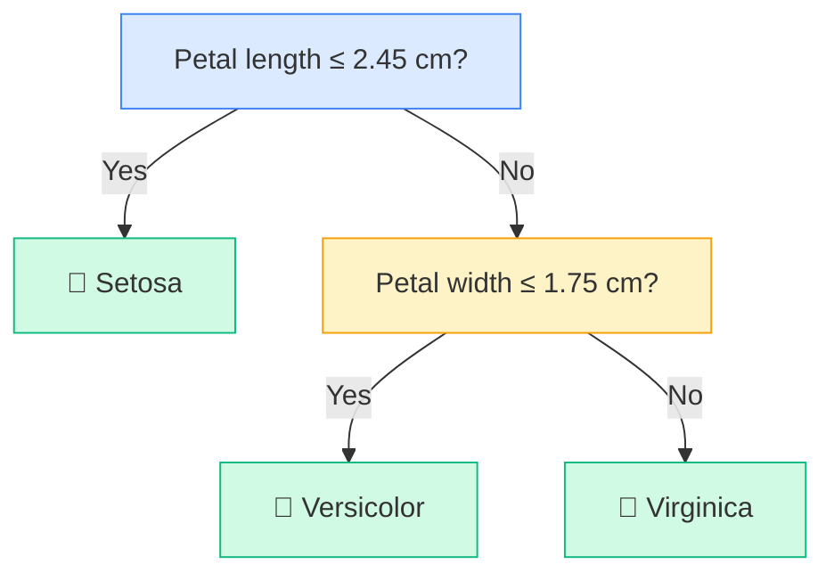
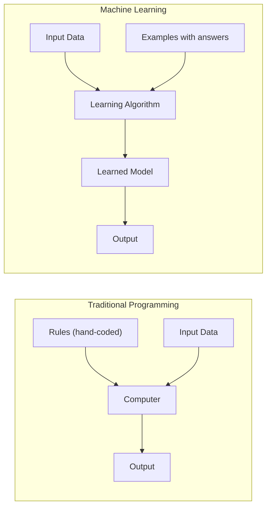
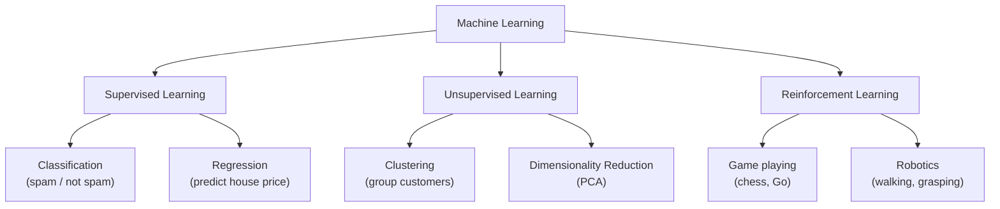
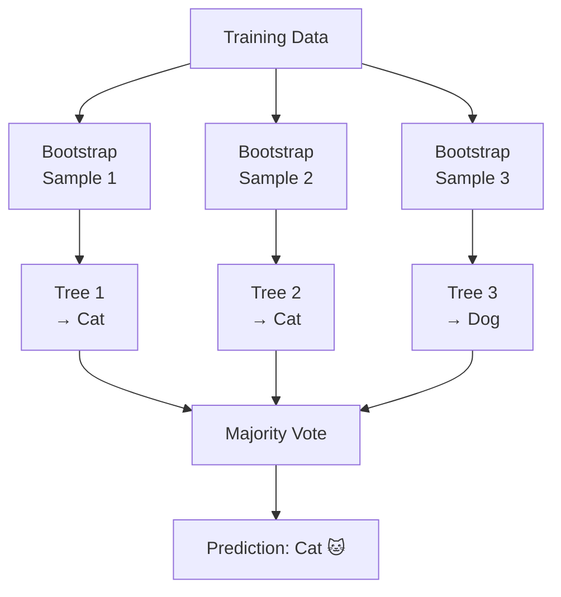
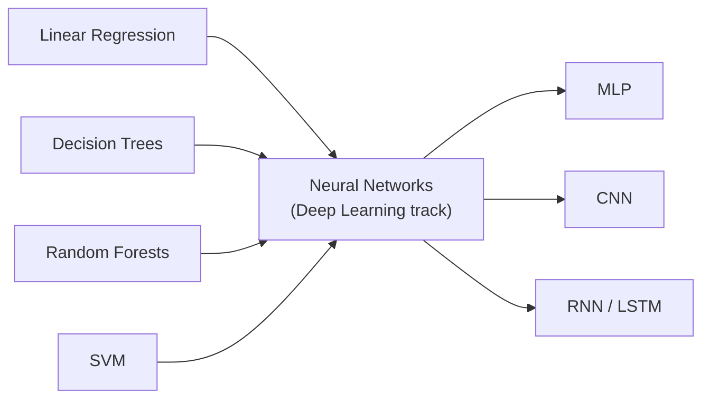

# ML Tutorials Redesign — "AI From the Ground Up" Implementation Plan

> **For agentic workers:** REQUIRED SUB-SKILL: Use superpowers:subagent-driven-development (recommended) or superpowers:executing-plans to implement this plan task-by-task. Steps use checkbox (`- [ ]`) syntax for tracking.

**Goal:** Redesign all 20 ML tutorials with human-written voice, KaTeX formulas, inline visuals, and a 5-track navigation structure under the new site title "AI From the Ground Up".

**Architecture:** Site uses Jekyll with `just-the-docs` remote theme hosted on GitHub Pages. No local `_layouts/` — custom head HTML goes in `_includes/head_custom.html`. Tutorials are markdown files in `tutorials/`. Navigation is driven by frontmatter (`parent`, `nav_order`). Phase order: infrastructure first → pilot 3 tutorials → roll out remaining 17.

**Tech Stack:** Jekyll, just-the-docs theme, KaTeX CDN (v0.16.9), Mermaid (via just-the-docs config), GitHub Pages

---

## File Map

**Create:**
- `_includes/head_custom.html` — KaTeX CDN tags
- `tutorials/ml-basics.md` — ML Basics track index page
- `tutorials/deep-learning-track.md` — Deep Learning track index page
- `tutorials/nlp.md` — NLP coming-soon placeholder
- `tutorials/transformers.md` — Transformers coming-soon placeholder
- `tutorials/llms-gpt.md` — LLMs & GPT coming-soon placeholder

**Modify:**
- `_config.yml` — title, description, mermaid version
- `index.html` — hero text + card grid restructured to 5 tracks
- All 20 `tutorials/*.md` files — frontmatter parent + full content rewrite

---

## Task 1: KaTeX and site config

**Files:**
- Modify: `_config.yml`
- Create: `_includes/head_custom.html`

- [ ] **Step 1: Update `_config.yml`**

Replace the title and description, add mermaid config:

```yaml
title: AI From the Ground Up
description: Plain-English tutorials on machine learning and AI — from linear regression to deep learning, with formulas, visuals, and real code.
baseurl: ""
url: "https://abinayanand7896-cloud.github.io"

remote_theme: just-the-docs/just-the-docs

nav_sort: order
highlighter: rouge
markdown: kramdown

mermaid:
  version: "9.1.6"

exclude:
  - Gemfile
  - Gemfile.lock
  - README.md
  - docs/
```

- [ ] **Step 2: Create `_includes/head_custom.html`**

```html
<link rel="stylesheet" href="https://cdn.jsdelivr.net/npm/katex@0.16.9/dist/katex.min.css" crossorigin="anonymous">
<script defer src="https://cdn.jsdelivr.net/npm/katex@0.16.9/dist/katex.min.js" crossorigin="anonymous"></script>
<script defer src="https://cdn.jsdelivr.net/npm/katex@0.16.9/dist/contrib/auto-render.min.js" crossorigin="anonymous"
  onload="renderMathInElement(document.body, {
    delimiters: [
      {left: '$$', right: '$$', display: true},
      {left: '$', right: '$', display: false}
    ],
    throwOnError: false
  });"></script>
```

- [ ] **Step 3: Commit**

```bash
git add _config.yml _includes/head_custom.html
git commit -m "feat: add KaTeX CDN and update site title to AI From the Ground Up"
```

---

## Task 2: Track index pages

**Files:**
- Create: `tutorials/ml-basics.md`
- Create: `tutorials/deep-learning-track.md`
- Create: `tutorials/nlp.md`
- Create: `tutorials/transformers.md`
- Create: `tutorials/llms-gpt.md`

- [ ] **Step 1: Create `tutorials/ml-basics.md`**

```markdown
---
layout: default
title: ML Basics
nav_order: 2
has_children: true
---

# ML Basics

This track covers the fundamental machine learning algorithms — the ones every practitioner should know. You'll learn how each model works, see the key formula, and write working code.

Start with [What is Machine Learning?](what-is-ml) if this is your first time here.
```

- [ ] **Step 2: Create `tutorials/deep-learning-track.md`**

```markdown
---
layout: default
title: Deep Learning
nav_order: 3
has_children: true
---

# Deep Learning

This track covers neural networks and their extensions — from a basic multi-layer perceptron to CNNs, RNNs, and LSTMs. Each tutorial builds on the previous one.

Start with [What are Neural Networks?](neural-networks-intro).
```

- [ ] **Step 3: Create `tutorials/nlp.md`**

```markdown
---
layout: default
title: NLP
nav_order: 4
has_children: false
---

# Natural Language Processing

*Coming soon.*

This track will cover how machines understand and generate text — tokenisation, word embeddings, sequence models, and more.
```

- [ ] **Step 4: Create `tutorials/transformers.md`**

```markdown
---
layout: default
title: Transformers
nav_order: 5
has_children: false
---

# Transformers

*Coming soon.*

This track will cover the attention mechanism, the Transformer architecture, BERT, and how self-attention replaced recurrence.
```

- [ ] **Step 5: Create `tutorials/llms-gpt.md`**

```markdown
---
layout: default
title: LLMs & GPT
nav_order: 6
has_children: false
---

# LLMs & GPT

*Coming soon.*

This track will cover large language models — how GPT works, how they are trained, fine-tuning, prompting, and what happens under the hood.
```

- [ ] **Step 6: Commit**

```bash
git add tutorials/ml-basics.md tutorials/deep-learning-track.md tutorials/nlp.md tutorials/transformers.md tutorials/llms-gpt.md
git commit -m "feat: add 5 navigation track index pages with coming-soon placeholders"
```

---

## Task 3: Update homepage (index.html)

**Files:**
- Modify: `index.html`

- [ ] **Step 1: Replace index.html**

Replace the entire file content:

```html
---
layout: default
title: Home
nav_order: 1
---

<style>
.page-hero {
  text-align: center;
  padding: 40px 20px 28px;
  border-bottom: 1px solid #e2e8f0;
  margin-bottom: 36px;
}
.page-hero h1 { font-size: 28px; font-weight: 800; color: #0f172a; margin: 0 0 8px; }
.page-hero p { font-size: 15px; color: #64748b; margin: 0 0 18px; }
.hero-cta {
  display: inline-block; background: #1e293b; color: #fff;
  padding: 9px 20px; border-radius: 6px; font-size: 14px;
  font-weight: 600; text-decoration: none; transition: background 0.2s;
}
.hero-cta:hover { background: #334155; color: #fff; }
.track-section { margin-bottom: 40px; }
.track-header {
  display: flex; align-items: center; gap: 12px;
  margin-bottom: 16px; padding-bottom: 10px;
  border-bottom: 2px solid #e2e8f0;
}
.track-badge {
  font-size: 11px; font-weight: 700; text-transform: uppercase;
  letter-spacing: 0.08em; padding: 3px 10px; border-radius: 20px; color: #fff;
}
.badge-ml   { background: #64748b; }
.badge-dl   { background: #334155; }
.badge-soon { background: #cbd5e1; color: #475569; }
.track-title { font-size: 17px; font-weight: 700; color: #1e293b; }
.track-count { font-size: 12px; color: #94a3b8; margin-left: auto; }
.cards-grid {
  display: grid;
  grid-template-columns: repeat(auto-fill, minmax(150px, 1fr));
  gap: 14px;
}
.tcard {
  border-radius: 10px; overflow: hidden; cursor: pointer;
  box-shadow: 0 2px 8px rgba(0,0,0,0.10);
  transition: box-shadow 0.2s, transform 0.2s;
  text-decoration: none; display: block; max-width: 200px;
}
.tcard:hover { box-shadow: 0 6px 20px rgba(0,0,0,0.18); transform: translateY(-2px); }
.tcard-header {
  padding: 18px 14px 14px; display: flex; flex-direction: column;
  align-items: center; text-align: center; min-height: 96px; justify-content: center;
}
.tcard-icon { font-size: 26px; margin-bottom: 7px; }
.tcard-name { font-weight: 700; font-size: 12px; color: #fff; line-height: 1.35; }
.ml .tcard-header { background: linear-gradient(135deg, #64748b, #94a3b8); }
.dl .tcard-header { background: linear-gradient(135deg, #334155, #475569); }
.soon .tcard-header { background: linear-gradient(135deg, #cbd5e1, #e2e8f0); }
.soon .tcard-name { color: #475569; }
.tcard-peek {
  background: #f8fafc; color: #475569; font-size: 11px; line-height: 1.5;
  padding: 0 12px; max-height: 0; overflow: hidden;
  transition: max-height 0.35s ease, padding 0.25s ease;
}
.tcard:hover .tcard-peek { max-height: 100px; padding: 10px 12px; border-top: 2px solid #e2e8f0; }
</style>

<div class="page-hero">
  <h1>AI From the Ground Up</h1>
  <p>Machine learning tutorials with real formulas, honest explanations, and working code.</p>
  <a class="hero-cta" href="{{ '/tutorials/what-is-ml' | relative_url }}">Start from scratch →</a>
</div>

<!-- ML Basics -->
<div class="track-section">
  <div class="track-header">
    <span class="track-badge badge-ml">ML Basics</span>
    <span class="track-title">Classical Machine Learning</span>
    <span class="track-count">14 tutorials</span>
  </div>
  <div class="cards-grid">
    <a class="tcard ml" href="{{ '/tutorials/what-is-ml' | relative_url }}">
      <div class="tcard-header"><div class="tcard-icon">❓</div><div class="tcard-name">What is Machine Learning?</div></div>
      <div class="tcard-peek">The big picture — what ML is, why it matters, and where it shows up in the real world.</div>
    </a>
    <a class="tcard ml" href="{{ '/tutorials/foundations' | relative_url }}">
      <div class="tcard-header"><div class="tcard-icon">🗺️</div><div class="tcard-name">ML Foundations</div></div>
      <div class="tcard-peek">Supervised, unsupervised, and reinforcement learning — the three ways a machine can learn.</div>
    </a>
    <a class="tcard ml" href="{{ '/tutorials/linear-regression' | relative_url }}">
      <div class="tcard-header"><div class="tcard-icon">📈</div><div class="tcard-name">Linear Regression</div></div>
      <div class="tcard-peek">Predict numbers using a straight line — the simplest and most widely used idea in all of ML.</div>
    </a>
    <a class="tcard ml" href="{{ '/tutorials/logistic-regression' | relative_url }}">
      <div class="tcard-header"><div class="tcard-icon">🔵</div><div class="tcard-name">Logistic Regression</div></div>
      <div class="tcard-peek">Sort things into two buckets — spam or not, sick or healthy — using a surprisingly simple trick.</div>
    </a>
    <a class="tcard ml" href="{{ '/tutorials/decision-tree' | relative_url }}">
      <div class="tcard-header"><div class="tcard-icon">🌳</div><div class="tcard-name">Decision Trees</div></div>
      <div class="tcard-peek">Make decisions step by step — like a flowchart your computer can learn from data.</div>
    </a>
    <a class="tcard ml" href="{{ '/tutorials/random-forest' | relative_url }}">
      <div class="tcard-header"><div class="tcard-icon">🌲</div><div class="tcard-name">Random Forests</div></div>
      <div class="tcard-peek">Build hundreds of trees and let them vote — together they're far smarter than any one tree alone.</div>
    </a>
    <a class="tcard ml" href="{{ '/tutorials/gradient-boosting' | relative_url }}">
      <div class="tcard-header"><div class="tcard-icon">⚡</div><div class="tcard-name">Gradient Boosting</div></div>
      <div class="tcard-peek">Build a powerful model by training each new tree to fix what the last one got wrong.</div>
    </a>
    <a class="tcard ml" href="{{ '/tutorials/xgboost' | relative_url }}">
      <div class="tcard-header"><div class="tcard-icon">🚀</div><div class="tcard-name">XGBoost</div></div>
      <div class="tcard-peek">A faster, smarter take on Gradient Boosting — the algorithm that wins most Kaggle competitions.</div>
    </a>
    <a class="tcard ml" href="{{ '/tutorials/svm' | relative_url }}">
      <div class="tcard-header"><div class="tcard-icon">✂️</div><div class="tcard-name">Support Vector Machines</div></div>
      <div class="tcard-peek">Find the widest possible boundary between two groups — works even when data isn't linearly separable.</div>
    </a>
    <a class="tcard ml" href="{{ '/tutorials/knn' | relative_url }}">
      <div class="tcard-header"><div class="tcard-icon">👥</div><div class="tcard-name">K-Nearest Neighbors</div></div>
      <div class="tcard-peek">Classify anything by asking: what do its closest neighbours look like?</div>
    </a>
    <a class="tcard ml" href="{{ '/tutorials/naive-bayes' | relative_url }}">
      <div class="tcard-header"><div class="tcard-icon">🎲</div><div class="tcard-name">Naive Bayes</div></div>
      <div class="tcard-peek">Make smart predictions using probability — fast, simple, and surprisingly good at text.</div>
    </a>
    <a class="tcard ml" href="{{ '/tutorials/pca' | relative_url }}">
      <div class="tcard-header"><div class="tcard-icon">📉</div><div class="tcard-name">PCA</div></div>
      <div class="tcard-peek">Squash high-dimensional data down to fewer dimensions while keeping the most important patterns.</div>
    </a>
    <a class="tcard ml" href="{{ '/tutorials/kmeans' | relative_url }}">
      <div class="tcard-header"><div class="tcard-icon">⭕</div><div class="tcard-name">K-Means Clustering</div></div>
      <div class="tcard-peek">Group similar data points together without any labels — the machine figures out the clusters itself.</div>
    </a>
    <a class="tcard ml" href="{{ '/tutorials/intermediate' | relative_url }}">
      <div class="tcard-header"><div class="tcard-icon">🗂️</div><div class="tcard-name">What's Next?</div></div>
      <div class="tcard-peek">A signpost page — where you are in the ML journey and what comes next.</div>
    </a>
  </div>
</div>

<!-- Deep Learning -->
<div class="track-section">
  <div class="track-header">
    <span class="track-badge badge-dl">Deep Learning</span>
    <span class="track-title">Neural Networks</span>
    <span class="track-count">6 tutorials</span>
  </div>
  <div class="cards-grid">
    <a class="tcard dl" href="{{ '/tutorials/neural-networks-intro' | relative_url }}">
      <div class="tcard-header"><div class="tcard-icon">🧠</div><div class="tcard-name">What are Neural Networks?</div></div>
      <div class="tcard-peek">The idea that changed everything — loosely inspired by the brain, but really just clever maths.</div>
    </a>
    <a class="tcard dl" href="{{ '/tutorials/mlp' | relative_url }}">
      <div class="tcard-header"><div class="tcard-icon">🔗</div><div class="tcard-name">MLP</div></div>
      <div class="tcard-peek">Your first real neural network — stack some layers, train it on data, watch it learn.</div>
    </a>
    <a class="tcard dl" href="{{ '/tutorials/deep-learning' | relative_url }}">
      <div class="tcard-header"><div class="tcard-icon">🏗️</div><div class="tcard-name">Deep Learning</div></div>
      <div class="tcard-peek">What makes a network "deep" — and why depth unlocks capabilities shallower models simply can't reach.</div>
    </a>
    <a class="tcard dl" href="{{ '/tutorials/cnn' | relative_url }}">
      <div class="tcard-header"><div class="tcard-icon">🖼️</div><div class="tcard-name">CNN</div></div>
      <div class="tcard-peek">Neural networks that see — how computers learn to recognise cats, faces, and X-rays.</div>
    </a>
    <a class="tcard dl" href="{{ '/tutorials/rnn' | relative_url }}">
      <div class="tcard-header"><div class="tcard-icon">🔄</div><div class="tcard-name">RNN</div></div>
      <div class="tcard-peek">Networks with memory — built for sequences like text, speech, and time-series data.</div>
    </a>
    <a class="tcard dl" href="{{ '/tutorials/lstm' | relative_url }}">
      <div class="tcard-header"><div class="tcard-icon">💡</div><div class="tcard-name">LSTM</div></div>
      <div class="tcard-peek">A smarter RNN that can remember things from way earlier in a sequence without forgetting.</div>
    </a>
  </div>
</div>

<!-- Coming Soon tracks -->
<div class="track-section">
  <div class="track-header">
    <span class="track-badge badge-soon">Coming Soon</span>
    <span class="track-title">NLP · Transformers · LLMs & GPT</span>
  </div>
  <div class="cards-grid">
    <a class="tcard soon" href="{{ '/tutorials/nlp' | relative_url }}">
      <div class="tcard-header"><div class="tcard-icon">💬</div><div class="tcard-name">NLP</div></div>
      <div class="tcard-peek">Tokenisation, embeddings, and how machines read text.</div>
    </a>
    <a class="tcard soon" href="{{ '/tutorials/transformers' | relative_url }}">
      <div class="tcard-header"><div class="tcard-icon">⚙️</div><div class="tcard-name">Transformers</div></div>
      <div class="tcard-peek">Attention is all you need — the architecture behind modern AI.</div>
    </a>
    <a class="tcard soon" href="{{ '/tutorials/llms-gpt' | relative_url }}">
      <div class="tcard-header"><div class="tcard-icon">🤖</div><div class="tcard-name">LLMs & GPT</div></div>
      <div class="tcard-peek">How GPT works, how it's trained, and what's really going on under the hood.</div>
    </a>
  </div>
</div>
```

- [ ] **Step 2: Commit**

```bash
git add index.html
git commit -m "feat: update homepage to 5-track layout (ML Basics, Deep Learning, 3 coming soon)"
```

---

## Task 4: Update tutorial frontmatter (all 20)

**Files:** All 20 `tutorials/*.md` files

Update the `parent` field and `nav_order` in every tutorial's frontmatter. ML Basics tutorials get `parent: ML Basics`, Deep Learning tutorials get `parent: Deep Learning`.

- [ ] **Step 1: Update ML Basics tutorials**

For each file below, change the frontmatter `parent` value and set `nav_order`:

| File | parent | nav_order |
|------|--------|-----------|
| `tutorials/what-is-ml.md` | ML Basics | 1 |
| `tutorials/foundations.md` | ML Basics | 2 |
| `tutorials/linear-regression.md` | ML Basics | 3 |
| `tutorials/logistic-regression.md` | ML Basics | 4 |
| `tutorials/decision-tree.md` | ML Basics | 5 |
| `tutorials/random-forest.md` | ML Basics | 6 |
| `tutorials/gradient-boosting.md` | ML Basics | 7 |
| `tutorials/xgboost.md` | ML Basics | 8 |
| `tutorials/svm.md` | ML Basics | 9 |
| `tutorials/knn.md` | ML Basics | 10 |
| `tutorials/naive-bayes.md` | ML Basics | 11 |
| `tutorials/pca.md` | ML Basics | 12 |
| `tutorials/kmeans.md` | ML Basics | 13 |
| `tutorials/intermediate.md` | ML Basics | 14 |

Example — `tutorials/what-is-ml.md` frontmatter becomes:
```yaml
---
layout: default
title: What is Machine Learning?
parent: ML Basics
nav_order: 1
---
```

- [ ] **Step 2: Update Deep Learning tutorials**

| File | parent | nav_order |
|------|--------|-----------|
| `tutorials/neural-networks-intro.md` | Deep Learning | 1 |
| `tutorials/mlp.md` | Deep Learning | 2 |
| `tutorials/deep-learning.md` | Deep Learning | 3 |
| `tutorials/cnn.md` | Deep Learning | 4 |
| `tutorials/rnn.md` | Deep Learning | 5 |
| `tutorials/lstm.md` | Deep Learning | 6 |

- [ ] **Step 3: Commit**

```bash
git add tutorials/
git commit -m "feat: update tutorial frontmatter to ML Basics and Deep Learning tracks"
```

---

## Task 5: Pilot — linear-regression.md

**Files:**
- Modify: `tutorials/linear-regression.md`

This is the first pilot. It establishes the template for all subsequent rewrites.

- [ ] **Step 1: Replace `tutorials/linear-regression.md`**

```markdown
---
layout: default
title: Linear Regression
parent: ML Basics
nav_order: 3
---

# Linear Regression

## What is it?

Linear Regression is one of the simplest and most useful tools in machine learning. Given a set of data points, it finds the best-fit straight line that describes the relationship between an input and an output — for example, how a house's size relates to its price. Once you have that line, you can use it to predict the output for any new input you give it. It's usually the first model anyone learns, and for good reason: it's fast, interpretable, and surprisingly effective.

---

## The Idea

Imagine you plot 100 houses on a graph — size on the x-axis, price on the y-axis. You can see a clear trend: as houses get bigger, prices go up. Linear Regression finds the single straight line that fits through those points as closely as possible. That line has two numbers: a slope (how much the price rises per square foot) and an intercept (the starting price when size is zero). Once those two numbers are learned from your data, you just plug in a new house size and the line tells you the predicted price.

The key insight is that the model isn't memorising your training data. It's learning a compact summary — one line — that generalises to houses it has never seen before. That's the whole game in machine learning.

---

## Visual

<div style="background:#f8fafc;border:1px solid #e2e8f0;border-radius:8px;padding:20px;margin:20px 0;">
<svg viewBox="0 0 320 200" xmlns="http://www.w3.org/2000/svg" style="width:100%;max-width:400px;display:block;margin:auto;">
  <!-- Axes -->
  <line x1="40" y1="170" x2="300" y2="170" stroke="#94a3b8" stroke-width="1.5"/>
  <line x1="40" y1="170" x2="40" y2="20" stroke="#94a3b8" stroke-width="1.5"/>
  <!-- Axis labels -->
  <text x="170" y="192" text-anchor="middle" font-size="11" fill="#64748b">House Size (sq ft)</text>
  <text x="12" y="100" text-anchor="middle" font-size="11" fill="#64748b" transform="rotate(-90,12,100)">Price ($k)</text>
  <!-- Data points -->
  <circle cx="70"  cy="148" r="4" fill="#3b82f6" opacity="0.8"/>
  <circle cx="95"  cy="135" r="4" fill="#3b82f6" opacity="0.8"/>
  <circle cx="115" cy="125" r="4" fill="#3b82f6" opacity="0.8"/>
  <circle cx="140" cy="110" r="4" fill="#3b82f6" opacity="0.8"/>
  <circle cx="165" cy="98"  r="4" fill="#3b82f6" opacity="0.8"/>
  <circle cx="185" cy="88"  r="4" fill="#3b82f6" opacity="0.8"/>
  <circle cx="210" cy="75"  r="4" fill="#3b82f6" opacity="0.8"/>
  <circle cx="235" cy="62"  r="4" fill="#3b82f6" opacity="0.8"/>
  <circle cx="260" cy="52"  r="4" fill="#3b82f6" opacity="0.8"/>
  <circle cx="280" cy="42"  r="4" fill="#3b82f6" opacity="0.8"/>
  <!-- Regression line -->
  <line x1="55" y1="158" x2="290" y2="36" stroke="#ef4444" stroke-width="2"/>
  <!-- Legend -->
  <circle cx="60" cy="185" r="4" fill="#3b82f6"/>
  <text x="70" y="189" font-size="10" fill="#475569">Data points</text>
  <line x1="130" y1="185" x2="150" y2="185" stroke="#ef4444" stroke-width="2"/>
  <text x="155" y="189" font-size="10" fill="#475569">Regression line</text>
</svg>
</div>

---

## The Math

$$\hat{y} = w_1 x_1 + w_2 x_2 + \dots + w_n x_n + b$$

Or in compact vector form:

$$\hat{y} = \mathbf{w}^T \mathbf{x} + b$$

> **In plain English:** The predicted value $\hat{y}$ is a weighted sum of your input features, plus a bias term $b$. Each weight $w_i$ says how much that feature matters. The model's job is to find the weights that make predictions as accurate as possible.

<details>
<summary>Show the derivation</summary>

We want to minimise the **Mean Squared Error (MSE)** — the average of the squared gaps between predicted and actual values:

$$\text{MSE} = \frac{1}{n} \sum_{i=1}^{n} (y_i - \hat{y}_i)^2$$

To find the optimal weights, we take the derivative of MSE with respect to $\mathbf{w}$ and set it to zero. This gives the **Normal Equation** — a closed-form solution:

$$\mathbf{w}^* = (\mathbf{X}^T \mathbf{X})^{-1} \mathbf{X}^T \mathbf{y}$$

In practice, scikit-learn uses this (or a numerically stable variant) rather than gradient descent for small datasets. For large datasets, **Stochastic Gradient Descent (SGD)** is used instead — it updates the weights incrementally rather than solving the whole system at once.

</details>

---

## How It Learns

Training Linear Regression means finding the values of $\mathbf{w}$ and $b$ that produce the smallest total prediction error across all your training examples. The model starts with arbitrary weights, computes predictions, measures how wrong they are using MSE, and then adjusts the weights to reduce that error. It repeats this process — either analytically via the Normal Equation, or iteratively via gradient descent — until the weights stop improving. Once training is done, those weights are fixed and the model is ready to predict.

---

## When to Use It

Linear Regression is the right tool when you need to predict a continuous number and you have reason to believe the relationship between your inputs and output is roughly linear. It's also the right tool when you need a model you can explain — you can look directly at the weights and say "a one-unit increase in X leads to a Y-unit increase in the output." It works poorly when the true relationship is curved or when there are complex interactions between features; in those cases, tree-based models or neural networks will outperform it. Always try Linear Regression first as a baseline before moving to something more complex.

---

## Try It Yourself

```python
import numpy as np
from sklearn.linear_model import LinearRegression

# House sizes in sq ft, prices in $thousands
house_sizes = np.array([500, 750, 1000, 1250, 1500, 1750, 2000]).reshape(-1, 1)
house_prices = np.array([150, 200, 250, 310, 350, 400, 450])

model = LinearRegression()
model.fit(house_sizes, house_prices)

print(f"Weight (slope):   {model.coef_[0]:.4f}")
print(f"Bias (intercept): {model.intercept_:.2f}")
print(f"Prediction for 1600 sq ft: ${model.predict([[1600]])[0]:.1f}k")
```

Expected output:
```
Weight (slope):   0.1714
Bias (intercept): 62.86
Prediction for 1600 sq ft: $337.1k
```

---

## Key Takeaways

Linear Regression finds the best straight line through your data by learning a slope and a bias term that minimise the average squared prediction error. It predicts continuous numbers — prices, temperatures, sales figures — and works best when the relationship between inputs and output is roughly linear. It's not just a beginner's tool: it's fast, interpretable, and often hard to beat as a baseline. When you move on to more complex models, you'll find that many of them are essentially generalisations of this same idea.

---

[← ML Foundations](foundations){: .btn } [Next → Logistic Regression](logistic-regression){: .btn .btn-primary }
```

- [ ] **Step 2: Verify locally**

Run `bundle exec jekyll serve` and open `http://localhost:4000/tutorials/linear-regression`.

Check:
- KaTeX formula renders (not raw `$$...$$` text)
- SVG scatter plot with regression line is visible
- `<details>` derivation is collapsed by default and expands on click
- No bullet lists in sections 1, 2, 5, 6, 8
- Navigation shows "ML Basics" as parent

- [ ] **Step 3: Commit**

```bash
git add tutorials/linear-regression.md
git commit -m "feat: rewrite linear-regression with new structure, KaTeX formula, SVG visual"
```

---

## Task 6: Pilot — decision-tree.md

**Files:**
- Modify: `tutorials/decision-tree.md`

- [ ] **Step 1: Replace `tutorials/decision-tree.md`**

```markdown
---
layout: default
title: Decision Trees
parent: ML Basics
nav_order: 5
---

# Decision Trees

## What is it?

A Decision Tree is a machine learning model that makes predictions by asking a sequence of yes/no questions about the input. At each step it splits the data based on the answer, following one branch or the other, until it reaches a final prediction. It learns which questions to ask — and in what order — directly from your training data. The result is a model you can read like a flowchart and explain to anyone, which makes it one of the most interpretable algorithms in all of ML.

---

## The Idea

Imagine you're a doctor trying to decide whether a patient has the flu. You might ask: Do they have a fever? If yes, do they have body aches? If yes, do symptoms come on suddenly? Each question narrows things down until you reach a confident answer. A Decision Tree does exactly this — but instead of a doctor's intuition, it uses mathematics to find the questions that divide your data most cleanly at each step.

The tree is built from the top down. At the root, it searches every possible feature and every possible split point to find the question that separates the classes best. It then recurses on each branch, splitting again and again, until the data at each leaf is mostly one class (or it hits a depth limit you've set). When a new example arrives, it just travels down the tree answering questions until it hits a leaf — that leaf's majority class is the prediction.

---

## Visual



---

## The Math

At each node, the tree picks the split that minimises **Gini Impurity** — a measure of how mixed the classes are in a group.

$$G = 1 - \sum_{k=1}^{K} p_k^2$$

where $p_k$ is the fraction of examples in class $k$ at that node.

> **In plain English:** Gini Impurity is zero when every example in a node belongs to the same class (a perfect split), and highest when the classes are evenly mixed. The tree always picks the split that produces the lowest weighted average Gini across the two child nodes.

<details>
<summary>Show the derivation</summary>

When evaluating a candidate split that divides $n$ examples into a left group of $n_L$ and a right group of $n_R$:

$$G_{\text{split}} = \frac{n_L}{n} G_L + \frac{n_R}{n} G_R$$

The tree computes this for every feature and every possible threshold, then picks the $(feature, threshold)$ pair that minimises $G_{\text{split}}$.

An alternative to Gini is **Information Gain**, based on entropy:

$$H = -\sum_{k=1}^{K} p_k \log_2 p_k$$

Entropy reaches zero for a pure node and $\log_2 K$ for a uniformly mixed node. Information gain is the drop in entropy after a split. Both criteria produce similar trees in practice; scikit-learn uses Gini by default.

</details>

---

## How It Learns

Building a Decision Tree is a greedy process. Starting at the root, the algorithm scans every feature and every possible split threshold, computes the weighted Gini impurity for each, and picks the best one. It then repeats this independently for the left and right branches. The tree keeps growing until every leaf is pure, or until a stopping condition is met — most commonly a maximum depth. A fully grown tree will memorise the training data perfectly but generalise badly to new examples (this is called overfitting). Setting `max_depth` limits this by stopping splits early, which sacrifices some training accuracy in exchange for much better performance on unseen data.

---

## When to Use It

Decision Trees are a natural fit when your problem has a rule-based flavour — when you can imagine a human expert writing down a decision flowchart. They handle both numerical and categorical features without any preprocessing, and they're easy to explain to a non-technical audience. The main weakness is overfitting: a single tree trained without depth limits will often perform worse on test data than on training data. If you need more predictive power, the solution is usually to move to Random Forest or Gradient Boosting, both of which build on Decision Trees but correct for this instability by combining many trees together.

---

## Try It Yourself

```python
from sklearn.datasets import load_iris
from sklearn.tree import DecisionTreeClassifier
from sklearn.model_selection import train_test_split
from sklearn.metrics import accuracy_score

data = load_iris()
X_train, X_test, y_train, y_test = train_test_split(
    data.data, data.target, test_size=0.2, random_state=42
)

model = DecisionTreeClassifier(max_depth=3, random_state=42)
model.fit(X_train, y_train)

predictions = model.predict(X_test)
print(f"Accuracy: {accuracy_score(y_test, predictions) * 100:.1f}%")
print(f"Tree depth: {model.get_depth()}")
print(f"Number of leaves: {model.get_n_leaves()}")
```

Expected output:
```
Accuracy: 100.0%
Tree depth: 3
Number of leaves: 4
```

---

## Key Takeaways

A Decision Tree learns a sequence of yes/no questions from your data and uses them to reach predictions. It's one of the few models you can visualise and explain completely — you can trace every prediction back to the exact questions that led there. The trade-off is overfitting: without a depth limit, a tree will memorise training data rather than learning the underlying pattern. In practice, Decision Trees are rarely used alone — they're the foundation for two of the most powerful ML algorithms in existence, Random Forest and Gradient Boosting, which you'll meet next.

---

[← Logistic Regression](logistic-regression){: .btn } [Next → Random Forests](random-forest){: .btn .btn-primary }
```

- [ ] **Step 2: Verify locally**

Run `bundle exec jekyll serve` and open `http://localhost:4000/tutorials/decision-tree`.

Check:
- Mermaid diagram renders (coloured boxes visible, not raw code)
- Gini formula renders in KaTeX
- Derivation section is collapsible
- No bullet lists in explanation sections

- [ ] **Step 3: Commit**

```bash
git add tutorials/decision-tree.md
git commit -m "feat: rewrite decision-tree with Mermaid visual, Gini formula, new structure"
```

---

## Task 7: Pilot — cnn.md

**Files:**
- Modify: `tutorials/cnn.md`

- [ ] **Step 1: Read current `tutorials/cnn.md`** to note what code examples are present.

- [ ] **Step 2: Replace `tutorials/cnn.md`**

```markdown
---
layout: default
title: Convolutional Neural Networks
parent: Deep Learning
nav_order: 4
---

# Convolutional Neural Networks (CNNs)

## What is it?

A Convolutional Neural Network is a type of neural network designed to process data that has a grid-like structure — most famously images. Instead of connecting every neuron to every pixel (which would be computationally ruinous for a 1080p image), a CNN slides a small filter across the image, looking for patterns in local patches. This makes it both efficient and powerful: the same filter that learns to detect a vertical edge in one corner of the image can detect that same edge anywhere else. CNNs are the reason computers can now recognise faces, read handwriting, and diagnose medical scans with human-level accuracy.

---

## The Idea

Think of how you scan a page of text. You don't process the entire page at once — your eye moves in small jumps, reading a few letters at a time. A CNN works similarly. A small grid of weights called a **filter** (or kernel) slides across the input image one patch at a time. At each position it multiplies its weights against the pixel values it's covering and sums the results, producing a single number. As the filter slides across the whole image, it produces a new grid of numbers called a **feature map** — a representation of where, and how strongly, the filter's pattern appears in the original image.

A CNN stacks many such filters, each learning to detect a different pattern. Early filters learn simple things like edges and corners. Deeper filters combine those simple patterns into more complex structures — textures, shapes, object parts — until the final layers can recognise a complete object. The whole thing is learned end-to-end from labelled training data, with no human hand-crafting the filters.

---

## Visual

<div style="background:#f8fafc;border:1px solid #e2e8f0;border-radius:8px;padding:20px;margin:20px 0;">
<p style="text-align:center;font-size:12px;color:#64748b;margin-bottom:12px;">3×3 filter sliding over a 5×5 input image</p>
<div style="display:flex;align-items:center;justify-content:center;gap:24px;flex-wrap:wrap;">

<!-- Input grid -->
<div>
<p style="text-align:center;font-size:11px;color:#64748b;margin-bottom:6px;">Input</p>
<div style="display:grid;grid-template-columns:repeat(5,32px);gap:2px;">
  <div style="width:32px;height:32px;background:#bfdbfe;border:2px solid #3b82f6;border-radius:3px;display:flex;align-items:center;justify-content:center;font-size:10px;">1</div>
  <div style="width:32px;height:32px;background:#bfdbfe;border:2px solid #3b82f6;border-radius:3px;display:flex;align-items:center;justify-content:center;font-size:10px;">0</div>
  <div style="width:32px;height:32px;background:#bfdbfe;border:2px solid #3b82f6;border-radius:3px;display:flex;align-items:center;justify-content:center;font-size:10px;">1</div>
  <div style="width:32px;height:32px;background:#e2e8f0;border:1px solid #cbd5e1;border-radius:3px;display:flex;align-items:center;justify-content:center;font-size:10px;color:#94a3b8;">0</div>
  <div style="width:32px;height:32px;background:#e2e8f0;border:1px solid #cbd5e1;border-radius:3px;display:flex;align-items:center;justify-content:center;font-size:10px;color:#94a3b8;">0</div>
  <div style="width:32px;height:32px;background:#bfdbfe;border:2px solid #3b82f6;border-radius:3px;display:flex;align-items:center;justify-content:center;font-size:10px;">0</div>
  <div style="width:32px;height:32px;background:#bfdbfe;border:2px solid #3b82f6;border-radius:3px;display:flex;align-items:center;justify-content:center;font-size:10px;">1</div>
  <div style="width:32px;height:32px;background:#bfdbfe;border:2px solid #3b82f6;border-radius:3px;display:flex;align-items:center;justify-content:center;font-size:10px;">1</div>
  <div style="width:32px;height:32px;background:#e2e8f0;border:1px solid #cbd5e1;border-radius:3px;display:flex;align-items:center;justify-content:center;font-size:10px;color:#94a3b8;">0</div>
  <div style="width:32px;height:32px;background:#e2e8f0;border:1px solid #cbd5e1;border-radius:3px;display:flex;align-items:center;justify-content:center;font-size:10px;color:#94a3b8;">1</div>
  <div style="width:32px;height:32px;background:#bfdbfe;border:2px solid #3b82f6;border-radius:3px;display:flex;align-items:center;justify-content:center;font-size:10px;">0</div>
  <div style="width:32px;height:32px;background:#bfdbfe;border:2px solid #3b82f6;border-radius:3px;display:flex;align-items:center;justify-content:center;font-size:10px;">0</div>
  <div style="width:32px;height:32px;background:#bfdbfe;border:2px solid #3b82f6;border-radius:3px;display:flex;align-items:center;justify-content:center;font-size:10px;">1</div>
  <div style="width:32px;height:32px;background:#e2e8f0;border:1px solid #cbd5e1;border-radius:3px;display:flex;align-items:center;justify-content:center;font-size:10px;color:#94a3b8;">1</div>
  <div style="width:32px;height:32px;background:#e2e8f0;border:1px solid #cbd5e1;border-radius:3px;display:flex;align-items:center;justify-content:center;font-size:10px;color:#94a3b8;">0</div>
  <div style="width:32px;height:32px;background:#e2e8f0;border:1px solid #cbd5e1;border-radius:3px;display:flex;align-items:center;justify-content:center;font-size:10px;color:#94a3b8;">1</div>
  <div style="width:32px;height:32px;background:#e2e8f0;border:1px solid #cbd5e1;border-radius:3px;display:flex;align-items:center;justify-content:center;font-size:10px;color:#94a3b8;">0</div>
  <div style="width:32px;height:32px;background:#e2e8f0;border:1px solid #cbd5e1;border-radius:3px;display:flex;align-items:center;justify-content:center;font-size:10px;color:#94a3b8;">0</div>
  <div style="width:32px;height:32px;background:#e2e8f0;border:1px solid #cbd5e1;border-radius:3px;display:flex;align-items:center;justify-content:center;font-size:10px;color:#94a3b8;">1</div>
  <div style="width:32px;height:32px;background:#e2e8f0;border:1px solid #cbd5e1;border-radius:3px;display:flex;align-items:center;justify-content:center;font-size:10px;color:#94a3b8;">1</div>
  <div style="width:32px;height:32px;background:#e2e8f0;border:1px solid #cbd5e1;border-radius:3px;display:flex;align-items:center;justify-content:center;font-size:10px;color:#94a3b8;">0</div>
  <div style="width:32px;height:32px;background:#e2e8f0;border:1px solid #cbd5e1;border-radius:3px;display:flex;align-items:center;justify-content:center;font-size:10px;color:#94a3b8;">1</div>
  <div style="width:32px;height:32px;background:#e2e8f0;border:1px solid #cbd5e1;border-radius:3px;display:flex;align-items:center;justify-content:center;font-size:10px;color:#94a3b8;">0</div>
  <div style="width:32px;height:32px;background:#e2e8f0;border:1px solid #cbd5e1;border-radius:3px;display:flex;align-items:center;justify-content:center;font-size:10px;color:#94a3b8;">1</div>
  <div style="width:32px;height:32px;background:#e2e8f0;border:1px solid #cbd5e1;border-radius:3px;display:flex;align-items:center;justify-content:center;font-size:10px;color:#94a3b8;">1</div>
</div>
<p style="text-align:center;font-size:10px;color:#3b82f6;margin-top:4px;">← active patch (3×3)</p>
</div>

<!-- Arrow -->
<div style="font-size:24px;color:#94a3b8;">→</div>

<!-- Filter -->
<div>
<p style="text-align:center;font-size:11px;color:#64748b;margin-bottom:6px;">Filter (learned)</p>
<div style="display:grid;grid-template-columns:repeat(3,32px);gap:2px;">
  <div style="width:32px;height:32px;background:#fef3c7;border:1px solid #f59e0b;border-radius:3px;display:flex;align-items:center;justify-content:center;font-size:10px;">1</div>
  <div style="width:32px;height:32px;background:#fef3c7;border:1px solid #f59e0b;border-radius:3px;display:flex;align-items:center;justify-content:center;font-size:10px;">0</div>
  <div style="width:32px;height:32px;background:#fef3c7;border:1px solid #f59e0b;border-radius:3px;display:flex;align-items:center;justify-content:center;font-size:10px;">1</div>
  <div style="width:32px;height:32px;background:#fef3c7;border:1px solid #f59e0b;border-radius:3px;display:flex;align-items:center;justify-content:center;font-size:10px;">0</div>
  <div style="width:32px;height:32px;background:#fef3c7;border:1px solid #f59e0b;border-radius:3px;display:flex;align-items:center;justify-content:center;font-size:10px;">1</div>
  <div style="width:32px;height:32px;background:#fef3c7;border:1px solid #f59e0b;border-radius:3px;display:flex;align-items:center;justify-content:center;font-size:10px;">0</div>
  <div style="width:32px;height:32px;background:#fef3c7;border:1px solid #f59e0b;border-radius:3px;display:flex;align-items:center;justify-content:center;font-size:10px;">1</div>
  <div style="width:32px;height:32px;background:#fef3c7;border:1px solid #f59e0b;border-radius:3px;display:flex;align-items:center;justify-content:center;font-size:10px;">0</div>
  <div style="width:32px;height:32px;background:#fef3c7;border:1px solid #f59e0b;border-radius:3px;display:flex;align-items:center;justify-content:center;font-size:10px;">1</div>
</div>
</div>

<!-- Arrow -->
<div style="font-size:24px;color:#94a3b8;">→</div>

<!-- Output -->
<div>
<p style="text-align:center;font-size:11px;color:#64748b;margin-bottom:6px;">Feature Map</p>
<div style="display:grid;grid-template-columns:repeat(3,32px);gap:2px;">
  <div style="width:32px;height:32px;background:#d1fae5;border:1px solid #10b981;border-radius:3px;display:flex;align-items:center;justify-content:center;font-size:10px;font-weight:600;">4</div>
  <div style="width:32px;height:32px;background:#d1fae5;border:1px solid #10b981;border-radius:3px;display:flex;align-items:center;justify-content:center;font-size:10px;">2</div>
  <div style="width:32px;height:32px;background:#d1fae5;border:1px solid #10b981;border-radius:3px;display:flex;align-items:center;justify-content:center;font-size:10px;">3</div>
  <div style="width:32px;height:32px;background:#d1fae5;border:1px solid #10b981;border-radius:3px;display:flex;align-items:center;justify-content:center;font-size:10px;">2</div>
  <div style="width:32px;height:32px;background:#d1fae5;border:1px solid #10b981;border-radius:3px;display:flex;align-items:center;justify-content:center;font-size:10px;">3</div>
  <div style="width:32px;height:32px;background:#d1fae5;border:1px solid #10b981;border-radius:3px;display:flex;align-items:center;justify-content:center;font-size:10px;">2</div>
  <div style="width:32px;height:32px;background:#d1fae5;border:1px solid #10b981;border-radius:3px;display:flex;align-items:center;justify-content:center;font-size:10px;">1</div>
  <div style="width:32px;height:32px;background:#d1fae5;border:1px solid #10b981;border-radius:3px;display:flex;align-items:center;justify-content:center;font-size:10px;">3</div>
  <div style="width:32px;height:32px;background:#d1fae5;border:1px solid #10b981;border-radius:3px;display:flex;align-items:center;justify-content:center;font-size:10px;">2</div>
</div>
</div>
</div>
</div>

---

## The Math

The convolution operation at position $(i, j)$ in the feature map is:

$$S(i, j) = \sum_{m=0}^{k-1} \sum_{n=0}^{k-1} I(i+m,\ j+n) \cdot K(m, n)$$

where $I$ is the input image, $K$ is the filter (kernel) of size $k \times k$, and $S(i,j)$ is the resulting activation.

> **In plain English:** At each position, the filter sits on top of a patch of the image. You multiply each filter weight by the pixel underneath it, then add all those products together. The result is one number in the feature map. Slide the filter across the whole image and you get the full feature map.

<details>
<summary>Show the derivation</summary>

For a filter of size $k \times k$ applied to an input of size $H \times W$, the output feature map has size:

$$H_{\text{out}} = H - k + 1, \quad W_{\text{out}} = W - k + 1$$

Adding **padding** of $p$ pixels around the input preserves the spatial size:

$$H_{\text{out}} = H - k + 2p + 1$$

With **stride** $s$ (sliding the filter $s$ pixels at a time instead of 1):

$$H_{\text{out}} = \left\lfloor \frac{H - k + 2p}{s} \right\rfloor + 1$$

The number of learnable parameters in one convolutional layer is $k \times k \times C_{\text{in}} \times C_{\text{out}}$, where $C_{\text{in}}$ is the number of input channels (e.g., 3 for RGB) and $C_{\text{out}}$ is the number of filters. This is dramatically fewer parameters than a fully connected layer of the same size — which is the key efficiency advantage of CNNs.

</details>

---

## How It Learns

A CNN is trained with standard backpropagation, exactly like any other neural network. The filter weights start randomly and are adjusted each training step to minimise the loss. What's remarkable is that nobody tells the network what to look for — it figures out on its own that early filters should detect edges, later filters should detect textures and shapes, and the final layers should combine everything into object recognition. This hierarchical feature learning is the CNN's superpower, and it emerges purely from gradient descent on labelled data.

---

## When to Use It

CNNs are the default choice for any task involving images — classification, object detection, segmentation, medical imaging, satellite imagery. They also work well on other grid-like data: audio spectrograms, time-series signals, and even text (treated as a 1D sequence). They do require more data than classical ML models to train well from scratch, but using a pretrained model (transfer learning) largely solves this — you can fine-tune a pretrained CNN on a small dataset and still get excellent results.

---

## Try It Yourself

```python
import torch
import torch.nn as nn

# Define a simple CNN for MNIST (28x28 grayscale images, 10 classes)
class SimpleCNN(nn.Module):
    def __init__(self):
        super().__init__()
        self.conv1 = nn.Conv2d(in_channels=1, out_channels=16, kernel_size=3, padding=1)
        self.conv2 = nn.Conv2d(in_channels=16, out_channels=32, kernel_size=3, padding=1)
        self.pool  = nn.MaxPool2d(2, 2)
        self.fc    = nn.Linear(32 * 7 * 7, 10)
        self.relu  = nn.ReLU()

    def forward(self, x):
        x = self.pool(self.relu(self.conv1(x)))  # -> 16 x 14 x 14
        x = self.pool(self.relu(self.conv2(x)))  # -> 32 x 7 x 7
        x = x.view(-1, 32 * 7 * 7)              # flatten
        return self.fc(x)                         # -> 10 class scores

model = SimpleCNN()
print(model)
print(f"\nTotal parameters: {sum(p.numel() for p in model.parameters()):,}")
```

Expected output:
```
SimpleCNN(
  (conv1): Conv2d(1, 16, kernel_size=(3, 3), stride=(1, 1), padding=(1, 1))
  (conv2): Conv2d(16, 32, kernel_size=(3, 3), stride=(1, 1), padding=(1, 1))
  (pool): MaxPool2d(kernel_size=2, stride=2, padding=0, dilation=1, ceil_mode=False)
  (fc): Linear(in_features=1568, out_features=10, bias=True)
  (relu): ReLU()
)

Total parameters: 21,658
```

---

## Key Takeaways

A CNN scans images with small learned filters, each producing a feature map that highlights where a particular pattern appears. Stacking many convolutional layers builds up a hierarchy of features — from simple edges to complex objects — entirely from data. The weight-sharing trick (the same filter applies everywhere in the image) is what makes CNNs both efficient and powerful. They are the foundation of modern computer vision, and understanding them is essential before tackling transformers applied to images.

---

[← Deep Learning](deep-learning){: .btn } [Next → RNN](rnn){: .btn .btn-primary }
```

- [ ] **Step 3: Verify locally**

Open `http://localhost:4000/tutorials/cnn`. Check:
- Filter sliding visual renders (coloured grid cells visible)
- Convolution formula renders in KaTeX
- Derivation section collapses/expands
- No bullet lists in explanation sections

- [ ] **Step 4: Commit**

```bash
git add tutorials/cnn.md
git commit -m "feat: rewrite cnn with filter-sliding visual, convolution formula, new structure"
```

---

## Task 8: ⚠️ PILOT REVIEW CHECKPOINT

**Before continuing to Tasks 9–24, the pilot must be reviewed.**

- [ ] **Step 1:** Open all three pilot tutorials in a browser and check they look right.
- [ ] **Step 2:** Confirm with the user that the template is approved before proceeding to the roll-out.

The remaining 17 tutorials follow the exact same 8-section structure. Use the three pilot files as reference templates.

---

## Task 9: Roll out — what-is-ml.md

**Files:** Modify `tutorials/what-is-ml.md`

**What is it? hook:** ML lets computers learn patterns from data instead of following hand-coded rules.  
**Visual:** Mermaid — traditional programming flow vs ML flow (two parallel diagrams).  
**Formula:** None (conceptual tutorial — omit The Math section, or replace with a brief note that equations come in later tutorials).

- [ ] **Step 1: Rewrite `tutorials/what-is-ml.md`** using the pilot template. Key unique content:

```markdown
---
layout: default
title: What is Machine Learning?
parent: ML Basics
nav_order: 1
---

# What is Machine Learning?

## What is it?

Machine learning is a way of building software that learns from examples rather than following instructions you write by hand. In traditional programming, you write explicit rules: "if the email contains the word 'winner' and comes from an unknown address, mark it as spam." In machine learning, you instead show the program thousands of emails labelled spam or not spam, and it figures out the rules itself. The result is a program that can handle patterns far too complex for any human to write down.

---

## The Idea

The core shift in machine learning is from *telling* a computer what to do to *showing* it what good looks like. You gather examples — inputs paired with correct outputs — and run a learning algorithm that finds a function mapping inputs to outputs as accurately as possible. Once trained, that function can handle inputs it has never seen before.

Three things are always present in any ML workflow: data (your examples), a model (the function being learned), and training (the process of fitting the model to the data). Everything in machine learning — from linear regression to GPT — is a variation on this same theme.

---

## Visual



---

## How It Learns

There is no single "learning" algorithm — different model types learn in different ways. What they all share is an objective: minimise the gap between what the model predicts and what the correct answer is, across as many examples as possible. The algorithm adjusts the model's internal parameters repeatedly until that gap is small enough. You will see this loop — predict, measure error, adjust — in every model in this series.

---

## When to Use It

Machine learning is the right tool when the pattern you're trying to capture is too complex or too subtle to write down as rules. Spam filtering, image recognition, speech transcription, product recommendations — all of these involve patterns that shift over time and vary in ways no human can anticipate. For simpler problems with clear rules and small datasets, traditional programming is often faster and more reliable. Machine learning shines when data is abundant, patterns are complex, and you need the system to improve as more data arrives.

---

## Try It Yourself

```python
from sklearn.datasets import load_iris
from sklearn.tree import DecisionTreeClassifier

data = load_iris()
model = DecisionTreeClassifier()
model.fit(data.data, data.target)

new_flower = [[5.1, 3.5, 1.4, 0.2]]
prediction = model.predict(new_flower)
print(f"Predicted species: {data.target_names[prediction[0]]}")
```

Expected output:
```
Predicted species: setosa
```

---

## Key Takeaways

Machine learning replaces hand-written rules with patterns learned from data. Every ML system needs three things: data, a model, and a training process. The model doesn't memorise examples — it learns a generalisation that applies to new inputs it has never seen. This series will take you from the simplest models all the way through deep learning, showing the math and the code at each step.

---

[Next → ML Foundations](foundations){: .btn .btn-primary }
```

- [ ] **Step 2: Commit**

```bash
git add tutorials/what-is-ml.md
git commit -m "feat: rewrite what-is-ml with Mermaid visual and new 8-section structure"
```

---

## Task 10: Roll out — foundations.md

**Files:** Modify `tutorials/foundations.md`

**What is it? hook:** Three ways a machine can learn — supervised, unsupervised, and reinforcement.  
**Visual:** Mermaid — three-branch roadmap showing each learning type with examples.  
**Formula:** None (conceptual).

- [ ] **Step 1: Rewrite `tutorials/foundations.md`** using pilot template. Sections 1–8 with:

Frontmatter:
```yaml
---
layout: default
title: ML Foundations
parent: ML Basics
nav_order: 2
---
```

**What is it?:** ML splits into three paradigms. Supervised learning trains on labelled examples. Unsupervised learning finds structure in unlabelled data. Reinforcement learning learns through trial, error, and reward signals.

**Visual:**


**Formula section:** Replace with a brief paragraph — "This tutorial is conceptual. Equations appear starting with Linear Regression."

- [ ] **Step 2: Commit**

```bash
git add tutorials/foundations.md
git commit -m "feat: rewrite foundations with three-branch Mermaid visual"
```

---

## Task 11: Roll out — logistic-regression.md

**Files:** Modify `tutorials/logistic-regression.md`

**What is it? hook:** Predicts the probability that an input belongs to a category — outputs a number between 0 and 1, not a raw count.  
**Visual:** HTML/CSS — sigmoid curve showing how any input maps to a probability between 0 and 1.  
**Key formula:** $\hat{y} = \sigma(\mathbf{w}^T \mathbf{x} + b)$ where $\sigma(z) = \frac{1}{1 + e^{-z}}$  
**Derivation:** Binary cross-entropy loss, maximum likelihood interpretation.

- [ ] **Step 1: Rewrite `tutorials/logistic-regression.md`** using pilot template.

Frontmatter:
```yaml
---
layout: default
title: Logistic Regression
parent: ML Basics
nav_order: 4
---
```

SVG sigmoid curve:
```html
<div style="background:#f8fafc;border:1px solid #e2e8f0;border-radius:8px;padding:20px;margin:20px 0;">
<svg viewBox="0 0 320 160" xmlns="http://www.w3.org/2000/svg" style="width:100%;max-width:400px;display:block;margin:auto;">
  <line x1="20" y1="130" x2="300" y2="130" stroke="#94a3b8" stroke-width="1.5"/>
  <line x1="160" y1="10" x2="160" y2="145" stroke="#94a3b8" stroke-width="1.5" stroke-dasharray="4"/>
  <text x="150" y="155" font-size="10" fill="#64748b">0</text>
  <text x="10" y="134" font-size="10" fill="#64748b">0</text>
  <text x="10" y="24" font-size="10" fill="#64748b">1</text>
  <text x="130" y="155" font-size="10" fill="#64748b">z →</text>
  <line x1="20" y1="125" x2="60" y2="123" stroke="#3b82f6" stroke-width="2" fill="none"/>
  <path d="M 60 123 Q 100 120 120 110 Q 140 95 160 80 Q 180 65 200 50 Q 220 38 260 28 L 300 25"
        stroke="#3b82f6" stroke-width="2.5" fill="none"/>
  <line x1="20" y1="20" x2="60" y2="20" stroke="#94a3b8" stroke-width="1" stroke-dasharray="3"/>
  <line x1="260" y1="20" x2="300" y2="20" stroke="#94a3b8" stroke-width="1" stroke-dasharray="3"/>
  <circle cx="160" cy="80" r="3" fill="#ef4444"/>
  <text x="165" y="78" font-size="9" fill="#ef4444">σ(0) = 0.5</text>
  <text x="200" y="155" font-size="10" fill="#3b82f6">sigmoid curve</text>
</svg>
</div>
```

- [ ] **Step 2: Commit**

```bash
git add tutorials/logistic-regression.md
git commit -m "feat: rewrite logistic-regression with sigmoid visual and cross-entropy derivation"
```

---

## Task 12: Roll out — random-forest.md

**Files:** Modify `tutorials/random-forest.md`

**What is it? hook:** A Random Forest builds hundreds of Decision Trees on random subsets of your data and lets them vote — combining their individual guesses into one much more reliable prediction.  
**Visual:** Mermaid — multiple trees each giving a prediction, arrows leading to majority vote.  
**Formula:** No single closed-form formula. Show the majority vote rule: $\hat{y} = \text{mode}\{T_1(x), T_2(x), \dots, T_B(x)\}$  
**Derivation:** Explain variance reduction via averaging; introduce bagging concept.

- [ ] **Step 1: Rewrite `tutorials/random-forest.md`** using pilot template.

Frontmatter:
```yaml
---
layout: default
title: Random Forests
parent: ML Basics
nav_order: 6
---
```

Mermaid visual:


- [ ] **Step 2: Commit**

```bash
git add tutorials/random-forest.md
git commit -m "feat: rewrite random-forest with bagging visual and ensemble formula"
```

---

## Task 13: Roll out — gradient-boosting.md

**Files:** Modify `tutorials/gradient-boosting.md`

**What is it? hook:** Gradient Boosting builds models sequentially — each new model is trained to correct the mistakes of the ones before it. The final prediction is the sum of all models' contributions.  
**Visual:** Mermaid — sequential chain: data → model 1 → residuals → model 2 → residuals → model 3 → sum.  
**Key formula:** $F_m(x) = F_{m-1}(x) + \eta \cdot h_m(x)$  
**Derivation:** Gradient descent in function space; relationship between residuals and negative gradient of MSE.

- [ ] **Step 1: Rewrite `tutorials/gradient-boosting.md`** using pilot template.

Frontmatter:
```yaml
---
layout: default
title: Gradient Boosting
parent: ML Basics
nav_order: 7
---
```

- [ ] **Step 2: Commit**

```bash
git add tutorials/gradient-boosting.md
git commit -m "feat: rewrite gradient-boosting with sequential Mermaid visual and boosting formula"
```

---

## Task 14: Roll out — xgboost.md

**Files:** Modify `tutorials/xgboost.md`

**What is it? hook:** XGBoost is Gradient Boosting with a better objective function, regularisation to prevent overfitting, and a range of engineering optimisations that make it much faster. It has won more Kaggle competitions than any other algorithm.  
**Visual:** Mermaid — same boosting flow as gradient-boosting but with regularisation term and pruning step added.  
**Key formula:** Regularised objective: $\mathcal{L} = \sum_i l(y_i, \hat{y}_i) + \sum_k \Omega(f_k)$ where $\Omega(f) = \gamma T + \frac{1}{2}\lambda \|w\|^2$  
**Derivation:** Second-order Taylor expansion of loss; why second-order matters.

- [ ] **Step 1: Rewrite `tutorials/xgboost.md`** using pilot template.

Frontmatter:
```yaml
---
layout: default
title: XGBoost
parent: ML Basics
nav_order: 8
---
```

- [ ] **Step 2: Commit**

```bash
git add tutorials/xgboost.md
git commit -m "feat: rewrite xgboost with regularised objective formula and optimised boosting visual"
```

---

## Task 15: Roll out — svm.md

**Files:** Modify `tutorials/svm.md`

**What is it? hook:** A Support Vector Machine finds the hyperplane that separates two classes with the widest possible margin. The data points closest to the boundary — the support vectors — are the only ones that matter for defining that boundary.  
**Visual:** HTML/CSS SVG — scatter plot with two classes, decision boundary, and margin lines with support vectors highlighted.  
**Key formula:** $\min_{\mathbf{w}, b} \frac{1}{2}\|\mathbf{w}\|^2 \quad \text{subject to} \quad y_i(\mathbf{w}^T \mathbf{x}_i + b) \geq 1$  
**Derivation:** Lagrangian dual formulation, kernel trick concept.

- [ ] **Step 1: Rewrite `tutorials/svm.md`** using pilot template.

Frontmatter:
```yaml
---
layout: default
title: Support Vector Machines
parent: ML Basics
nav_order: 9
---
```

SVG visual (margin + support vectors):
```html
<div style="background:#f8fafc;border:1px solid #e2e8f0;border-radius:8px;padding:20px;margin:20px 0;">
<svg viewBox="0 0 280 200" xmlns="http://www.w3.org/2000/svg" style="width:100%;max-width:360px;display:block;margin:auto;">
  <!-- Class A points (circles) -->
  <circle cx="50" cy="60" r="7" fill="#3b82f6" opacity="0.8"/>
  <circle cx="70" cy="40" r="7" fill="#3b82f6" opacity="0.8"/>
  <circle cx="40" cy="90" r="7" fill="#3b82f6" opacity="0.8"/>
  <circle cx="80" cy="70" r="7" fill="#3b82f6" opacity="0.8"/>
  <circle cx="55" cy="110" r="7" fill="#3b82f6" opacity="0.8"/>
  <!-- Class B points (squares) -->
  <rect x="173" y="83" width="14" height="14" fill="#ef4444" opacity="0.8"/>
  <rect x="193" y="55" width="14" height="14" fill="#ef4444" opacity="0.8"/>
  <rect x="213" y="75" width="14" height="14" fill="#ef4444" opacity="0.8"/>
  <rect x="183" y="105" width="14" height="14" fill="#ef4444" opacity="0.8"/>
  <rect x="223" y="50" width="14" height="14" fill="#ef4444" opacity="0.8"/>
  <!-- Support vectors (ringed) -->
  <circle cx="80" cy="70" r="11" fill="none" stroke="#3b82f6" stroke-width="2" stroke-dasharray="3"/>
  <rect x="169" y="79" width="22" height="22" fill="none" stroke="#ef4444" stroke-width="2" stroke-dasharray="3"/>
  <!-- Decision boundary -->
  <line x1="130" y1="20" x2="130" y2="180" stroke="#1e293b" stroke-width="2.5"/>
  <!-- Margin lines -->
  <line x1="107" y1="20" x2="107" y2="180" stroke="#94a3b8" stroke-width="1.5" stroke-dasharray="5"/>
  <line x1="153" y1="20" x2="153" y2="180" stroke="#94a3b8" stroke-width="1.5" stroke-dasharray="5"/>
  <!-- Margin arrow -->
  <line x1="107" y1="155" x2="153" y2="155" stroke="#64748b" stroke-width="1"/>
  <text x="120" y="170" font-size="10" fill="#64748b">margin</text>
  <text x="118" y="15" font-size="10" fill="#1e293b" font-weight="600">boundary</text>
</svg>
</div>
```

- [ ] **Step 2: Commit**

```bash
git add tutorials/svm.md
git commit -m "feat: rewrite svm with margin SVG visual and max-margin formula"
```

---

## Task 16: Roll out — knn.md

**Files:** Modify `tutorials/knn.md`

**What is it? hook:** K-Nearest Neighbors classifies a new point by looking at the k training examples closest to it and taking a vote. It memorises the entire training set and makes no assumptions about the data's shape.  
**Visual:** HTML/CSS SVG — scatter plot with query point highlighted, k=3 nearest neighbours circled and connected.  
**Key formula:** Euclidean distance: $d(\mathbf{x}, \mathbf{x'}) = \sqrt{\sum_{j=1}^{n}(x_j - x'_j)^2}$  
**Derivation:** Why distance metric choice matters; Manhattan vs Euclidean; curse of dimensionality.

- [ ] **Step 1: Rewrite `tutorials/knn.md`** using pilot template.

Frontmatter:
```yaml
---
layout: default
title: K-Nearest Neighbors
parent: ML Basics
nav_order: 10
---
```

- [ ] **Step 2: Commit**

```bash
git add tutorials/knn.md
git commit -m "feat: rewrite knn with neighbour scatter visual and distance formula"
```

---

## Task 17: Roll out — naive-bayes.md

**Files:** Modify `tutorials/naive-bayes.md`

**What is it? hook:** Naive Bayes uses Bayes' theorem to estimate the probability that an input belongs to each class, treating all features as independent of each other. Despite this naïve assumption being almost always wrong, it works surprisingly well — especially for text classification.  
**Visual:** Mermaid — probability flow showing prior × likelihood → posterior.  
**Key formula:** $P(C \mid X) = \frac{P(X \mid C)\, P(C)}{P(X)}$  
**Derivation:** Why the denominator can be dropped for classification; Gaussian Naive Bayes variant.

- [ ] **Step 1: Rewrite `tutorials/naive-bayes.md`** using pilot template.

Frontmatter:
```yaml
---
layout: default
title: Naive Bayes
parent: ML Basics
nav_order: 11
---
```

- [ ] **Step 2: Commit**

```bash
git add tutorials/naive-bayes.md
git commit -m "feat: rewrite naive-bayes with Bayes theorem formula and probability Mermaid"
```

---

## Task 18: Roll out — pca.md

**Files:** Modify `tutorials/pca.md`

**What is it? hook:** Principal Component Analysis (PCA) is a technique for reducing the number of features in your dataset while retaining as much information as possible. It finds new axes — principal components — that capture the directions of greatest variance in the data.  
**Visual:** HTML/CSS SVG — 2D scatter plot with original axes and two principal component arrows overlaid.  
**Key formula:** $\mathbf{Z} = \mathbf{X} \mathbf{W}$ where columns of $\mathbf{W}$ are the top eigenvectors of the covariance matrix $\mathbf{C} = \frac{1}{n}\mathbf{X}^T\mathbf{X}$  
**Derivation:** Eigenvalue decomposition; explained variance ratio; choosing number of components.

- [ ] **Step 1: Rewrite `tutorials/pca.md`** using pilot template.

Frontmatter:
```yaml
---
layout: default
title: PCA
parent: ML Basics
nav_order: 12
---
```

- [ ] **Step 2: Commit**

```bash
git add tutorials/pca.md
git commit -m "feat: rewrite pca with eigenvector formula and principal components SVG"
```

---

## Task 19: Roll out — kmeans.md

**Files:** Modify `tutorials/kmeans.md`

**What is it? hook:** K-Means Clustering groups your data into k clusters by repeatedly assigning each point to its nearest cluster centre, then moving the centres to the average of their assigned points. It runs until the assignments stop changing.  
**Visual:** HTML/CSS SVG — scatter plot with 3 clusters in different colours, centroids marked with ×.  
**Key formula:** $\underset{S}{\arg\min} \sum_{i=1}^{k} \sum_{\mathbf{x} \in S_i} \|\mathbf{x} - \boldsymbol{\mu}_i\|^2$  
**Derivation:** EM interpretation; why K-Means can get stuck in local minima; k-means++ initialisation.

- [ ] **Step 1: Rewrite `tutorials/kmeans.md`** using pilot template.

Frontmatter:
```yaml
---
layout: default
title: K-Means Clustering
parent: ML Basics
nav_order: 13
---
```

- [ ] **Step 2: Commit**

```bash
git add tutorials/kmeans.md
git commit -m "feat: rewrite kmeans with cluster SVG and within-cluster variance formula"
```

---

## Task 20: Roll out — intermediate.md

**Files:** Modify `tutorials/intermediate.md`

**What is it? hook:** You've completed the ML Basics track. This page maps out where you've been and what comes next — Deep Learning — and explains how the models you've learned relate to the neural networks ahead.  
**Visual:** Mermaid — learning path showing ML Basics models leading into Deep Learning track.  
**Formula:** None.

- [ ] **Step 1: Rewrite `tutorials/intermediate.md`** using pilot template (adapt for a signpost page — omit The Math section entirely).

Frontmatter:
```yaml
---
layout: default
title: What's Next?
parent: ML Basics
nav_order: 14
---
```

Mermaid visual:


- [ ] **Step 2: Commit**

```bash
git add tutorials/intermediate.md
git commit -m "feat: rewrite intermediate as signpost page with learning path Mermaid"
```

---

## Task 21: Roll out — neural-networks-intro.md

**Files:** Modify `tutorials/neural-networks-intro.md`

**What is it? hook:** A neural network is a function made of layers of simple computing units — neurons — each of which takes a weighted sum of its inputs, applies a non-linear transformation, and passes the result forward. Stack enough of these layers and the network can learn to approximate almost any function.  
**Visual:** Mermaid — input layer → hidden layer → output layer with labelled nodes.  
**Formula:** Single neuron output: $a = \sigma\!\left(\sum_{j} w_j x_j + b\right)$  
**Derivation:** Why non-linearity is essential; what happens without activation functions (collapses to linear regression).

- [ ] **Step 1: Rewrite `tutorials/neural-networks-intro.md`** using pilot template.

Frontmatter:
```yaml
---
layout: default
title: What are Neural Networks?
parent: Deep Learning
nav_order: 1
---
```

- [ ] **Step 2: Commit**

```bash
git add tutorials/neural-networks-intro.md
git commit -m "feat: rewrite neural-networks-intro with neuron formula and layer Mermaid"
```

---

## Task 22: Roll out — mlp.md

**Files:** Modify `tutorials/mlp.md`

**What is it? hook:** A Multilayer Perceptron (MLP) is the simplest deep neural network — several fully connected layers of neurons stacked in sequence. Each layer transforms its input into a richer representation, and the final layer produces the prediction.  
**Visual:** Mermaid — deeper network with 2 hidden layers, labelled with activation function at each layer.  
**Formula:** Forward pass: $\mathbf{a}^{(l)} = \sigma\!\left(\mathbf{W}^{(l)} \mathbf{a}^{(l-1)} + \mathbf{b}^{(l)}\right)$  
**Derivation:** Backpropagation chain rule; vanishing gradient problem introduction.

- [ ] **Step 1: Rewrite `tutorials/mlp.md`** using pilot template.

Frontmatter:
```yaml
---
layout: default
title: Multilayer Perceptron (MLP)
parent: Deep Learning
nav_order: 2
---
```

- [ ] **Step 2: Commit**

```bash
git add tutorials/mlp.md
git commit -m "feat: rewrite mlp with forward-pass formula and backprop derivation"
```

---

## Task 23: Roll out — deep-learning.md

**Files:** Modify `tutorials/deep-learning.md`

**What is it? hook:** Deep learning is machine learning with neural networks that have many layers — enough layers that the network can learn a hierarchy of features automatically. "Deep" refers to the depth of the network, not to the difficulty of the concept.  
**Visual:** Mermaid — stacked layers labelled: pixels → edges → shapes → object parts → object.  
**Formula:** Universal approximation: a network with one hidden layer and enough neurons can approximate any continuous function. No single closed-form formula — show the depth-vs-width trade-off concept.  
**Derivation:** Why depth helps (exponential representational gain); what vanishing gradients are and how ReLU addresses them.

- [ ] **Step 1: Rewrite `tutorials/deep-learning.md`** using pilot template.

Frontmatter:
```yaml
---
layout: default
title: Deep Learning
parent: Deep Learning
nav_order: 3
---
```

- [ ] **Step 2: Commit**

```bash
git add tutorials/deep-learning.md
git commit -m "feat: rewrite deep-learning with hierarchical features Mermaid and depth discussion"
```

---

## Task 24: Roll out — rnn.md

**Files:** Modify `tutorials/rnn.md`

**What is it? hook:** A Recurrent Neural Network (RNN) processes sequences — text, audio, time-series — by maintaining a hidden state that summarises everything seen so far. At each step, the hidden state is updated using both the new input and the previous state.  
**Visual:** Mermaid — unrolled RNN showing timesteps t-1, t, t+1 with hidden state arrows connecting them.  
**Key formula:** $h_t = \tanh(W_h h_{t-1} + W_x x_t + b)$  
**Derivation:** Backpropagation through time (BPTT); why vanilla RNNs struggle with long sequences (exploding/vanishing gradients).

- [ ] **Step 1: Rewrite `tutorials/rnn.md`** using pilot template.

Frontmatter:
```yaml
---
layout: default
title: Recurrent Neural Networks
parent: Deep Learning
nav_order: 5
---
```

- [ ] **Step 2: Commit**

```bash
git add tutorials/rnn.md
git commit -m "feat: rewrite rnn with unrolled timestep Mermaid and hidden-state formula"
```

---

## Task 25: Roll out — lstm.md

**Files:** Modify `tutorials/lstm.md`

**What is it? hook:** An LSTM (Long Short-Term Memory) is an improved RNN that uses three gates — forget, input, and output — to control what information is kept, added, or read from a separate memory cell. This lets it learn dependencies across hundreds of timesteps without the gradient problems that break vanilla RNNs.  
**Visual:** Mermaid — LSTM cell showing cell state highway and the three gates.  
**Key formulas:** The four gate equations:

$$f_t = \sigma(W_f [h_{t-1}, x_t] + b_f)$$
$$i_t = \sigma(W_i [h_{t-1}, x_t] + b_i)$$
$$\tilde{C}_t = \tanh(W_C [h_{t-1}, x_t] + b_C)$$
$$C_t = f_t \odot C_{t-1} + i_t \odot \tilde{C}_t$$

**Derivation:** How the cell state gradient highway solves vanishing gradients; GRU as a simplified variant.

- [ ] **Step 1: Rewrite `tutorials/lstm.md`** using pilot template.

Frontmatter:
```yaml
---
layout: default
title: LSTM
parent: Deep Learning
nav_order: 6
---
```

- [ ] **Step 2: Commit**

```bash
git add tutorials/lstm.md
git commit -m "feat: rewrite lstm with gate equations and LSTM cell Mermaid"
```

---

## Task 26: Final commit and push

- [ ] **Step 1: Verify all 20 tutorials render locally**

Run `bundle exec jekyll serve` and open each tutorial URL. Confirm:
- All KaTeX formulas render
- All Mermaid diagrams show
- All HTML/CSS SVG visuals display
- No `<details>` collapse is broken
- Navigation shows correct parent track for each tutorial
- Homepage shows all 5 tracks with correct links

- [ ] **Step 2: Final commit**

```bash
git status
git add -A
git commit -m "feat: complete ML tutorials redesign - AI From the Ground Up"
```

- [ ] **Step 3: Push to GitHub Pages**

```bash
git push origin main
```

Wait ~2 minutes, then verify at `https://abinayanand7896-cloud.github.io`.
