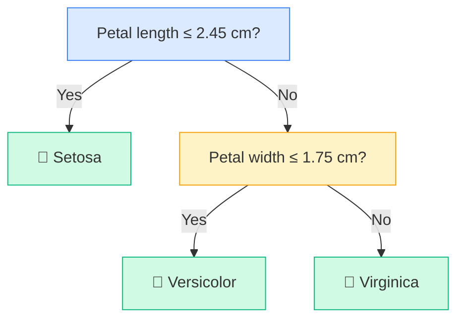

# Decision Trees

You know how a doctor checks you for the flu? First they ask: "Do you have a fever?" If yes: "Do you have body aches?" If yes: "Did your symptoms start suddenly?" Each question narrows things down until there is a confident answer. A Decision Tree is a computer model that does exactly this, but it learns which questions to ask from data instead of a medical textbook.

---

## What is a Decision Tree?

A Decision Tree is a model that makes predictions by asking a series of yes/no questions about the input. At each step, it follows one branch based on the answer, until it reaches a final prediction.

The clever part is that the model figures out which questions to ask on its own. You show it your training data (which means the examples with known answers), and it works out the questions that best separate the different categories. No human has to write the rules.

**New word: node.** In a Decision Tree, a "node" is one question. The top question is called the root. The final answers at the very bottom are called leaves.

---

## A simple way to think about it

Imagine you are playing a guessing game where your friend thinks of an animal and you have to figure out which one by asking yes/no questions. A smart player does not ask random questions. They ask questions that cut the possibilities in half each time.

"Does it have four legs?" "Yes." "Does it live in water?" "No." "Does it eat meat?" "Yes." You reach "lion" after just three questions.

A Decision Tree works the same way. It scans all the information it has and picks the question that best divides the examples at each step. It keeps asking questions until the answer is clear. The tree it builds is like the record of all those questions and branches.

---

## How it works, step by step

1. The algorithm looks at every piece of information (every feature) in your training data
2. It tries every possible way to split the data and finds the split that creates the most separated groups
3. It uses that split as the first question (the root of the tree)
4. It then repeats steps 1 and 2 separately for each branch created by that question
5. It keeps splitting until each group contains mostly one category, or until it hits a limit you set
6. For a new example, it simply follows the questions from the top until it reaches a leaf and reads off the prediction

---

## See it visually



This is a real Decision Tree trained on iris flower data. It only needs two questions to classify all three flower species. A new flower enters at the top, answers each question, and follows the branches until it reaches a leaf with the species name.

---

## The maths (do not panic)

Here is the formula the algorithm uses to pick the best question at each step. We will break down every part.

$$G = 1 - \sum_{k=1}^{K} p_k^2$$

> **In plain English:** This formula measures how mixed up a group is. If all examples in the group belong to the same category, the score is 0 (perfectly pure). If the categories are evenly mixed, the score is highest. The algorithm always picks the question that leads to the least-mixed groups. This score is called the Gini Impurity score.

<details>
<summary>Show more detail</summary>

When the algorithm considers splitting a group of examples into a left group and a right group, it calculates the combined impurity of both groups:

$$G_{\text{split}} = \frac{n_L}{n} G_L + \frac{n_R}{n} G_R$$

Here, $n_L$ is the number of examples going left and $n_R$ is the number going right. The algorithm calculates this for every possible feature and every possible dividing value (for example, "petal length less than 1.5?" or "petal length less than 2.0?"), and picks the combination that gives the lowest score.

There is another method called **Information Gain**, based on a different formula called entropy:

$$H = -\sum_{k=1}^{K} p_k \log_2 p_k$$

Entropy also measures how mixed a group is, just with a different calculation. Both methods produce very similar trees in practice. The default in most tools, including the one you will use in the code below, is Gini Impurity.

</details>

---

## Run the code yourself

This code will train a Decision Tree on the iris flower dataset and tell you its accuracy, how deep the tree grew, and how many leaves it has.

**Step 1:** Open [Google Colab](https://colab.research.google.com) and create a new notebook. (Or use Jupyter if you followed the [Get Started guide](setup).)

**Step 2:** Copy this code into a cell:

```python
from sklearn.datasets import load_iris                    # loads the iris flower dataset
from sklearn.tree import DecisionTreeClassifier           # the Decision Tree model
from sklearn.model_selection import train_test_split      # splits data into training and test sets
from sklearn.metrics import accuracy_score                # measures how often we are right

data = load_iris()                                        # load the 150-flower dataset

# Split data: 80% is used for training, 20% is kept hidden for testing
X_train, X_test, y_train, y_test = train_test_split(
    data.data, data.target, test_size=0.2, random_state=42
)

# Create the tree with a maximum depth of 3 questions
# Without a limit, the tree would memorise the training data and perform worse on new examples
model = DecisionTreeClassifier(max_depth=3, random_state=42)
model.fit(X_train, y_train)                               # build the tree from training data

predictions = model.predict(X_test)                       # run each test flower through the tree
print(f"Accuracy: {accuracy_score(y_test, predictions) * 100:.1f}%")
print(f"Tree depth: {model.get_depth()}")                 # how many questions deep is the tree?
print(f"Number of leaves: {model.get_n_leaves()}")        # how many final answer points does it have?
```

**Step 3:** Press **Shift + Enter** to run it.

You should see:
```
Accuracy: 100.0%
Tree depth: 3
Number of leaves: 4
```

**What each line does:**
- `DecisionTreeClassifier(max_depth=3)`: creates a tree that is allowed to ask at most 3 questions before giving an answer
- `model.fit(X_train, y_train)`: builds the tree by finding the best questions to ask
- `model.predict(X_test)`: sends each test flower down through the tree and returns the answer at the leaf
- `model.get_depth()`: tells you how many levels deep the final tree is
- `model.get_n_leaves()`: tells you how many final answer points the tree has

**What just happened?**

The model learned just three yes/no questions that perfectly separate all three iris flower species. You can actually look at the diagram above and follow the same logic your model used. Try removing `max_depth=3` and see how deep the tree grows on its own. Notice whether the accuracy on the test set goes up or down. Usually, a tree that grows without limits gets worse on test data because it memorises the training examples instead of learning the real pattern.

---

## Quick recap

- A Decision Tree learns a sequence of yes/no questions from your data and uses them to make predictions
- It is one of the few models you can read like a flowchart and explain to anyone
- Without a depth limit, a tree will memorise training data instead of learning the underlying pattern
- In practice, Decision Trees are rarely used alone. They are the building block for Random Forests and Gradient Boosting
- Always set `max_depth` or another limit to stop the tree from growing too large

---

[← Logistic Regression](logistic-regression){: .btn } [Next → Random Forests](random-forest){: .btn .btn-primary }
