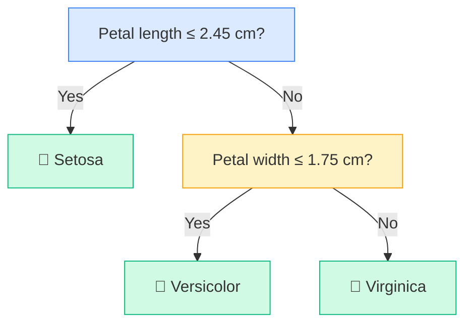

# Decision Trees

## What is it?

A Decision Tree is a machine learning model that makes predictions by asking a sequence of yes/no questions about the input. At each step it splits the data based on the answer, following one branch or the other, until it reaches a final prediction. It learns which questions to ask — and in what order — directly from your training data. The result is a model you can read like a flowchart and explain to anyone, which makes it one of the most interpretable algorithms in all of ML.

---

## The Idea

Imagine you're a doctor trying to decide whether a patient has the flu. You might ask: Do they have a fever? If yes, do they have body aches? If yes, do symptoms come on suddenly? Each question narrows things down until you reach a confident answer. A Decision Tree does exactly this — but instead of a doctor's intuition, it uses mathematics to find the questions that divide your data most cleanly at each step.

The tree is built from the top down. At the root, it searches every possible feature and every possible split point to find the question that separates the classes best. It then recurses on each branch, splitting again and again, until the data at each leaf is mostly one class (or it hits a depth limit you've set). When a new example arrives, it just travels down the tree answering questions until it hits a leaf — that leaf's majority class is the prediction.

---

## Visual



---

## The Math

At each node, the tree picks the split that minimises **Gini Impurity** — a measure of how mixed the classes are in a group.

$$G = 1 - \sum_{k=1}^{K} p_k^2$$

where $p_k$ is the fraction of examples in class $k$ at that node.

> **In plain English:** Gini Impurity is zero when every example in a node belongs to the same class (a perfect split), and highest when the classes are evenly mixed. The tree always picks the split that produces the lowest weighted average Gini across the two child nodes.

<details>
<summary>Show the derivation</summary>

When evaluating a candidate split that divides $n$ examples into a left group of $n_L$ and a right group of $n_R$:

$$G_{\text{split}} = \frac{n_L}{n} G_L + \frac{n_R}{n} G_R$$

The tree computes this for every feature and every possible threshold, then picks the $(feature, threshold)$ pair that minimises $G_{\text{split}}$.

An alternative to Gini is **Information Gain**, based on entropy:

$$H = -\sum_{k=1}^{K} p_k \log_2 p_k$$

Entropy reaches zero for a pure node and $\log_2 K$ for a uniformly mixed node. Information gain is the drop in entropy after a split. Both criteria produce similar trees in practice; scikit-learn uses Gini by default.

</details>

---

## How It Learns

Building a Decision Tree is a greedy process. Starting at the root, the algorithm scans every feature and every possible split threshold, computes the weighted Gini impurity for each, and picks the best one. It then repeats this independently for the left and right branches. The tree keeps growing until every leaf is pure, or until a stopping condition is met — most commonly a maximum depth. A fully grown tree will memorise the training data perfectly but generalise badly to new examples (this is called overfitting). Setting `max_depth` limits this by stopping splits early, which sacrifices some training accuracy in exchange for much better performance on unseen data.

---

## When to Use It

Decision Trees are a natural fit when your problem has a rule-based flavour — when you can imagine a human expert writing down a decision flowchart. They handle both numerical and categorical features without any preprocessing, and they're easy to explain to a non-technical audience. The main weakness is overfitting: a single tree trained without depth limits will often perform worse on test data than on training data. If you need more predictive power, the solution is usually to move to Random Forest or Gradient Boosting, both of which build on Decision Trees but correct for this instability by combining many trees together.

---

## Try It Yourself

```python
from sklearn.datasets import load_iris
from sklearn.tree import DecisionTreeClassifier
from sklearn.model_selection import train_test_split
from sklearn.metrics import accuracy_score

data = load_iris()
X_train, X_test, y_train, y_test = train_test_split(
    data.data, data.target, test_size=0.2, random_state=42
)

model = DecisionTreeClassifier(max_depth=3, random_state=42)
model.fit(X_train, y_train)

predictions = model.predict(X_test)
print(f"Accuracy: {accuracy_score(y_test, predictions) * 100:.1f}%")
print(f"Tree depth: {model.get_depth()}")
print(f"Number of leaves: {model.get_n_leaves()}")
```

Expected output:
```
Accuracy: 100.0%
Tree depth: 3
Number of leaves: 4
```

---

## Key Takeaways

A Decision Tree learns a sequence of yes/no questions from your data and uses them to reach predictions. It's one of the few models you can visualise and explain completely — you can trace every prediction back to the exact questions that led there. The trade-off is overfitting: without a depth limit, a tree will memorise training data rather than learning the underlying pattern. In practice, Decision Trees are rarely used alone — they're the foundation for two of the most powerful ML algorithms in existence, Random Forest and Gradient Boosting, which you'll meet next.

---

[← Logistic Regression](logistic-regression){: .btn } [Next → Random Forests](random-forest){: .btn .btn-primary }
