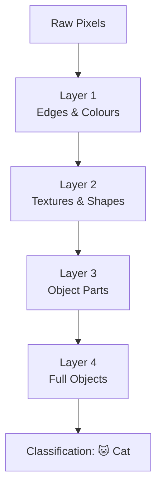

# What is Deep Learning?

Your phone can unlock with your face. Google Translate understands sentences. Spotify knows what song you want to hear next. All of these features were built using the same idea: deep learning.

---

## What is Deep Learning?

Deep learning is a type of machine learning that uses neural networks with many layers, not just one or two. The word "deep" refers to the depth of layers, not any philosophical meaning.

Each layer transforms the data it receives and passes the result to the next layer. By the time data has passed through many layers, the network has built up a rich, multi-level understanding of the input.

**New word: representation** is just the way data is described at a given layer. Raw pixels are one representation. A list of detected edges is another. A description of shapes is another. Each layer converts one representation into a better one.

---

## A simple way to think about it

Imagine trying to identify a face in a crowd. You do not process the whole photo at once.

Your brain first notices light and dark patches (very basic). Then edges and lines. Then features like eyes and a nose. Then how those features fit together into a face. Then who the face belongs to.

A deep neural network does exactly the same thing, layer by layer. You never told it to look for edges. It learned that looking for edges is useful, because edges help identify shapes, which help identify faces. This automatic discovery of useful steps is called **hierarchical representation learning**, and it is the core insight behind deep learning.

No human writes the rules. The network invents them by learning from millions of examples.

---

## How it works, step by step

1. Raw data enters the first layer: pixels, sound waves, words, or numbers.
2. The first layer finds very simple patterns: edges in an image, sounds in audio, word patterns in text.
3. Each deeper layer combines the patterns from the layer below into more complex patterns.
4. The final layers make the actual decision: "cat", "spam", "buy", "translate to French".
5. The network is trained by showing it millions of labelled examples and adjusting every connection each time it makes a mistake.

---

## See it visually



Each box in the diagram is a layer. Data flows from top to bottom, becoming more abstract and meaningful at each step. The bottom layers see pixels. The top layers see concepts.

---

## The maths (do not panic)

Here is what the full chain of layers looks like as a formula:

$$\mathbf{a}^{(L)} = f_L(\mathbf{W}^{(L)} f_{L-1}(\cdots f_1(\mathbf{W}^{(1)}\mathbf{x} + \mathbf{b}^{(1)}) \cdots) + \mathbf{b}^{(L)})$$

> **In plain English:** The output of the whole network is just a long chain of "multiply by weights, add a bias, apply an activation function," repeated once for every layer. It looks complicated, but each individual step is simple. The depth of the chain, how many times it repeats, is what gives the network its power.

<details>
<summary>Show more detail</summary>

One challenge that arises with very deep networks is called the vanishing gradient problem. When the network is adjusting its weights after making a mistake, it has to send an error signal backwards through every layer. If the activation function used to be sigmoid (which squashes all values to between 0 and 1), the error signal got a little smaller at every layer. By the time it reached the early layers, it was so tiny that the weights there barely changed.

The modern solution is to use ReLU as the activation function. ReLU simply passes positive values through unchanged, so the error signal stays full size as it travels back. Techniques like batch normalisation (which keeps values in a useful range at each layer) and residual connections (which add a shortcut that lets the error signal skip layers entirely) allow networks to be trained even when they are hundreds of layers deep.

</details>

---

## Run the code yourself

This code builds and trains a small deep network using PyTorch, a popular deep learning library. It learns to classify handwritten digit images. You will need PyTorch installed: in Colab, run `!pip install torch torchvision` in a cell first.

**Step 1:** Open [Google Colab](https://colab.research.google.com) and create a new notebook.

**Step 2:** Copy this code into a cell:

```python
import torch                                        # PyTorch: the deep learning library
import torch.nn as nn                              # tools for building neural networks
import torch.optim as optim                        # tools for updating weights
from torchvision import datasets, transforms       # image datasets and rescaling tools
from torch.utils.data import DataLoader            # groups examples into batches

# Define a small deep network for MNIST (28x28 pixel images of digits 0-9)
class DeepNet(nn.Module):
    def __init__(self):
        super().__init__()
        self.net = nn.Sequential(
            nn.Flatten(),                           # convert 28x28 image into 784 numbers
            nn.Linear(784, 256), nn.ReLU(), nn.BatchNorm1d(256),  # layer 1: 784 inputs, 256 outputs
            nn.Linear(256, 128), nn.ReLU(), nn.BatchNorm1d(128),  # layer 2: 256 inputs, 128 outputs
            nn.Linear(128,  64), nn.ReLU(),         # layer 3: 128 inputs, 64 outputs
            nn.Linear( 64,  10)                     # output layer: 64 inputs, 10 class scores
        )
    def forward(self, x):
        return self.net(x)   # pass input through all layers in sequence

# Load the MNIST dataset and rescale pixel values to a small range
transform = transforms.Compose([transforms.ToTensor(),
                                 transforms.Normalize((0.1307,), (0.3081,))])
train_loader = DataLoader(datasets.MNIST('.', train=True,  download=True, transform=transform), batch_size=256, shuffle=True)
test_loader  = DataLoader(datasets.MNIST('.', train=False, download=True, transform=transform), batch_size=1000)

model     = DeepNet()                               # create the network
optimizer = optim.Adam(model.parameters(), lr=1e-3) # Adam: a smart way to adjust the learning speed
criterion = nn.CrossEntropyLoss()                   # measures how wrong the predictions are

# Train for 3 passes through the dataset (called epochs)
for epoch in range(1, 4):
    model.train()
    for X, y in train_loader:
        optimizer.zero_grad()                       # clear old error signals
        loss = criterion(model(X), y)              # forward pass: how wrong are we?
        loss.backward()                             # backward pass: figure out who is to blame
        optimizer.step()                            # nudge every weight in the right direction

    # Test on images the network has never seen
    model.eval()
    correct = 0
    with torch.no_grad():                           # no need to track errors during testing
        for X, y in test_loader:
            correct += (model(X).argmax(1) == y).sum().item()
    print(f"Epoch {epoch}  Test accuracy: {correct / 100:.2f}%")
```

**Step 3:** Press **Shift + Enter** to run it.

You should see:
```
Epoch 1  Test accuracy: 97.52%
Epoch 2  Test accuracy: 97.89%
Epoch 3  Test accuracy: 98.21%
```

**What each line does:**
- `nn.Sequential(...)`: chains all the layers together so input flows through them in order
- `nn.Flatten()`: converts the 28x28 pixel grid into a flat list of 784 numbers
- `nn.BatchNorm1d(256)`: keeps values at a healthy scale between layers so training stays stable
- `optimizer.zero_grad()`: clears the error signals from the last batch so they do not pile up
- `loss.backward()`: calculates how much each weight contributed to the error
- `optimizer.step()`: nudges every weight by a small amount to reduce the error

**What just happened?**

The network improved with every pass through the training data. It started at 97.5% accuracy and reached 98.2% by the third pass. Each pass it saw every training image once and adjusted its weights a little. Three passes through 60,000 images is 180,000 small adjustments. That is deep learning in action.

---

## Quick recap

- Deep learning uses neural networks with many layers, each one learning more complex patterns than the one before.
- Nobody writes the rules. The network discovers what patterns are useful by learning from millions of labelled examples.
- The word "deep" just means many layers, typically more than two or three.
- Deep learning works best when the input is complex and unstructured: images, audio, or text. For spreadsheet-style data, simpler methods often work just as well.
- Transfer learning means you can often start from a network that has already learned general patterns on a large dataset, then fine-tune it for your specific task.

---

[← Multi-Layer Perceptron](mlp){: .btn } [Next → Convolutional Neural Networks](cnn){: .btn .btn-primary }
