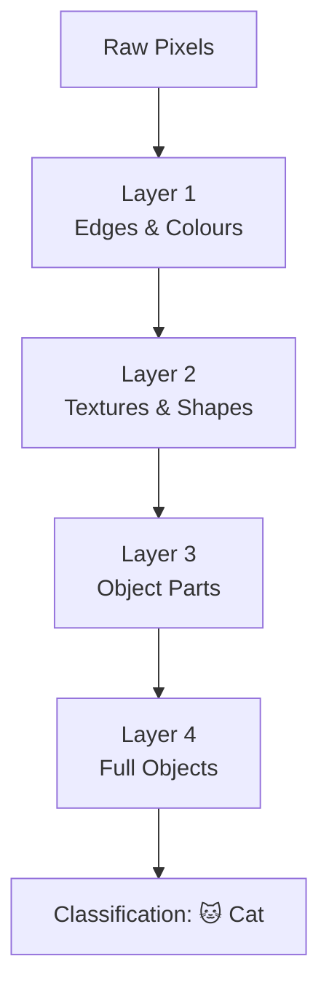

# What is Deep Learning?

## What is it?

Deep learning is machine learning with neural networks that have many layers, deep enough that each layer learns increasingly abstract representations of the input. Rather than hand-engineering features, the network discovers useful representations on its own directly from raw data. It's what powers image recognition, language models, speech synthesis, and most modern AI systems.

## The Idea

A shallow neural network with one hidden layer can theoretically approximate any function, but in practice it needs an impractically large layer to do so for complex data. Deep networks use a different strategy: instead of building one very wide layer, they stack many thinner layers. Each layer transforms the representation produced by the layer below it, learning to extract progressively higher-level features.

In a CNN processing an image, the first layers might detect edges and colour patches. The next layers combine those into textures and simple shapes. Deeper still, the network recognises eyes, wheels, or fur. The final layers combine these object parts into full classifications. No one told the network to look for edges. It learned that representation because it was useful for minimising the loss.

This hierarchical representation learning is the core insight of deep learning. The features that intermediate layers discover are not engineered by a human. They're the features that the training data itself suggests are useful. This is why deep learning works so well on domains like images, audio, and text, where the right feature representation is far from obvious.

## Visual



## The Math

$$\mathbf{a}^{(L)} = f_L(\mathbf{W}^{(L)} f_{L-1}(\cdots f_1(\mathbf{W}^{(1)}\mathbf{x} + \mathbf{b}^{(1)}) \cdots) + \mathbf{b}^{(L)})$$

> **In plain English:** The output of a deep network is a long chain of transformations. Each layer takes the previous layer's output, applies a linear transformation, and passes it through an activation function. The depth of this chain is what gives the network its expressive power.

<details><summary>Show the derivation</summary>

The vanishing gradient problem: for deep networks with sigmoid activations, $\partial\mathcal{L}/\partial\mathbf{W}^{(1)}$ involves a product of many Jacobians, each with entries $\leq 0.25$ for sigmoid. The product shrinks exponentially with depth. ReLU avoids this because its derivative is 1 (for positive inputs) rather than a fraction. Batch normalisation, residual connections (ResNets), and careful weight initialisation are additional tools that allow training to remain stable at 100+ layers.

</details>

## How It Learns

Deep networks are trained with the same backpropagation and gradient descent loop as shallow networks, but at a much larger scale. The key practical ingredients are GPU acceleration for parallel matrix multiplications, mini-batch gradient descent with Adam or SGD with momentum, regularisation techniques such as dropout, weight decay, and batch normalisation, and large labelled datasets.

Transfer learning is often used to offset the data requirements. A model pre-trained on a large dataset, like ImageNet for vision or a massive text corpus for language, has already learned general-purpose features. Fine-tuning such a model on a smaller task-specific dataset is far more efficient than training from scratch, and it's the reason that state-of-the-art performance is accessible even to practitioners without vast computational resources.

## When to Use It

Deep learning excels when data is rich and unstructured: images, audio, video, text, and sequences. It tends to underperform classical ML methods such as gradient boosting on structured tabular data unless the dataset is very large. The cost is real. Deep models require more data, more compute, and more hyperparameter tuning than classical methods.

When a Random Forest or Gradient Boosting model performs adequately, it's usually the better choice. Deep learning is not a universal upgrade. It's a specialised tool that pays off when the data is complex, the quantity is large, and the features that matter are not obvious enough to engineer by hand.

## Try It Yourself

If you have not set up Python yet, start with the [Get Started guide](../setup) first.

This code trains a small deep network on MNIST handwritten digits using PyTorch. You'll need PyTorch installed: `pip install torch torchvision`.

Copy this into a cell and run it with Shift + Enter:

```python
import torch                                        # PyTorch deep learning library
import torch.nn as nn                              # neural network building blocks
import torch.optim as optim                        # optimisers like Adam
from torchvision import datasets, transforms       # image datasets and transforms
from torch.utils.data import DataLoader            # batches data for training

# A small deep network for MNIST (28x28 grayscale images, 10 digit classes)
class DeepNet(nn.Module):
    def __init__(self):
        super().__init__()
        self.net = nn.Sequential(
            nn.Flatten(),                           # convert 28x28 image to 784 numbers
            nn.Linear(784, 256), nn.ReLU(), nn.BatchNorm1d(256),  # layer 1
            nn.Linear(256, 128), nn.ReLU(), nn.BatchNorm1d(128),  # layer 2
            nn.Linear(128,  64), nn.ReLU(),         # layer 3
            nn.Linear( 64,  10)                     # output: 10 digit classes
        )
    def forward(self, x):
        return self.net(x)

# Load MNIST data and normalise pixel values
transform = transforms.Compose([transforms.ToTensor(),
                                 transforms.Normalize((0.1307,), (0.3081,))])
train_loader = DataLoader(datasets.MNIST('.', train=True,  download=True, transform=transform), batch_size=256, shuffle=True)
test_loader  = DataLoader(datasets.MNIST('.', train=False, download=True, transform=transform), batch_size=1000)

model     = DeepNet()                               # create the network
optimizer = optim.Adam(model.parameters(), lr=1e-3) # Adam adjusts learning rate automatically
criterion = nn.CrossEntropyLoss()                   # loss function for multi-class classification

for epoch in range(1, 4):                           # train for 3 epochs
    model.train()
    for X, y in train_loader:
        optimizer.zero_grad()                       # reset gradients from last batch
        loss = criterion(model(X), y)              # forward pass: compute loss
        loss.backward()                             # backward pass: compute gradients
        optimizer.step()                            # update weights

    # Evaluate on test data
    model.eval()
    correct = 0
    with torch.no_grad():                           # no gradients needed for evaluation
        for X, y in test_loader:
            correct += (model(X).argmax(1) == y).sum().item()
    print(f"Epoch {epoch}  Test accuracy: {correct / 100:.2f}%")
```

Expected output (approximate):
```
Epoch 1  Test accuracy: 97.52%
Epoch 2  Test accuracy: 97.89%
Epoch 3  Test accuracy: 98.21%
```

**What each line does:**
- `nn.Sequential(...)`: chains the layers together so data flows through them in order
- `nn.BatchNorm1d(256)`: normalises activations between layers, which stabilises deep training
- `optimizer.zero_grad()`: clears old gradients before computing new ones
- `loss.backward()`: runs backpropagation to compute gradients for all weights
- `optimizer.step()`: updates every weight by a small step in the gradient direction

**What just happened?**

The network got better with every epoch. It started at 97.5% accuracy and reached 98.2% by epoch 3. Each epoch it saw every training image once and adjusted its weights a little. That's deep learning: many layers, many examples, many small adjustments.

## Key Takeaways

- Deep learning trains neural networks with many layers, allowing hierarchical representation learning without hand-engineered features.
- Each layer discovers and builds on abstractions learned by the layer below. That's the core insight.
- ReLU activations, batch normalisation, and residual connections make training stable at 100+ layers.
- Deep learning is not always the right tool, but when the data is complex and large, it's extraordinarily capable.
- Transfer learning means you often don't need to train from scratch. Fine-tune a pretrained model instead.

---

[← Multi-Layer Perceptron](mlp){: .btn } [Next → Convolutional Neural Networks](cnn){: .btn .btn-primary }
