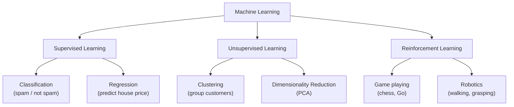

# ML Foundations

> Before running any code here, check the [Get Started guide](setup) to make sure your environment is ready.

## What is it?

Machine learning splits into three broad approaches that cover almost every problem you'll encounter. Supervised learning trains a model on labelled examples, meaning pairs of inputs and correct answers, so it can predict outputs for new inputs. Unsupervised learning finds hidden structure in data that has no labels, grouping or compressing it without being told what to look for. Reinforcement learning places an agent in an environment where it learns through trial, error, and reward signals, the same way a game-playing program masters chess by playing millions of games.

## The Idea

Think of supervised learning as a student working through a marked textbook. Every practice problem comes with the correct answer at the back. The student checks their work, notices where they go wrong, and adjusts. Over time they get better at solving problems they've never seen before. A supervised model does the same thing: it receives thousands of labelled examples and gradually learns to map inputs to outputs.

Unsupervised learning is more like arriving in a foreign city with no map. You wander around and start noticing patterns. There's a neighbourhood that smells of bread. Another that's full of art galleries. You build a mental map from your own observations. The algorithm does exactly this: it looks at raw, unlabelled data and discovers clusters and groupings without anyone telling it what categories to find.

Reinforcement learning is closest to how animals learn. Imagine training a dog. It performs an action, you give it a treat if it did the right thing, and it gradually learns which behaviours earn rewards. An RL agent does the same. It takes actions in an environment, receives numerical rewards or penalties, and slowly refines its strategy to maximise what it earns over time. That's how programs learn to play Go at superhuman levels and how robots learn to walk.

## Visual



## The Math

The maths lives inside each specific algorithm. This tutorial is about the big picture. You'll see equations starting with Linear Regression in the next tutorial.

## How It Learns

Each approach shares a common theme: define an objective, then adjust the model's parameters to improve it. In supervised learning, the model measures the gap between its predictions and the correct labels, then nudges its parameters to close that gap a little more with every example it sees. In unsupervised learning, the objective might be making clusters as tight and well-separated as possible. In reinforcement learning, the objective is long-term cumulative reward. Three approaches, three different objectives, but the same underlying logic: measure how well you're doing and keep improving.

## When to Use It

Reach for supervised learning whenever you have a clear prediction task and labelled examples to learn from. Spam detection, price prediction, and image classification all fall here. If your data has no labels and you want to explore its structure or reduce its dimensionality before feeding it to another model, unsupervised learning is the right tool. Reinforcement learning is best saved for sequential decision-making problems where the right action now depends on what you want to happen many steps later, like game playing or robot control.

## Try It Yourself

If you have not set up Python yet, start with the [Get Started guide](setup) first.

This code shows both supervised and unsupervised learning side by side. The first half trains a model to predict a number. The second half groups data into clusters without any labels at all.

Copy this into a cell and run it with Shift + Enter:

```python
from sklearn.linear_model import LinearRegression  # supervised model
from sklearn.cluster import KMeans                 # unsupervised model
from sklearn.datasets import load_iris             # a classic dataset
import numpy as np                                 # number arrays

# --- Supervised: predict a continuous value ---
X_train = np.array([[1], [2], [3], [4], [5]])   # input: 5 data points
y_train = np.array([2.1, 3.9, 6.2, 7.8, 10.1]) # output: the correct answers

model = LinearRegression()          # create the model
model.fit(X_train, y_train)         # train it on the labelled data
print("Supervised prediction for x=6:", round(model.predict([[6]])[0], 2))

# --- Unsupervised: cluster without labels ---
iris = load_iris()
X_iris = iris.data   # features only, no labels used

kmeans = KMeans(n_clusters=3, random_state=42, n_init="auto")  # ask for 3 groups
kmeans.fit(X_iris)                                              # find the groups
print("Cluster labels (first 10):", kmeans.labels_[:10])       # show which group each point got
```

Expected output:
```
Supervised prediction for x=6: 11.96
Cluster labels (first 10): [1 1 1 1 1 1 1 1 1 1]
```

**What each line does:**
- `LinearRegression()`: creates a model that fits a straight line through data
- `model.fit(X_train, y_train)`: trains the model using the labelled examples
- `model.predict([[6]])`: asks the trained model for its prediction at x=6
- `KMeans(n_clusters=3)`: creates a clustering model that will find 3 groups
- `kmeans.fit(X_iris)`: groups the iris data without using any labels
- `kmeans.labels_[:10]`: shows which cluster each of the first 10 points ended up in

**What just happened?**

The first half trained a supervised model: it learned the relationship between x and y from five examples, then predicted a new value. The second half did something different entirely. It found three natural groupings in the iris data without ever being told the species names. That's the difference between supervised and unsupervised learning in action.

## Key Takeaways

- Supervised learning uses labelled data to predict outputs. It's the most common type in practice.
- Unsupervised learning finds structure in unlabelled data, useful for clustering and compression.
- Reinforcement learning learns through trial and reward, great for games and robotics.
- Choosing the right approach is the first and most important step in any ML project.
- Most tutorials in this series focus on supervised learning, with detours into K-Means and PCA.

[← What is ML?](what-is-ml){: .btn } [Next → Linear Regression](linear-regression){: .btn .btn-primary }
