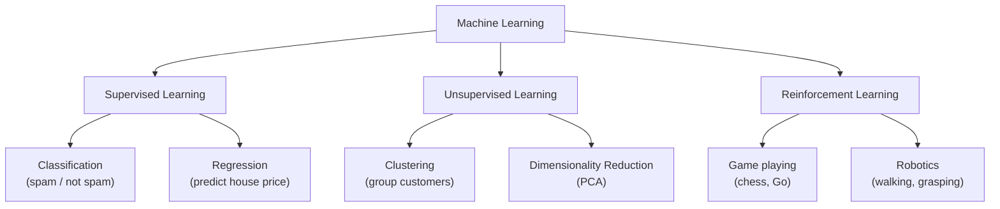

# ML Foundations

## What is it?

Machine learning splits into three broad paradigms that cover almost every problem you'll encounter. Supervised learning trains a model on labelled examples — pairs of inputs and correct answers — so it can predict outputs for new inputs. Unsupervised learning finds hidden structure in data that comes without labels, grouping or compressing it without being told what to look for. Reinforcement learning places an agent in an environment where it learns through trial, error, and reward signals, the same way a game-playing program masters chess by playing millions of games.

## The Idea

Think of supervised learning as a student working through a marked textbook. Every practice problem comes with the correct answer printed at the back. The student checks their work, notices where they go wrong, and adjusts their approach. Over time they get better at solving problems they've never seen before. In the same way, a supervised model receives thousands of labelled examples — emails tagged spam or not spam, house prices paired with their features — and gradually learns to map inputs to outputs.

Unsupervised learning is more like arriving in a foreign city with no map and no guide. You wander the streets, start noticing patterns — there's a neighbourhood that smells of bread, another that's full of art galleries — and you build a mental map entirely from your own observations. The algorithm does the same: it looks at raw, unlabelled data and discovers clusters, groupings, or compressed representations without anyone telling it what categories to find.

Reinforcement learning is closest to how animals learn. Imagine training a dog: it performs an action, you give it a treat if it did the right thing, and it gradually learns which behaviours earn rewards. An RL agent does exactly this — it takes actions in an environment, receives numerical rewards or penalties, and slowly refines its strategy to maximise the total reward it collects over time. This is how programs learn to play Go at superhuman levels and how robots learn to walk.

## Visual



## The Math

The maths lives inside each specific algorithm — this tutorial is about the big picture. You'll see equations starting with Linear Regression in the next tutorial.

## How It Learns

Each paradigm shares a common theme: define an objective, then adjust the model's parameters to improve it. In supervised learning the model measures the gap between its predictions and the correct labels, then nudges its parameters to close that gap a little more with every example it sees. In unsupervised learning the objective might be making clusters as tight and well-separated as possible, or compressing data while preserving as much information as possible. In reinforcement learning the objective is long-term cumulative reward — the agent doesn't just optimise for the next step but for the entire sequence of decisions ahead. Three paradigms, three different objectives, but the same underlying logic: measure how well you're doing and keep improving.

## When to Use It

Reach for supervised learning whenever you have a clear prediction task and a dataset of labelled examples to learn from — spam detection, price prediction, image classification all fall here. If your data has no labels and you want to explore its structure, understand natural groupings, or reduce its dimensionality before feeding it to another model, unsupervised learning is the right tool. Reinforcement learning is best saved for sequential decision-making problems where the right action now depends on what you want to happen many steps later, and where you can simulate or observe the consequences of actions — game playing, robot control, and recommendation systems that adapt over time all fit this mould.

## Try It Yourself

```python
from sklearn.linear_model import LinearRegression
from sklearn.cluster import KMeans
from sklearn.datasets import load_iris
import numpy as np

# --- Supervised: predict a continuous value ---
X_train = np.array([[1], [2], [3], [4], [5]])
y_train = np.array([2.1, 3.9, 6.2, 7.8, 10.1])

model = LinearRegression()
model.fit(X_train, y_train)
print("Supervised prediction for x=6:", round(model.predict([[6]])[0], 2))

# --- Unsupervised: cluster without labels ---
iris = load_iris()
X_iris = iris.data  # features only — no labels used

kmeans = KMeans(n_clusters=3, random_state=42, n_init="auto")
kmeans.fit(X_iris)
print("Cluster labels (first 10):", kmeans.labels_[:10])
```

Expected output:
```
Supervised prediction for x=6: 11.96
Cluster labels (first 10): [1 1 1 1 1 1 1 1 1 1]
```

## Key Takeaways

Three paradigms — supervised, unsupervised, and reinforcement — cover the vast majority of machine learning problems you'll ever encounter. Supervised learning is by far the most common in practice, and it's the focus of most tutorials in this series. You'll also dip into unsupervised territory when we cover K-Means and PCA. Understanding which paradigm fits your problem is genuinely the first and most important step in any ML project — it shapes the data you need, the model you choose, and how you measure success.

[← What is ML?](what-is-ml){: .btn } [Next → Linear Regression](linear-regression){: .btn .btn-primary }
