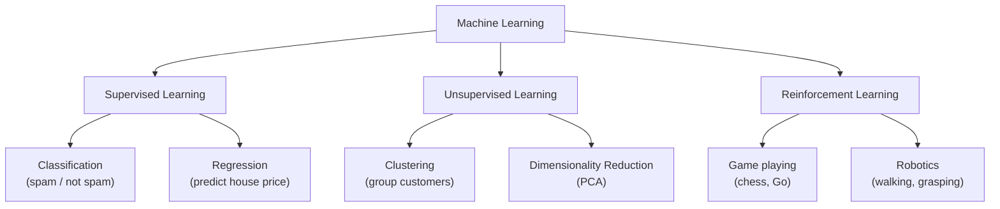

# ML Foundations

> Before running any code here, check the [Get Started guide](setup) to make sure your environment is ready.

Have you ever used a music app that suggested a song you had never heard, and it turned out to be perfect? Or noticed that Google Photos can group pictures of the same person together? These two things are done by completely different types of machine learning, and this tutorial explains the difference.

---

## What is ML Foundations?

Machine learning has three main flavours, and almost every problem you will ever encounter fits into one of them.

The first is called **supervised learning** (which means "learning with a teacher"). You give the computer thousands of examples that already have the right answer attached. The computer studies them and learns to predict the right answer for new examples.

The second is called **unsupervised learning** (which means "learning without a teacher"). You give the computer data but no answers. It looks for patterns and groupings on its own.

The third is called **reinforcement learning** (which means "learning by trial and reward"). The computer tries things, gets a score for how well it did, and gradually figures out the best strategy. This is how computers learn to play video games.

---

## A simple way to think about it

Think of supervised learning like a student doing practice exam papers. Every question comes with the correct answer at the back. The student checks their work, sees where they went wrong, and gets better over time. A supervised model does the same: it studies thousands of labelled examples and gradually learns to get them right.

Unsupervised learning is like arriving in a new city with no map. You walk around and start noticing things. One area smells of fresh bread. Another is full of bookshops. You build a mental map just from your own observations. The algorithm does exactly this: it looks at raw data and discovers groupings without anyone telling it what the groups should be.

Reinforcement learning is like training a dog. The dog tries an action. You give it a treat if it did the right thing. Over time the dog learns which actions earn treats. A reinforcement learning program does the same, except the "treats" are points or scores in a computer environment.

---

## How it works, step by step

1. Decide which type of learning fits your problem: do you have labelled examples, unlabelled data, or a reward signal?
2. Collect your data in the right format for your chosen approach
3. Pick a model that suits your approach (a classifier for supervised learning, a clustering tool for unsupervised, etc.)
4. Train the model on your data
5. Test how well it performs on examples it has not seen before

---

## See it visually



This diagram shows the three types of machine learning and an example of what each type is used for. Most tutorials in this series focus on supervised learning, because it is the most common type in real-world applications.

---

## The maths (do not panic)

The maths lives inside each specific algorithm. This tutorial is about the big picture. You will see equations starting with the Linear Regression tutorial.

---

## Run the code yourself

This code shows both supervised and unsupervised learning side by side. The first half trains a model to predict a number from labelled examples. The second half groups data into clusters without using any labels at all.

**Step 1:** Open [Google Colab](https://colab.research.google.com) and create a new notebook. (Or use Jupyter if you followed the [Get Started guide](setup).)

**Step 2:** Copy this code into a cell:

```python
from sklearn.linear_model import LinearRegression  # a supervised model that fits a line
from sklearn.cluster import KMeans                 # an unsupervised model that finds groups
from sklearn.datasets import load_iris             # a classic flower dataset we will use
import numpy as np                                 # a tool for working with lists of numbers

# --- Part 1: Supervised learning: predict a number from labelled examples ---
X_train = np.array([[1], [2], [3], [4], [5]])    # input values: 5 data points
y_train = np.array([2.1, 3.9, 6.2, 7.8, 10.1])  # correct output for each input

model = LinearRegression()           # create a blank model
model.fit(X_train, y_train)          # train it by showing it the labelled examples
print("Supervised prediction for x=6:", round(model.predict([[6]])[0], 2))

# --- Part 2: Unsupervised learning: find groups with no labels ---
iris = load_iris()
X_iris = iris.data   # we only use the measurements here, not the species labels

kmeans = KMeans(n_clusters=3, random_state=42, n_init="auto")  # ask for 3 groups
kmeans.fit(X_iris)                                              # find the 3 groups on its own
print("Cluster labels (first 10):", kmeans.labels_[:10])       # show which group each flower got
```

**Step 3:** Press **Shift + Enter** to run it.

You should see:
```
Supervised prediction for x=6: 11.96
Cluster labels (first 10): [1 1 1 1 1 1 1 1 1 1]
```

**What each line does:**
- `LinearRegression()`: creates a model that will learn by fitting a straight line through the data
- `model.fit(X_train, y_train)`: trains the model using the labelled examples
- `model.predict([[6]])`: asks the trained model for its prediction at the new value 6
- `KMeans(n_clusters=3)`: creates a clustering model that will find 3 natural groups in the data
- `kmeans.fit(X_iris)`: groups the flower data without using any species labels at all
- `kmeans.labels_[:10]`: shows which group each of the first 10 flowers ended up in

**What just happened?**

The first half trained a supervised model. It learned the relationship between the input and output from five labelled examples, then predicted a new value it had never seen. The second half did something completely different. It found three natural groupings in the flower data without ever being told the species names. That is the difference between supervised and unsupervised learning in action.

---

## Quick recap

- Supervised learning uses labelled examples to predict outputs. It is the most common type in practice.
- Unsupervised learning finds patterns in data that has no labels. It is useful for grouping and exploration.
- Reinforcement learning learns through trial and reward. It is great for games and robotics.
- Choosing the right type of learning is the first and most important decision in any machine learning project.
- Most tutorials in this series focus on supervised learning, with some detours into unsupervised methods.

[← What is ML?](what-is-ml){: .btn } [Next → Linear Regression](linear-regression){: .btn .btn-primary }
