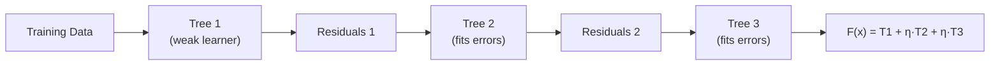

# Gradient Boosting

## What is it?

Gradient Boosting builds models sequentially — each new model is trained specifically to correct the errors made by the previous ones. The final prediction is the sum of all models' contributions, each scaled by a learning rate. It consistently produces some of the most accurate predictions on tabular data.

## The Idea

The clearest way to understand Gradient Boosting is to contrast it with Random Forest. In a Random Forest, hundreds of trees are trained independently on random subsets of the data, then their predictions are averaged. Gradient Boosting takes a completely different approach: trees are built one after another, and every new tree is built to fix the mistakes of the model so far.

Tree 1 makes its best guess at the target. Tree 2 is not trained on the original labels — it is trained on the residuals, the gap between tree 1's predictions and reality. Tree 3 is then trained on tree 2's residuals, and so on. Each individual tree is deliberately shallow, usually with just 3 to 8 leaves, making it a "weak learner." But when you stack dozens or hundreds of them additively, they compose into a remarkably powerful model.

The word "gradient" gives the technique its name and its generality. For mean squared error loss, the negative gradient of the loss with respect to the predictions turns out to be exactly the residuals, so fitting each new tree to the residuals is gradient descent. For other loss functions — log-loss for classification, mean absolute error for robust regression — the "pseudo-residuals" look different but the principle is identical: each tree takes a small step in the direction that most reduces the current loss. This is gradient descent, not in a parameter space, but in function space.

## Visual



## The Math

$$F_m(\mathbf{x}) = F_{m-1}(\mathbf{x}) + \eta \cdot h_m(\mathbf{x})$$

> **In plain English:** The model at step $m$ is the previous model plus a small step — $\eta$ is the learning rate (typically 0.01–0.1) and $h_m$ is a new small tree trained to correct the remaining errors.

<details><summary>Show the derivation</summary>

For MSE loss $\mathcal{L} = \frac{1}{2}(y - F(\mathbf{x}))^2$, the negative gradient is $y - F(\mathbf{x})$ — the residuals. For other losses (log-loss, MAE) the "pseudo-residuals" differ but the principle is identical: fit each tree to the negative gradient of the loss. This is gradient descent in function space rather than parameter space.

</details>

## How It Learns

The algorithm fits tree 1 to the training data and records the residuals — the difference between its predictions and the true labels. Tree 2 is then fitted to those residuals, and its predictions are added to the running total, scaled by the learning rate $\eta$: $F_1 = F_0 + \eta h_1$. The process repeats — compute the new residuals, fit the next tree, update the model — for $M$ iterations, with $M$ being one of the key hyperparameters. A smaller $\eta$ paired with more trees leads to better generalisation but slower training.

## When to Use It

Gradient Boosting typically beats Random Forest on structured data when tuned. The trade-offs are real: training is sequential and therefore slower than Random Forest's embarrassingly parallel tree building, the algorithm is more sensitive to outliers (which inflate residuals and can mislead subsequent trees), and it requires careful tuning of at least three hyperparameters — learning rate, tree depth, and number of estimators. It is also the conceptual foundation for XGBoost and LightGBM, which add regularisation, approximate split-finding, and hardware optimisations to make the same idea faster and more robust at scale.

## Try It Yourself

```python
from sklearn.datasets import load_breast_cancer
from sklearn.ensemble import GradientBoostingClassifier
from sklearn.model_selection import train_test_split
from sklearn.metrics import accuracy_score

# Load dataset
data = load_breast_cancer()
X, y = data.data, data.target

# Split
X_train, X_test, y_train, y_test = train_test_split(X, y, test_size=0.2, random_state=42)

# Train Gradient Boosting
model = GradientBoostingClassifier(n_estimators=100, learning_rate=0.1, max_depth=3, random_state=42)
model.fit(X_train, y_train)

# Evaluate
predictions = model.predict(X_test)
print(f"Accuracy: {accuracy_score(y_test, predictions) * 100:.1f}%")
```

Expected output:

```
Accuracy: 96.5%
```

## Key Takeaways

Gradient Boosting builds an additive model one shallow tree at a time, each correcting the last one's mistakes rather than working independently. The learning rate controls each tree's contribution — lower rates paired with more trees generalise better, even though they take longer to train. It consistently outperforms Random Forest on tabular data when properly tuned, which is why it remains the algorithm of choice for most Kaggle competitions on structured data. Understanding it also unlocks XGBoost and LightGBM, which are built on exactly the same sequential boosting idea with engineering refinements on top.

---

[← Random Forests](random-forest){: .btn } [Next → XGBoost](xgboost){: .btn .btn-primary }
