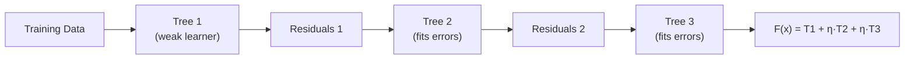

# Gradient Boosting

Imagine learning to throw darts. Your first throw lands 10 centimetres to the left of the bullseye. So your second throw corrects for that: you aim 10 centimetres to the right. The third throw corrects whatever was still off after the second. Each throw fixes the mistake of the previous one. Gradient Boosting trains models the same way: each new model focuses entirely on fixing what the last one got wrong.

---

## What is Gradient Boosting?

Gradient Boosting is a method that builds a sequence of small, simple Decision Trees, where each tree is trained specifically to correct the mistakes of all the trees before it. The final prediction is the combined sum of all the trees' contributions.

It consistently produces some of the most accurate predictions on structured data (which means data in tables, like spreadsheets), and it is the foundation for two of the most powerful tools used in data science competitions today: XGBoost and LightGBM.

---

## A simple way to think about it

Imagine you are trying to guess someone's age from a photo. Your first guess is 35. The real answer is 42. You were off by 7. So your second model is trained just on that error of 7 years. It might get that error down to 3 years. Then a third model is trained on that remaining 3-year error. And so on.

Each model is deliberately kept small and simple (called a "weak learner", which means a model that is only slightly better than random guessing). A single weak learner is not impressive. But when you stack 100 of them together, each one correcting the previous one's mistakes, the result is a very powerful model.

The word "gradient" comes from the maths that guides how each correction is calculated. In simple terms, it means the model always makes each new tree in the direction that reduces the overall error most efficiently.

---

## How it works, step by step

1. Start with a simple first guess for every example (for example, the average value across all training examples)
2. Calculate the error (which means the gap between the prediction and the real answer) for every example
3. Train a new small tree to predict those errors
4. Add that tree's predictions to the running total, scaled down by a small amount (called the learning rate, which controls how big each correction step is)
5. Recalculate the errors with the new improved total
6. Repeat steps 3 to 5 for as many rounds as you choose (usually 100 to 1000)

---

## See it visually



The diagram shows how each tree is built on the errors (called residuals) left by the previous tree. The final prediction (shown as F(x)) is the sum of all trees, each scaled by the learning rate (shown as the Greek letter eta).

---

## The maths (do not panic)

Here is the formula that makes this work. We will break down every part.

$$F_m(\mathbf{x}) = F_{m-1}(\mathbf{x}) + \eta \cdot h_m(\mathbf{x})$$

> **In plain English:** The prediction at step $m$ equals the previous prediction plus a small correction. The correction is a new tree ($h_m$) that was trained to fix the current errors, scaled down by the learning rate ($\eta$, a small number like 0.1). This keeps each correction small and stable.

<details><summary>Show more detail</summary>

For the most common loss function (which means the formula used to measure prediction errors) called Mean Squared Error, the errors that each new tree is trained to predict are simply $y - F(\mathbf{x})$, which is the gap between the real answer and the current prediction. These gaps are called residuals.

For other loss functions, the gaps look slightly different but the principle is the same: each new tree is trained to fit the negative gradient of the loss function. This is why the method is called gradient boosting. Each tree takes a step in the direction that most reduces the overall error, similar to how a ball rolls downhill toward the lowest point.

$$F_m(\mathbf{x}) = F_{m-1}(\mathbf{x}) + \eta \cdot h_m(\mathbf{x})$$

A smaller learning rate ($\eta$) paired with more trees generally gives better results. The model learns more carefully and avoids jumping too far with any one correction. The downside is slower training.

</details>

---

## Run the code yourself

This code trains a Gradient Boosting model to tell cancerous tumours from non-cancerous ones, using 100 small trees built one after another, each correcting the last one's mistakes.

**Step 1:** Open [Google Colab](https://colab.research.google.com) and create a new notebook. (Or use Jupyter if you followed the [Get Started guide](setup).)

**Step 2:** Copy this code into a cell:

```python
from sklearn.datasets import load_breast_cancer              # medical dataset: 569 samples, 2 classes
from sklearn.ensemble import GradientBoostingClassifier      # the Gradient Boosting model
from sklearn.model_selection import train_test_split         # splits data into training and test sets
from sklearn.metrics import accuracy_score                   # measures how often we are right

# Load the breast cancer dataset (labels are: 0 = malignant, 1 = benign)
data = load_breast_cancer()
X, y = data.data, data.target

# Hold out 20% of the data for testing after training is complete
X_train, X_test, y_train, y_test = train_test_split(X, y, test_size=0.2, random_state=42)

# Create the Gradient Boosting model
model = GradientBoostingClassifier(
    n_estimators=100,    # build 100 trees total, one after another
    learning_rate=0.1,   # each tree contributes only 10% of its prediction (small, careful steps)
    max_depth=3,         # keep trees shallow so they stay weak learners
    random_state=42
)
model.fit(X_train, y_train)   # train each tree on the errors left by all previous trees

# Test how accurate the model is on examples it never saw during training
predictions = model.predict(X_test)
print(f"Accuracy: {accuracy_score(y_test, predictions) * 100:.1f}%")
```

**Step 3:** Press **Shift + Enter** to run it.

You should see:
```
Accuracy: 96.5%
```

**What each line does:**
- `n_estimators=100`: builds a sequence of 100 trees, each one fixing what came before
- `learning_rate=0.1`: scales each tree's contribution down to 10% so corrections stay small and stable
- `max_depth=3`: keeps each tree small and simple so it only fixes a small piece of the error
- `model.fit(...)`: trains the trees one by one in sequence
- `model.predict(X_test)`: adds up all 100 trees' contributions to produce the final prediction

**What just happened?**

100 small, individually weak trees worked together to achieve 96.5% accuracy on cancer diagnosis. No single tree would do that well on its own. Each one just identified and corrected what the previous tree got wrong. That is the power of boosting: many small corrections add up to one very accurate model.

---

## Quick recap

- Gradient Boosting builds one small tree at a time, each one trained to correct the errors of all previous trees
- The learning rate controls how large each correction step is. Smaller steps with more trees give better results
- It consistently outperforms Random Forests on structured data when tuned carefully
- Training must happen one tree at a time (unlike Random Forests where all trees can train at once)
- Understanding Gradient Boosting is the key to understanding XGBoost and LightGBM, which are built on the same idea

---

[← Random Forests](random-forest){: .btn } [Next → XGBoost](xgboost){: .btn .btn-primary }
