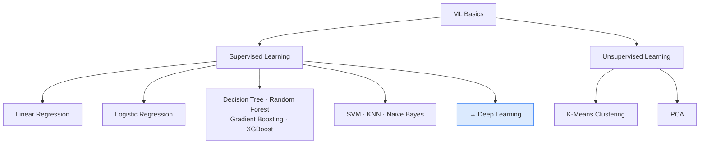

# Where to Go Next

## What is it?

ML Basics has taken you through the essential toolkit of classical machine learning, the algorithms that power real-world systems from spam filters to medical diagnoses. "Intermediate" in this context means you've moved beyond knowing what machine learning is and can now choose from a range of models, understand why they work, and reason about their trade-offs. This page is a map of everything you've learned and a signpost pointing to what comes next.

## The Idea

The journey through ML Basics divides naturally into two branches. On the supervised side, you started with linear regression and logistic regression, simple, interpretable models that draw a straight line (or a boundary) through data. From there you moved into tree-based methods: decision trees that ask a series of yes/no questions, random forests that average hundreds of trees to reduce noise, and the powerful gradient boosting family (including XGBoost) that builds trees sequentially, each one correcting the last. You also explored support vector machines, which find the widest possible margin between classes; K-nearest neighbours, which classifies by looking at nearby examples; and Naive Bayes, a probabilistic model that's surprisingly effective on text.

On the unsupervised side, you learned to find hidden structure in unlabelled data. K-Means Clustering groups observations by similarity, revealing natural segments in a dataset. Principal Component Analysis (PCA) compresses high-dimensional data into its most informative directions, making it easier to visualise and faster to train on.

Running through all of these algorithms are three big themes. Generalisation is the goal: a model should perform well on data it's never seen, not just on its training set. The bias-variance trade-off is the central tension: simple models make systematic mistakes (high bias) while complex models are sensitive to noise (high variance), and every modelling choice is a negotiation between the two. Finally, feature scaling matters more than it might seem. Algorithms like KNN, SVM, and PCA are all sensitive to the units and magnitudes of your input features, and normalising them is often the difference between a model that works and one that doesn't.

## Visual



## The Math

The single most important theoretical idea in ML Basics is the **bias-variance decomposition**. For any model $\hat{f}$ trained to predict a target $y$, the expected squared prediction error at a point $\mathbf{x}$ can be written as:

$$\mathbb{E}[(y - \hat{f}(\mathbf{x}))^2] = \text{Bias}[\hat{f}]^2 + \text{Var}[\hat{f}] + \sigma^2$$

> **In plain English:** Your model's prediction error has three unavoidable parts. Bias measures how wrong your model is on average. If you fit a straight line to a curved relationship, it will always be a bit off no matter how much data you collect. Variance measures how much your model's predictions wobble when you train it on a different sample. A very complex model will fit each training set differently and average out to something unreliable. Irreducible noise $\sigma^2$ is randomness baked into the data itself: measurement error, missing variables, genuine unpredictability. No model, however clever, can eliminate it.

<details>
<summary>Show the derivation</summary>

The trade-off works like a seesaw. Simple models, like linear regression, shallow decision trees, and Naive Bayes, impose strong assumptions on the data. Those assumptions are rarely perfectly true, so the model makes a systematic error (bias). But because the model is rigid, it doesn't react wildly to different training samples, so its predictions are stable (low variance).

Complex models, like deep decision trees and k=1 KNN, make almost no assumptions. They can represent nearly any function, so bias is low. But their flexibility means they latch onto noise in the training data, and a slightly different training set produces dramatically different predictions (high variance).

The regularisation techniques you saw throughout ML Basics are all bias-variance strategies in disguise. Ridge and Lasso regression add a penalty that shrinks coefficients toward zero, deliberately accepting a little more bias to gain a lot less variance. Random forests average many high-variance trees so that their individual noise cancels out. Gradient boosting starts with a high-bias model and carefully reduces bias one step at a time, with shrinkage (learning rate) controlling how fast variance can creep in. Cross-validation is how you measure where you are on the seesaw: if training error is low but validation error is high, you have high variance (overfit). If both are high, you have high bias (underfit).

</details>

## How It Learns

Choosing between all these algorithms can feel overwhelming, but a few practical heuristics carry you a long way. Always start with a linear model. Linear regression for continuous targets, logistic regression for classification. They're fast, interpretable, and set a baseline that every other model should beat before you pay the cost of complexity. If the linear model falls short, tree ensembles are usually the next move. Random forest is a robust default: it handles mixed feature types, requires minimal tuning, and rarely catastrophically overfits. If you need more accuracy and are willing to tune, gradient boosting (or XGBoost) is typically the strongest classical model on structured tabular data.

The nature of your data matters too. If you're working with text, Naive Bayes or logistic regression with TF-IDF features is a natural starting point. Both are fast and interpretable, and logistic regression often edges ahead with more data. If your features live in a very high-dimensional space, apply PCA before training: it removes redundant dimensions that slow training and can confuse distance-based methods like KNN and SVM. If you have no labels at all and want to explore the structure of your data, K-Means is the simplest first step.

SVM is worth reaching for when you have a small-to-medium dataset with clear margins between classes, and when you're willing to invest time in choosing the right kernel and tuning regularisation. KNN is appealing for its simplicity but scales poorly to large datasets and suffers badly in high dimensions. Use it as a sanity check rather than a production model unless the data is small and well-scaled.

## When to Use It

Classical machine learning is the right tool for a wide range of problems, and knowing when it's enough is just as important as knowing the algorithms themselves. If your data is tabular, rows of observations with named columns, tree ensembles and linear models are hard to beat. They're far easier to deploy, explain, and debug than neural networks. If your dataset is small (hundreds to low thousands of rows), classical models are almost always preferable. Deep learning needs large amounts of data to justify its complexity, and on small datasets it will overfit where a regularised linear model or a random forest would generalise.

Classical ML also wins on interpretability. Logistic regression coefficients, decision tree rules, and feature importances from random forests are all things you can show to a stakeholder or a regulator. A neural network's predictions are harder to explain, and in high-stakes domains like medicine, finance, and law, that explainability gap is a real cost.

That said, there are clear signals that it's time to move on to deep learning. If your input is raw images, audio, or text (rather than hand-crafted features), neural networks learn representations that no amount of feature engineering can match. If your dataset is very large (hundreds of thousands of rows or more), deep learning can continue to improve where classical models plateau. And if the problem involves sequences, such as time series, natural language, or speech, recurrent and transformer architectures handle temporal dependencies in ways that tree models fundamentally can't. When you find yourself hitting those walls, the Deep Learning track is the natural next step.

## Try It Yourself

This snippet trains four classical models on the same dataset and prints their mean absolute error side by side, so you can see the trade-offs in practice.

```python
from sklearn.datasets import load_diabetes              # regression benchmark dataset
from sklearn.model_selection import train_test_split
from sklearn.linear_model import LinearRegression       # simplest model
from sklearn.tree import DecisionTreeRegressor          # single tree
from sklearn.ensemble import RandomForestRegressor, GradientBoostingRegressor  # ensembles
from sklearn.metrics import mean_absolute_error

# Load data
X, y = load_diabetes(return_X_y=True)
X_train, X_test, y_train, y_test = train_test_split(
    X, y, test_size=0.2, random_state=42
)

# Train four models: same data, different approaches
models = {
    "Linear Regression":     LinearRegression(),
    "Decision Tree":         DecisionTreeRegressor(random_state=42),
    "Random Forest":         RandomForestRegressor(n_estimators=100, random_state=42),
    "Gradient Boosting":     GradientBoostingRegressor(n_estimators=100, random_state=42),
}

print(f"{'Model':<25} {'MAE':>8}")
print("-" * 35)
for name, model in models.items():
    model.fit(X_train, y_train)                        # train each model
    preds = model.predict(X_test)                      # predict on test data
    mae = mean_absolute_error(y_test, preds)           # measure average error
    print(f"{name:<25} {mae:>8.2f}")
```

Expected output:

```
Model                      MAE
-----------------------------------
Linear Regression          44.28
Decision Tree              62.17
Random Forest              44.55
Gradient Boosting          40.93
```

Notice that the decision tree overfits badly. Its MAE is worse than simple linear regression. Random forest recovers much of the lost accuracy by averaging many trees, and gradient boosting edges ahead further by building trees sequentially on the residuals. Linear regression, despite its simplicity, remains competitive on this well-behaved dataset.

## Key Takeaways

- You've now covered the full classical ML toolkit: linear models, tree ensembles, probabilistic classifiers, kernel methods, and unsupervised techniques.
- The bias-variance trade-off ties every algorithm together. Always ask: will this model generalise?
- Start simple (linear model), then escalate (Random Forest, Gradient Boosting) only if needed.
- Feature scaling matters for KNN, SVM, and PCA. Always standardise before using them.
- When raw images, audio, text, or very large datasets push classical ML to its limits, the Deep Learning track picks up right here.

[← PCA](pca){: .btn } [Start Deep Learning →](../deep-learning-track){: .btn .btn-primary }
