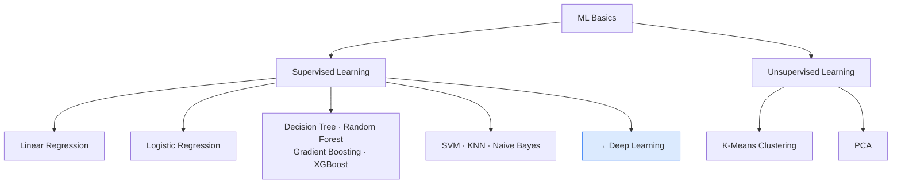

# Where to Go Next

You have just worked through the core toolkit of classical machine learning. That is a big deal. The algorithms you learned power spam filters, credit scoring systems, medical diagnoses, and product recommendations used by millions of people every day. This page maps out what you have covered and points you toward what comes next.

---

## What is the Intermediate level?

"Intermediate" here means you have moved past asking "what is machine learning?" and can now choose the right tool for a problem, understand why it works, and reason about whether it will hold up on new data.

This page is a map of what you have learned and a bridge to the Deep Learning track.

---

## A simple way to think about it

Think of the ML Basics track as learning to drive. You know how to use the steering wheel, the pedals, and the mirrors. You can handle most roads.

Deep learning is like learning to fly a plane. Much more powerful, but you need a solid foundation first. That foundation is exactly what you have just built.

---

## How it works, step by step

Here is the full picture of what the ML Basics track covered:

**Supervised learning** (you provide labelled examples):
1. Linear Regression: predict a number, like a house price
2. Logistic Regression: predict a yes/no answer, like "is this email spam?"
3. Decision Trees, Random Forests, and Gradient Boosting: powerful tree-based methods for most real-world problems
4. Support Vector Machines: find the widest gap between two classes
5. K-Nearest Neighbours: classify by looking at similar examples
6. Naive Bayes: fast probabilistic classifier, great for text

**Unsupervised learning** (you have no labels, just raw data):
7. K-Means Clustering: discover natural groups in your data
8. PCA: compress many features down to just a few

---

## See it visually



The chart shows how all the algorithms you have learned connect, and that supervised learning is the natural stepping stone into Deep Learning.

---

## The maths (do not panic)

The most important theoretical idea running through all of ML Basics is the **bias-variance trade-off**. For any model trained to make predictions, the total prediction error breaks down like this:

$$\mathbb{E}[(y - \hat{f}(\mathbf{x}))^2] = \text{Bias}[\hat{f}]^2 + \text{Var}[\hat{f}] + \sigma^2$$

> **In plain English:** Your model's errors come from three sources. Bias is systematic wrongness: if you fit a straight line to a curved relationship, it will always be a bit off no matter how much data you collect. Variance is wobbliness: a very complex model changes a lot depending on which training examples it saw, so its predictions are unpredictable. Irreducible noise ($\sigma^2$) is randomness baked into the world itself, things like measurement errors that no model can fix. Good modelling is about keeping bias and variance both low.

<details>
<summary>Show more detail</summary>

The trade-off works like a seesaw. Simple models (like linear regression or Naive Bayes) make strong assumptions about the data. Those assumptions are rarely perfectly true, so the model makes consistent mistakes (high bias). But because the model is not flexible, it does not react wildly to different training samples, so its predictions are stable (low variance).

Complex models (like a very deep decision tree or a KNN with k=1) make almost no assumptions. They can represent almost any pattern, so bias is low. But their flexibility means they latch onto noise in the training data, and a slightly different training set produces very different predictions (high variance).

The techniques you saw throughout ML Basics are all ways of managing this seesaw. Random forests average many trees so their individual noise cancels out. Regularisation in linear models shrinks the weights to avoid over-reacting to noise. Cross-validation tells you where on the seesaw you currently sit.

</details>

---

## Run the code yourself

This snippet trains four different models on the same dataset and compares their accuracy side by side. You will see the trade-offs in action.

**Step 1:** Open [Google Colab](https://colab.research.google.com) and create a new notebook.

**Step 2:** Copy this code into a cell:

```python
# Import the tools we need
from sklearn.datasets import load_diabetes              # a medical regression dataset
from sklearn.model_selection import train_test_split
from sklearn.linear_model import LinearRegression       # simple baseline
from sklearn.tree import DecisionTreeRegressor          # a single decision tree
from sklearn.ensemble import RandomForestRegressor, GradientBoostingRegressor  # ensemble methods
from sklearn.metrics import mean_absolute_error

# Load data: 442 patients, 10 medical measurements, target = disease progression score
X, y = load_diabetes(return_X_y=True)
X_train, X_test, y_train, y_test = train_test_split(
    X, y, test_size=0.2, random_state=42
)

# Four models: same data, different approaches
models = {
    "Linear Regression":     LinearRegression(),
    "Decision Tree":         DecisionTreeRegressor(random_state=42),
    "Random Forest":         RandomForestRegressor(n_estimators=100, random_state=42),
    "Gradient Boosting":     GradientBoostingRegressor(n_estimators=100, random_state=42),
}

# Train each model and measure how far off its predictions are on average
print(f"{'Model':<25} {'MAE':>8}")
print("-" * 35)
for name, model in models.items():
    model.fit(X_train, y_train)                        # train on 80% of the data
    preds = model.predict(X_test)                      # predict on the other 20%
    mae = mean_absolute_error(y_test, preds)           # average prediction error
    print(f"{name:<25} {mae:>8.2f}")
```

**Step 3:** Press **Shift + Enter** to run it.

You should see:
```
Model                      MAE
-----------------------------------
Linear Regression          44.28
Decision Tree              62.17
Random Forest              44.55
Gradient Boosting          40.93
```

**What each line does:**
- `load_diabetes()`: loads a medical dataset with 10 features per patient and a disease score to predict
- `train_test_split(...)`: splits the data so 20% is held back to test how the models do on unseen patients
- `model.fit(X_train, y_train)`: trains each model on the training patients
- `model.predict(X_test)`: asks each model to predict the disease score for the test patients
- `mean_absolute_error(...)`: measures the average gap between predicted and real scores

**What just happened?**

The single decision tree performed worst. It memorised the training data too closely and fell apart on new patients. The random forest fixed this by averaging 100 trees, so their individual mistakes cancelled out. Gradient boosting went a step further by building trees one at a time, each one focusing on the errors the last one made. And simple linear regression stayed surprisingly competitive because this dataset has a fairly linear relationship.

---

## Quick recap

- You have now covered the full classical ML toolkit: linear models, tree methods, probabilistic classifiers, distance-based methods, and unsupervised techniques.
- The bias-variance trade-off runs through all of them: simple models make consistent errors, complex models make unpredictable ones.
- When in doubt, start with a linear model and escalate to Random Forest or Gradient Boosting only if you need more accuracy.
- Rescale features before using KNN, SVM, or PCA. Those algorithms are sensitive to the size of the numbers.
- When you need to work with raw images, audio, or text, or when your dataset is very large, the Deep Learning track picks up right here.

[← PCA](pca){: .btn } [Start Deep Learning →](../deep-learning-track){: .btn .btn-primary }
