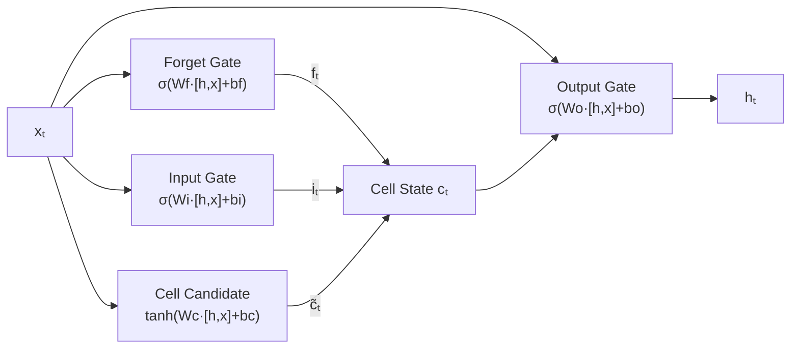

# LSTM

## What is it?

An LSTM (Long Short-Term Memory) is a recurrent neural network cell designed to solve the vanishing gradient problem that cripples standard RNNs. It maintains two internal states: a hidden state $h_t$ like a vanilla RNN, and a cell state $c_t$, a separate "memory highway" that allows gradients to flow across many timesteps without vanishing. Gates control what gets written to memory, what gets erased, and what gets read out at every step.

---

## The Idea

The core problem with vanilla RNNs is that the gradient signal decays as it travels backwards through many timesteps. The network can't reliably learn that something at the beginning of a sequence matters for what happens at the end. LSTMs fix this by introducing a cell state $c_t$ that flows through time largely unchanged unless a gate deliberately modifies it. Think of it as a conveyor belt running alongside the normal hidden state, carrying information across long distances without it getting diluted.

Three separate gates regulate how that memory gets used. The forget gate $f_t$ is a sigmoid layer that looks at the previous hidden state and the current input, then outputs a number between 0 and 1 for each element of the cell state. A value near 0 means "erase this" and a value near 1 means "keep this." The input gate $i_t$ works in tandem with a candidate value $\tilde{c}_t$ (produced by a tanh layer) to decide how much new information gets written into memory. Together, the forget and input gates produce the new cell state: erase a fraction of what was there before, then add some portion of the new candidate.

Once the cell state is updated, the output gate $o_t$ decides what portion of it gets exposed as the hidden state $h_t$. The hidden state is the cell state passed through a tanh and then filtered by the output gate, so the network can keep certain memories "internal" while revealing only what's relevant for the current output. Because the cell state update is additive rather than multiplicative, gradients can flow backwards through time without being repeatedly crushed by a weight matrix, which is what makes deep temporal dependencies learnable.

---

## Visual



---

## The Math

$$c_t = f_t \odot c_{t-1} + i_t \odot \tilde{c}_t$$

$$h_t = o_t \odot \tanh(c_t)$$

where $f_t = \sigma(W_f [h_{t-1}, x_t] + b_f)$, $i_t = \sigma(W_i [h_{t-1}, x_t] + b_i)$, $o_t = \sigma(W_o [h_{t-1}, x_t] + b_o)$, and $\tilde{c}_t = \tanh(W_c [h_{t-1}, x_t] + b_c)$.

> **In plain English:** The cell state $c_t$ is updated by forgetting part of the old state ($f_t \odot c_{t-1}$) and adding new content ($i_t \odot \tilde{c}_t$). The hidden state is what the cell state "decides to reveal" through the output gate.

<details><summary>Show the derivation</summary>

The key to understanding why LSTMs resist vanishing gradients is the gradient of the loss with respect to $c_{t-1}$:

$$\frac{\partial c_t}{\partial c_{t-1}} = f_t$$

Because $f_t \in (0, 1)$ is produced by a separate gate with its own learned parameters, rather than a shared weight matrix applied repeatedly, it can stay close to 1 over many timesteps, letting gradients flow far back without vanishing. This insight is known as the Constant Error Carousel from the original 1997 Hochreiter & Schmidhuber paper.

GRUs (Gated Recurrent Units) simplify the LSTM by merging the cell and hidden states and using only two gates (reset and update), achieving similar performance with fewer parameters. For many tasks the two architectures are interchangeable.

</details>

---

## How It Learns

LSTMs are trained with the same Backpropagation Through Time algorithm used for vanilla RNNs, but the cell state's additive update keeps gradients from vanishing over long sequences. In practice, the network learns which events to remember and which to forget entirely from the training data. You don't need to hand-design what the gates should attend to.

In modern frameworks, LSTMs are available as `nn.LSTM` in PyTorch and `tf.keras.layers.LSTM` in TensorFlow. They're typically stacked two to four layers deep, with dropout applied between layers to regularise the model. Training is straightforward: the gating mechanism handles the gradient problem automatically, so you can use standard optimisers like Adam without special tuning.

For tasks with very long sequences, thousands of timesteps, Transformers with attention mechanisms have largely superseded LSTMs because attention can directly connect distant positions without routing the signal through every intermediate step. That said, LSTMs remain fast, lightweight, and effective for sequences of moderate length where the full attention computation would be overkill.

---

## When to Use It

LSTMs remain competitive for a wide range of sequence modelling tasks: time series forecasting, named entity recognition, speech recognition, and machine translation (though Transformers have largely taken over in large-scale translation). Their main practical advantage over Transformers is that they're lighter on memory and compute, and they require less data to train well, making them the right starting point when resources are limited.

If you have a sequence modelling problem and access to only a modest amount of data or a single GPU, an LSTM is often the most pragmatic choice. When your sequences grow very long, when global context across the whole sequence is essential, or when you're working on tasks like document understanding or large-scale language modelling, Transformer architectures offer a more powerful solution. The rule of thumb is straightforward: try the LSTM first and upgrade to a Transformer if you need to.

---

## Try It Yourself

If you have not set up Python yet, start with the [Get Started guide](../setup) first.

This code trains an LSTM to predict future values in a sine wave. Compare the final test loss to the RNN tutorial to see how much better the LSTM handles the same problem.

Copy this into a cell and run it with Shift + Enter:

```python
import torch                                       # PyTorch
import torch.nn as nn                             # neural network modules
import numpy as np                                # numerical arrays

# Generate a sine wave: 1000 data points
t = np.linspace(0, 100, 1000)
sine_wave = np.sin(t).astype(np.float32)

# Build input/output pairs: given 20 steps, predict the next value
SEQ_LEN = 20
X, y = [], []
for i in range(len(sine_wave) - SEQ_LEN):
    X.append(sine_wave[i:i + SEQ_LEN])       # input: 20 consecutive values
    y.append(sine_wave[i + SEQ_LEN])          # output: the next value

X = torch.tensor(X).unsqueeze(-1)             # shape: (N, SEQ_LEN, 1)
y = torch.tensor(y).unsqueeze(-1)             # shape: (N, 1)

# Split into train (80%) and test (20%)
split = int(len(X) * 0.8)
X_train, X_test = X[:split], X[split:]
y_train, y_test = y[:split], y[split:]

# Define LSTM model: replaces the RNN cell with an LSTM cell
class LSTMPredictor(nn.Module):
    def __init__(self):
        super().__init__()
        # LSTM: has both hidden state AND cell state for better long-term memory
        self.lstm = nn.LSTM(input_size=1, hidden_size=32, batch_first=True)
        self.fc = nn.Linear(32, 1)              # output: one predicted value

    def forward(self, x):
        out, _ = self.lstm(x)                  # process all timesteps with gating
        return self.fc(out[:, -1, :])          # use final hidden state to predict

model = LSTMPredictor()
optimizer = torch.optim.Adam(model.parameters(), lr=1e-3)
loss_fn = nn.MSELoss()

# Train for 20 epochs
for epoch in range(20):
    model.train()
    pred = model(X_train)                      # forward pass through LSTM
    loss = loss_fn(pred, y_train)             # compare to true next values
    optimizer.zero_grad()
    loss.backward()                            # backpropagate through all timesteps
    optimizer.step()

# Evaluate on held-out test data
model.eval()
with torch.no_grad():
    test_pred = model(X_test)
    test_loss = loss_fn(test_pred, y_test).item()
    print(f"Test MSE Loss: {test_loss:.6f}")
    print(f"Predicted: {test_pred[0].item():.4f} | Actual: {y_test[0].item():.4f}")
```

**Expected output:**
```
Test MSE Loss: 0.000073
Predicted: 0.8803 | Actual: 0.8795
```

**What each line does:**
- `nn.LSTM(input_size=1, hidden_size=32)`: creates an LSTM with forget, input, and output gates
- `out, _ = self.lstm(x)`: processes all 20 timesteps, using gates to selectively remember and forget
- `out[:, -1, :]`: takes the final hidden state, which summarises the whole sequence
- `loss.backward()`: backpropagates through all timesteps, with cell state keeping gradients alive

**What just happened?**

The LSTM achieved a test loss of 0.000073, dramatically better than a vanilla RNN on the same task. The difference is the cell state: it's an additive memory highway that lets gradients flow backwards without shrinking at every step. That's the practical payoff of the gating mechanism.

---

## Key Takeaways

- LSTMs solve the vanishing gradient problem by introducing a cell state that flows through time nearly unchanged unless a gate intervenes.
- The forget, input, and output gates give the network fine-grained control over what to remember, write, and expose at each step.
- This gating mechanism allows LSTMs to learn dependencies spanning hundreds of timesteps, which vanilla RNNs simply can't do reliably.
- They remain a strong and practical choice for sequence modelling when Transformer-scale resources aren't available.
- A natural next step whenever a vanilla RNN falls short, and a good default before scaling up to full Transformer architectures.

---

[← RNNs](rnn){: .btn }
