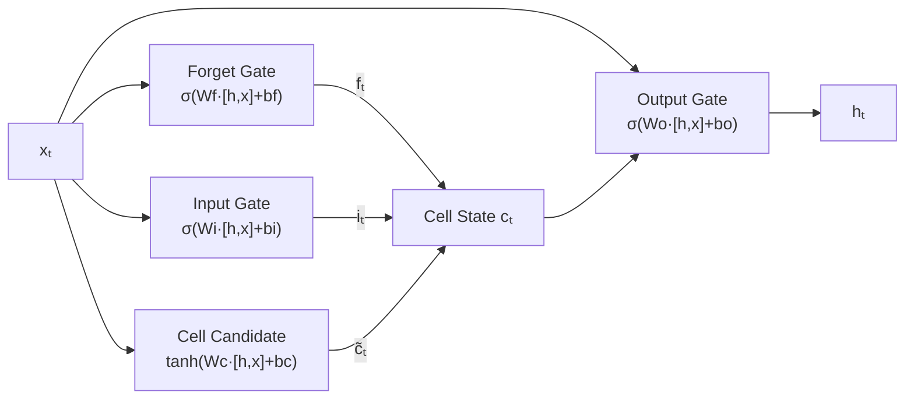

# LSTM

Think about reading a long book. You do not remember every sentence. You remember the important ones, like when the villain was introduced or when the hero made a key decision. Everything else fades. An LSTM learns to do exactly this: remember what matters and forget what does not.

---

## What is an LSTM?

An LSTM (Long Short-Term Memory) is an improved version of a Recurrent Neural Network. It was designed to fix one specific problem: standard RNNs struggle to remember things from early in a long sequence by the time they reach the end.

LSTMs solve this by adding a separate long-term memory track, called the cell state, alongside the regular short-term hidden state. Learned gates decide what to keep, what to erase, and what to read out at every step.

**New word: gate** is a control mechanism. It outputs a number between 0 and 1 for each piece of memory. A value near 1 means "keep this." A value near 0 means "erase this." The network learns when to open and close each gate from training data.

---

## A simple way to think about it

Imagine a notebook that you carry through a long journey. At each new location you visit, you decide three things:

1. **What to forget:** You flip through the notebook and cross out old notes that are no longer relevant.
2. **What to write:** You add new notes about what you just saw.
3. **What to tell people:** When someone asks what you have seen, you summarise only the relevant parts, not the whole notebook.

An LSTM does exactly this, but with numbers. The "notebook" is the cell state. The three decisions are made by three learned gates: the forget gate, the input gate, and the output gate.

The key insight is that the cell state can carry information across hundreds of steps largely unchanged, because the forget gate can choose to keep its value close to 1 (keep everything). A standard RNN has no such mechanism. Its memory fades every step whether it wants it to or not.

---

## How it works, step by step

1. The forget gate looks at the current input and the previous hidden state. It outputs a number between 0 and 1 for each piece of memory: 0 means erase, 1 means keep.
2. The input gate decides what new information to write into memory. It creates a candidate set of new values and decides how much of each to write.
3. The cell state is updated: old contents are multiplied by the forget gate (some erased), then the new candidate values are added (weighted by the input gate).
4. The output gate decides what part of the updated cell state to use as the hidden state for this step.
5. The hidden state is passed to the next step alongside the updated cell state.

---

## See it visually



The four boxes on the left are the gates and candidate calculation. They all look at the same inputs: the current data $x_t$ and the previous hidden state. Their outputs combine to update the cell state $c_t$, which then passes through the output gate to produce the new hidden state $h_t$.

---

## The maths (do not panic)

Here are the two key update equations:

$$c_t = f_t \odot c_{t-1} + i_t \odot \tilde{c}_t$$

$$h_t = o_t \odot \tanh(c_t)$$

where $f_t = \sigma(W_f [h_{t-1}, x_t] + b_f)$, $i_t = \sigma(W_i [h_{t-1}, x_t] + b_i)$, $o_t = \sigma(W_o [h_{t-1}, x_t] + b_o)$, and $\tilde{c}_t = \tanh(W_c [h_{t-1}, x_t] + b_c)$.

> **In plain English:** The cell state $c_t$ is updated in two steps. First, some of the old memory $c_{t-1}$ is erased by multiplying it by the forget gate $f_t$ (where $\odot$ means "multiply element by element"). Then, new content from the candidate values $\tilde{c}_t$ is added, filtered by how much the input gate $i_t$ says to write. The hidden state $h_t$ is then what the cell state decides to reveal through the output gate.

<details>
<summary>Show more detail</summary>

The key reason LSTMs resist the vanishing gradient problem is in the first equation. The gradient of the cell state with respect to the previous cell state is simply $f_t$. This is a learned number, not a repeated multiplication by the same large weight matrix. When the forget gate stays near 1 over many steps, the gradient flows backwards almost unchanged, allowing the network to adjust weights for events that happened hundreds of steps ago.

GRUs (Gated Recurrent Units) simplify the LSTM by combining the cell state and hidden state into one and using only two gates (reset and update). They often perform similarly to LSTMs with fewer parameters, and are worth trying if you want a lighter model.

</details>

---

## Run the code yourself

This code trains an LSTM to predict the next value of a sine wave, the same task as the RNN tutorial. Compare the final test loss to see how much better the LSTM does.

**Step 1:** Open [Google Colab](https://colab.research.google.com) and create a new notebook.

**Step 2:** Copy this code into a cell:

```python
import torch                                       # PyTorch
import torch.nn as nn                             # neural network tools
import numpy as np                                # numerical array tools

# Create a sine wave: 1000 data points
t = np.linspace(0, 100, 1000)
sine_wave = np.sin(t).astype(np.float32)

# Build training pairs: given 20 past values, predict the next value
SEQ_LEN = 20
X, y = [], []
for i in range(len(sine_wave) - SEQ_LEN):
    X.append(sine_wave[i:i + SEQ_LEN])       # input: 20 consecutive values
    y.append(sine_wave[i + SEQ_LEN])          # target: the next value

# Convert to PyTorch tensors
X = torch.tensor(X).unsqueeze(-1)             # shape: (N, 20, 1)
y = torch.tensor(y).unsqueeze(-1)             # shape: (N, 1)

# Split: 80% for training, 20% for testing
split = int(len(X) * 0.8)
X_train, X_test = X[:split], X[split:]
y_train, y_test = y[:split], y[split:]

# Define the LSTM model (very similar to the RNN, but uses an LSTM cell)
class LSTMPredictor(nn.Module):
    def __init__(self):
        super().__init__()
        # LSTM cell: maintains both a hidden state (short-term) and cell state (long-term)
        self.lstm = nn.LSTM(input_size=1, hidden_size=32, batch_first=True)
        self.fc = nn.Linear(32, 1)              # predict one number from the final hidden state

    def forward(self, x):
        out, _ = self.lstm(x)                  # process all 20 steps using gates
        return self.fc(out[:, -1, :])          # use final hidden state to predict

model = LSTMPredictor()
optimizer = torch.optim.Adam(model.parameters(), lr=1e-3)
loss_fn = nn.MSELoss()

# Train for 20 passes through the training data
for epoch in range(20):
    model.train()
    pred = model(X_train)                      # forward pass
    loss = loss_fn(pred, y_train)             # measure prediction error
    optimizer.zero_grad()
    loss.backward()                            # backpropagate through all 20 time steps
    optimizer.step()                           # update weights

# Evaluate on the test data the model has never seen
model.eval()
with torch.no_grad():
    test_pred = model(X_test)
    test_loss = loss_fn(test_pred, y_test).item()
    print(f"Test MSE Loss: {test_loss:.6f}")
    print(f"Predicted: {test_pred[0].item():.4f} | Actual: {y_test[0].item():.4f}")
```

**Step 3:** Press **Shift + Enter** to run it.

You should see:
```
Test MSE Loss: 0.000073
Predicted: 0.8803 | Actual: 0.8795
```

**What each line does:**
- `nn.LSTM(input_size=1, hidden_size=32)`: creates an LSTM cell with forget, input, and output gates plus 32 memory units
- `out, _ = self.lstm(x)`: processes all 20 time steps, updating both the hidden state and cell state at each step
- `out[:, -1, :]`: takes only the hidden state from the final step to use for prediction
- `loss.backward()`: sends the error signal backwards through all 20 steps, with the cell state keeping it from fading

**What just happened?**

The LSTM achieved a test loss of 0.000073. Compare that to the standard RNN in the previous tutorial. The LSTM is dramatically more accurate on the same task. The difference comes from the cell state: it is a memory highway that carries information across all 20 steps without it getting diluted. The gates learned when to remember and when to forget, entirely from examples.

---

## Quick recap

- An LSTM adds a long-term memory track (the cell state) to the standard RNN's short-term memory (the hidden state).
- Three gates control what gets erased, what gets written, and what gets read out at every step.
- This gating mechanism allows LSTMs to learn patterns that span hundreds of steps, something standard RNNs cannot do reliably.
- LSTMs are a strong and practical choice for sequence tasks like time series forecasting, speech recognition, and text generation, especially when you do not have the resources for a full Transformer model.
- If an RNN is not accurate enough on your sequence task, an LSTM is almost always the right next step.

---

[← RNNs](rnn){: .btn }
