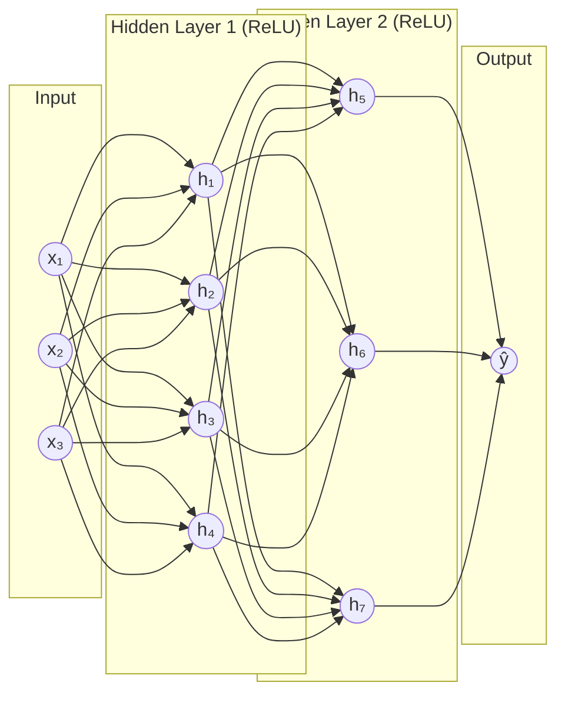

# Multi-Layer Perceptron

## What is it?

A Multi-Layer Perceptron (MLP) is a neural network with one or more hidden layers, making it capable of learning non-linear decision boundaries. It's the simplest form of a "deep" neural network and forms the backbone of fully-connected architectures used for tabular data and as components inside larger models.

---

## The Idea

The perceptron is the building block: a single neuron that takes a weighted sum of its inputs and outputs either 0 or 1. One perceptron can only draw a straight line through the feature space, limiting it to linearly separable problems. Add a hidden layer and suddenly the network can combine those lines into curves and regions. Add more hidden layers and the network builds increasingly abstract representations of the input.

The "multi-layer" part is what unlocks expressive power. A shallow MLP (one hidden layer) is a universal function approximator. It can in principle represent any continuous function, given enough neurons. In practice, deeper networks with fewer neurons per layer are more parameter-efficient and often generalise better.

The activation function between layers is critical. ReLU ($\max(0, x)$) is the modern default. It's fast, avoids vanishing gradients better than sigmoid or tanh, and works well in practice. Each hidden layer applies ReLU to its weighted sums, introducing the non-linearity that makes deep representations possible.

---

## Visual



---

## The Math

$$\mathbf{a}^{(l)} = f\!\left(\mathbf{W}^{(l)}\mathbf{a}^{(l-1)} + \mathbf{b}^{(l)}\right)$$

> **In plain English:** Each layer takes the output of the previous layer, applies a linear transformation (weights + bias), then applies the activation function $f$. Repeating this for $L$ layers produces the final prediction.

<details><summary>Show the derivation</summary>

The full forward pass for an MLP with $L$ layers starts with $\mathbf{a}^{(0)} = \mathbf{x}$, then computes $\mathbf{a}^{(l)}$ for $l = 1, \dots, L$ using the formula above. The output layer typically uses a different activation: softmax for multi-class classification, sigmoid for binary, or linear (no activation) for regression.

Loss is computed at the output, and backpropagation computes $\frac{\partial \mathcal{L}}{\partial \mathbf{W}^{(l)}}$ for every layer via the chain rule. The gradient of layer $l$ depends on the gradient of layer $l+1$, which is why deeper gradients can vanish (become very small) in networks with saturating activations like sigmoid. ReLU largely avoids this.

</details>

---

## How It Learns

An MLP is trained with mini-batch gradient descent. At each step, a small batch of training examples is passed through the network (forward pass), a loss is computed, and backpropagation computes the gradient of the loss with respect to every weight in every layer. The optimiser (Adam is the modern default) updates the weights using these gradients.

One full pass through the training data is an epoch, and training typically runs for tens to hundreds of epochs until the validation loss stops improving. Early stopping, halting training when validation performance plateaus, is a simple and effective technique to prevent overfitting.

---

## When to Use It

MLPs are a strong choice for tabular data when you have enough training examples (thousands or more) and gradient boosting leaves accuracy on the table. They're also used as components inside larger architectures. The final "classification head" of a CNN or transformer is typically a small MLP.

The main hyperparameters to tune are the number of layers, units per layer, learning rate, and regularisation technique (dropout and weight decay are the most common). For truly high-dimensional data like images or sequences, specialised architectures such as CNNs, RNNs, and Transformers outperform a plain MLP because they exploit structure in the data that a fully-connected network ignores.

---

## Try It Yourself

If you have not set up Python yet, start with the [Get Started guide](../setup) first.

This code trains a two-hidden-layer MLP to classify handwritten digits. You'll see how quickly it reaches high accuracy with a simple network.

Copy this into a cell and run it with Shift + Enter:

```python
from sklearn.datasets import load_digits               # 8x8 handwritten digit images
from sklearn.model_selection import train_test_split
from sklearn.preprocessing import StandardScaler       # scale before training
from sklearn.neural_network import MLPClassifier       # fully-connected neural network

# Load the digits dataset (1797 samples, 64 features, 10 classes)
X, y = load_digits(return_X_y=True)

# Scale features: important for gradient-based training
scaler = StandardScaler()
X_train, X_test, y_train, y_test = train_test_split(X, y, test_size=0.2, random_state=42)
X_train = scaler.fit_transform(X_train)   # learn scale from training data
X_test = scaler.transform(X_test)         # apply same scale to test data

# Two hidden layers of 128 and 64 units, ReLU activation
mlp = MLPClassifier(
    hidden_layer_sizes=(128, 64),   # first hidden layer: 128 neurons, second: 64
    activation='relu',              # apply ReLU after each hidden layer
    max_iter=200,                   # maximum training epochs
    random_state=42
)
mlp.fit(X_train, y_train)           # train: forward pass + backpropagation

accuracy = mlp.score(X_test, y_test)  # fraction of test images correctly classified
print(f"Test accuracy: {accuracy * 100:.1f}%")
```

Expected output:

```
Test accuracy: 97.8%
```

**What each line does:**
- `hidden_layer_sizes=(128, 64)`: creates two hidden layers with 128 and 64 neurons
- `activation='relu'`: uses ReLU as the activation function, avoiding vanishing gradients
- `max_iter=200`: trains for up to 200 epochs (stops early if it converges)
- `mlp.fit(X_train, y_train)`: runs forward passes and backpropagation to adjust weights
- `mlp.score(X_test, y_test)`: computes accuracy on the held-out test set

**What just happened?**

Two hidden layers of neurons learned to recognise handwritten digits with 97.8% accuracy. The first layer learned low-level patterns (edges, corners). The second layer combined those into higher-level patterns (digit parts). The output layer turned those into a class prediction. All automatically, from labelled examples.

---

## Key Takeaways

- An MLP is a neural network with one or more hidden layers, each applying a linear transformation followed by a non-linear activation.
- Depth gives it expressive power. Each layer builds on representations learned by the previous one.
- ReLU activations and mini-batch gradient descent with Adam make training practical at scale.
- MLPs work best on tabular data and serve as the fully-connected "head" inside larger architectures.
- They're the simplest form of deep network and a natural stepping stone to CNNs, RNNs, and Transformers.

---

[← Neural Networks](neural-networks-intro){: .btn } [Next → Deep Learning](deep-learning){: .btn .btn-primary }
