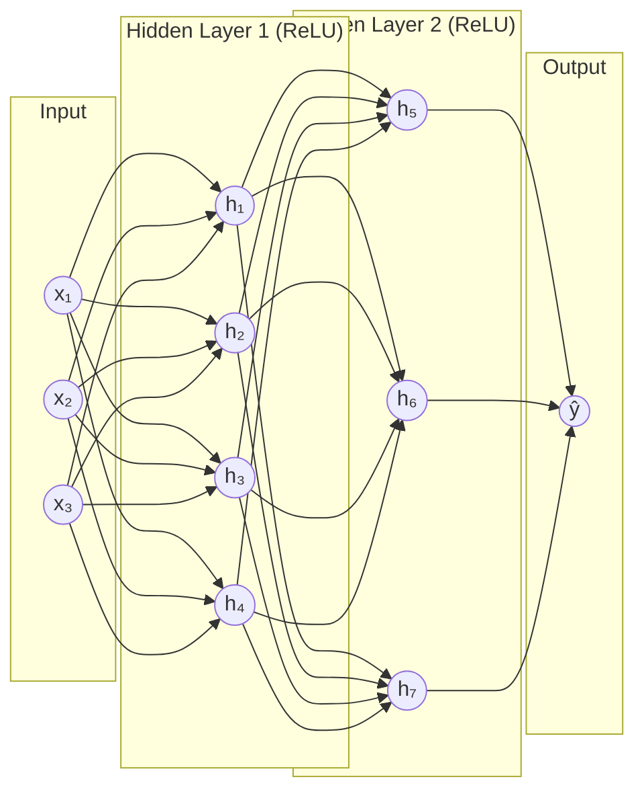

# Multi-Layer Perceptron

The first neural networks had just one layer. They could only draw straight lines through data. Adding more layers changed everything. Suddenly the network could learn curves, corners, and complex shapes. That is the idea behind the Multi-Layer Perceptron.

---

## What is a Multi-Layer Perceptron?

A Multi-Layer Perceptron (MLP) is a neural network with at least one hidden layer between the input and the output. The hidden layers are where the network builds up an internal understanding of the data, step by step.

**New word: perceptron** is the name for a single neuron that makes a yes/no decision. An MLP stacks many of these neurons across multiple layers.

**New word: hidden layer** is any layer that sits between the input layer and the output layer. It is "hidden" because you do not directly see its values. Its job is to find useful patterns in the data.

---

## A simple way to think about it

Imagine you are learning to recognise handwritten letters. You do not jump straight from "a bunch of pixels" to "that is the letter A."

First you notice individual strokes: a diagonal line here, a curve there. Then you notice how those strokes combine into corners and arcs. Then you recognise the whole letter from those parts.

That is exactly what an MLP does. The first hidden layer looks for simple patterns in the input. The second hidden layer combines those simple patterns into more complex ones. The output layer makes the final decision. Each layer builds on the understanding developed by the layer before it.

The ingredient that makes this possible is the **activation function**. The most common one today is called ReLU, which simply means: if the value is negative, output 0; if positive, output the value unchanged. This tiny rule is what allows each layer to add something genuinely new rather than just repeating what the previous layer already calculated.

---

## How it works, step by step

1. Data enters the input layer as a list of numbers (pixel values, measurements, etc.).
2. The first hidden layer applies weights to those numbers and passes them through ReLU.
3. The second hidden layer does the same to the output of the first.
4. This continues through however many hidden layers you have.
5. The output layer produces the final prediction (a class label, a number, etc.).
6. The error is calculated and every weight in every layer is adjusted slightly to reduce it.
7. Repeat for thousands of training examples until the weights settle.

---

## See it visually



Each circle is a neuron. Every line between layers is a connection with a learnable weight. The data flows left to right through both hidden layers before reaching the output. Each hidden layer has the chance to find more complex patterns than the one before it.

---

## The maths (do not panic)

Here is the formula that each hidden layer applies:

$$\mathbf{a}^{(l)} = f\!\left(\mathbf{W}^{(l)}\mathbf{a}^{(l-1)} + \mathbf{b}^{(l)}\right)$$

> **In plain English:** Each layer takes the output of the previous layer ($\mathbf{a}^{(l-1)}$), multiplies it by a set of learned weights ($\mathbf{W}^{(l)}$), adds a bias ($\mathbf{b}^{(l)}$), then passes everything through the activation function $f$. Doing this repeatedly across $L$ layers produces the final prediction.

<details>
<summary>Show more detail</summary>

The full forward pass starts with $\mathbf{a}^{(0)} = \mathbf{x}$ (the input) and computes $\mathbf{a}^{(l)}$ for each layer $l = 1, \dots, L$ using the formula above.

The output layer typically uses a different activation. For classifying into multiple categories, it uses softmax, which converts a list of numbers into percentages that add up to 100%. For predicting a single number (like a house price), it uses no activation at all.

Training works backwards: first compute the error at the output, then use the chain rule from calculus to figure out how much each weight in each layer contributed to that error. This is called backpropagation. Each weight is then nudged a small amount in the direction that reduces the error.

</details>

---

## Run the code yourself

This code trains a two-hidden-layer MLP to classify handwritten digit images. You will see that even a modest network reaches high accuracy in seconds.

**Step 1:** Open [Google Colab](https://colab.research.google.com) and create a new notebook.

**Step 2:** Copy this code into a cell:

```python
# Import the tools we need
from sklearn.datasets import load_digits               # 1797 tiny handwritten digit images
from sklearn.model_selection import train_test_split
from sklearn.preprocessing import StandardScaler       # rescale before training
from sklearn.neural_network import MLPClassifier       # the multi-layer network

# Load the digits dataset (1797 samples, each image = 64 pixel values, 10 possible digits)
X, y = load_digits(return_X_y=True)

# Split and rescale
X_train, X_test, y_train, y_test = train_test_split(X, y, test_size=0.2, random_state=42)
scaler = StandardScaler()
X_train = scaler.fit_transform(X_train)   # learn the scale from training images
X_test = scaler.transform(X_test)         # apply the same scale to test images

# Create an MLP: first hidden layer has 128 neurons, second has 64
mlp = MLPClassifier(
    hidden_layer_sizes=(128, 64),   # two hidden layers
    activation='relu',              # ReLU activation: negative outputs become 0
    max_iter=200,                   # train for up to 200 passes through the data
    random_state=42
)
mlp.fit(X_train, y_train)           # train by adjusting weights to reduce errors

# Report accuracy on images the network has never seen
accuracy = mlp.score(X_test, y_test)
print(f"Test accuracy: {accuracy * 100:.1f}%")
```

**Step 3:** Press **Shift + Enter** to run it.

You should see:
```
Test accuracy: 97.8%
```

**What each line does:**
- `load_digits(return_X_y=True)`: loads 1797 handwritten digit images as 64-number arrays
- `StandardScaler()`: rescales pixel values so each one contributes fairly to the network's calculations
- `hidden_layer_sizes=(128, 64)`: creates two hidden layers, 128 neurons in the first and 64 in the second
- `activation='relu'`: uses ReLU at each hidden layer so the network can learn non-straight patterns
- `max_iter=200`: runs through the training data up to 200 times, stopping early if it converges
- `mlp.fit(X_train, y_train)`: runs the forward pass and error correction loop to adjust all weights
- `mlp.score(X_test, y_test)`: measures accuracy on images the network has never seen

**What just happened?**

Two hidden layers of neurons learned to classify handwritten digits with 97.8% accuracy. The first hidden layer found simple patterns like strokes and curves. The second hidden layer combined those into digit-shaped structures. The output layer turned those structures into a digit prediction. All from labelled examples, with no hand-written rules.

---

## Quick recap

- An MLP is a neural network with one or more hidden layers, each applying weights and an activation function to build up richer patterns.
- The activation function (ReLU is the modern standard) is what allows each layer to learn something genuinely new rather than just repeating the previous layer.
- More layers allow more complex patterns. But you do not always need many layers; start small and add depth only if you need it.
- MLPs are a strong choice for spreadsheet-style data and serve as the final prediction layer inside larger architectures like CNNs and Transformers.
- They are the simplest form of deep network and the natural starting point before moving to CNNs and RNNs.

---

[← Neural Networks](neural-networks-intro){: .btn } [Next → Deep Learning](deep-learning){: .btn .btn-primary }
