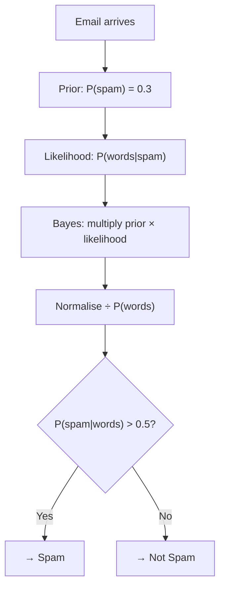

# Naive Bayes

Every time Gmail moves a suspicious email into your spam folder, it probably used an algorithm called Naive Bayes. It is one of the oldest tricks in machine learning, it trains in milliseconds, and it is surprisingly difficult to beat on email and text problems. Here is how it works.

---

## What is Naive Bayes?

Naive Bayes is a way of sorting things into categories by calculating probabilities. Given some information, it asks: "What is the probability that this belongs to category A? What is the probability it belongs to category B?" Then it picks the category with the highest probability.

It is called "naive" because it makes a simplifying assumption: it treats every piece of information as completely independent of every other piece. In reality, words in an email often appear together (the word "buy" makes "cheap" more likely), but Naive Bayes ignores that connection. Despite this simplification, it often works remarkably well.

**New word: probability.** A probability is a number between 0 and 1. Zero means impossible. One means certain. 0.7 means "70% likely."

---

## A simple way to think about it

Imagine you are sorting your post into three piles: bills, junk mail, and personal letters. You have been doing this for years and you have built up an instinct. Bills usually contain words like "payment", "invoice", and "due date." Junk mail usually has words like "winner", "free", and "act now." Personal letters have people's names and phrases like "how are you."

When a new letter arrives, you quickly scan it for these keywords. Each word gives you a clue about which pile it belongs to. Naive Bayes does exactly this. It has studied thousands of past examples and learned which words appear most often in each category. When a new example arrives, it checks each word and multiplies all the individual clues together to produce an overall probability for each category.

The "naive" part is that it assumes each word is an independent clue. In reality, words interact. But even with that simplification, the algorithm performs very well because there are so many clues in a typical document that the pattern still comes through clearly.

---

## How it works, step by step

1. Count how often each category appears in the training data. For example, 30% of emails are spam.
2. For each category, count how often each word (or feature) appears in examples of that category
3. Store those counts. That is the entire training process. No adjusting, no looping, just counting.
4. When a new example arrives, calculate the probability score for each category by multiplying the category's base rate by the individual probability of each feature in that category
5. Pick the category with the highest score

---

## See it visually



The diagram shows the steps from a new email arriving to a final decision. The prior is the base rate (how common spam is). The likelihood is how well the email's words match the spam pattern. Multiplying them gives a combined score. Dividing by the total (normalising) turns it into a proper probability. The final step checks if that probability is above 50%.

---

## The maths (do not panic)

Here is the formula that makes this work. We will break down every part.

$$P(C \mid \mathbf{x}) = \frac{P(\mathbf{x} \mid C) \, P(C)}{P(\mathbf{x})} \propto P(C) \prod_{j=1}^{p} P(x_j \mid C)$$

> **In plain English:** The probability that a new example belongs to category $C$ is calculated by taking the base rate of that category ($P(C)$) and multiplying it by the individual probability of each feature given that category ($P(x_j \mid C)$). The category with the highest resulting score wins. The $\propto$ symbol means "proportional to", which means we only need to compare the scores, not calculate exact probabilities.

<details><summary>Show more detail</summary>

The key simplification is the independence assumption: $P(\mathbf{x} \mid C) = \prod_j P(x_j \mid C)$. This turns a very difficult joint estimation problem into a simple multiplication of individual probabilities.

The denominator $P(\mathbf{x})$ is the same for every category, so it does not affect which category wins. It can be ignored when comparing categories.

For **Gaussian Naive Bayes** (used for measurements and numbers), each feature's probability is modelled as a bell curve with a mean and a spread estimated from the training data.

For **Multinomial Naive Bayes** (used for text), each word's probability is its relative frequency in the category's training documents. A small adjustment called Laplace smoothing (which adds a small count to every word so that unseen words do not produce a probability of exactly zero) is applied to handle words that were not in the training data.

In practice, the probabilities are converted to log scale before multiplying, to avoid errors from multiplying many very small numbers together:

$$\log P(C \mid \mathbf{x}) \propto \log P(C) + \sum_j \log P(x_j \mid C)$$

This turns the multiplication of tiny numbers into a sum of negative numbers, which is much more reliable on a computer.

</details>

---

## Run the code yourself

This code trains a Naive Bayes model to sort real news articles into four categories: baseball, space science, politics, and computer graphics. After training, it will classify a brand new sentence it has never seen.

**Step 1:** Open [Google Colab](https://colab.research.google.com) and create a new notebook. (Or use Jupyter if you followed the [Get Started guide](setup).)

**Step 2:** Copy this code into a cell:

```python
from sklearn.datasets import fetch_20newsgroups        # downloads a dataset of real news articles
from sklearn.naive_bayes import MultinomialNB          # Naive Bayes model designed for word counts
from sklearn.feature_extraction.text import CountVectorizer  # converts text articles into word counts
from sklearn.metrics import accuracy_score

# Choose four categories of news articles to work with
categories = ['rec.sport.baseball', 'sci.space', 'talk.politics.guns', 'comp.graphics']

# Download the training and test articles (this may take a moment the first time)
train_data = fetch_20newsgroups(subset='train', categories=categories)
test_data  = fetch_20newsgroups(subset='test',  categories=categories)

# Convert each article from raw text into a list of word counts
# For example, an article about space might have: {"rocket": 3, "orbit": 2, "launch": 1, ...}
vectorizer = CountVectorizer()
X_train = vectorizer.fit_transform(train_data.data)   # learn the vocabulary, then count words in training articles
X_test  = vectorizer.transform(test_data.data)        # count words in test articles using the same vocabulary

# Train the model: this just counts word frequencies per category, no looping required
model = MultinomialNB()
model.fit(X_train, train_data.target)

# Test accuracy on the held-out test articles
predictions = model.predict(X_test)
accuracy = accuracy_score(test_data.target, predictions)
print(f"Accuracy: {accuracy * 100:.1f}%")

# Classify a brand new sentence the model has never seen
new_text = ["The rocket launched into orbit successfully"]
new_counts = vectorizer.transform(new_text)           # convert the new sentence to word counts
pred = model.predict(new_counts)
print(f"Category: {train_data.target_names[pred[0]]}")
```

**Step 3:** Press **Shift + Enter** to run it.

You should see:
```
Accuracy: 93.7%
Category: sci.space
```

**What each line does:**
- `fetch_20newsgroups(...)`: downloads a classic dataset of real news posts across 20 different topics
- `CountVectorizer()`: creates a tool that converts raw text into a count of how many times each word appears
- `vectorizer.fit_transform(train_data.data)`: learns the full list of known words from training articles, then counts words
- `MultinomialNB()`: creates a Naive Bayes model designed for word count data
- `model.fit(X_train, train_data.target)`: trains the model by counting word frequencies per category (one pass through data, no iteration)
- `vectorizer.transform(new_text)`: converts the new sentence into word counts using the same vocabulary

**What just happened?**

The model saw the words "rocket" and "orbit" in the new sentence and correctly identified it as a science/space article. It made that decision by comparing word frequencies: words like "rocket" appear far more often in space articles than in baseball, politics, or computer graphics articles. The model needed no loop, no gradient steps, and no iterations. It just counted words during training and multiplied probabilities during prediction. Simple, fast, and 93.7% accurate.

---

## Quick recap

- Naive Bayes predicts categories by calculating which category makes the observed features most probable
- Training is just counting: how common is each category, and how often does each word appear in each category
- The "naive" assumption treats every feature as independent, which is rarely true but rarely hurts performance
- It is especially effective for text problems like spam detection, news classification, and sentiment analysis
- It is one of the fastest classifiers available and often a strong baseline for more complex models

---

[← K-Nearest Neighbours](knn){: .btn } [Next → K-Means Clustering](kmeans){: .btn .btn-primary }
