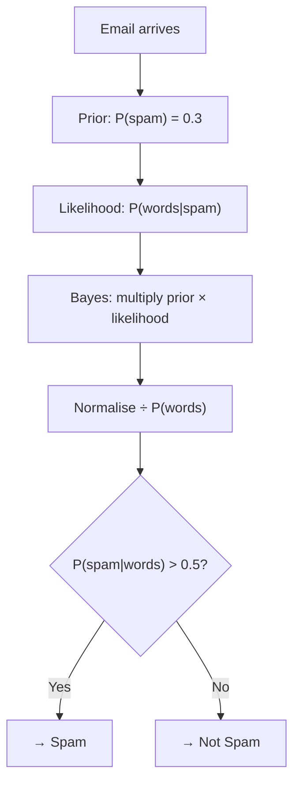

# Naive Bayes

## What is it?

Naive Bayes is a probabilistic classifier that uses Bayes' theorem to estimate the probability that a data point belongs to each class, given its features. It is called "naive" because it assumes all features are independent of each other — a simplification that rarely holds in practice but still produces surprisingly accurate classifiers. It is fast, simple, and particularly effective for text classification.

## The Idea

At the heart of Naive Bayes is Bayes' theorem, which gives you a principled way to update your beliefs in light of new evidence. The key intuition is that you can reason backwards: instead of directly asking "given these words, is this email spam?", you ask "how likely are these words to appear in spam emails?" and work from there. The prior probability tells you how common spam is in the first place, the likelihood tells you how well the observed words match the spam pattern, and multiplying them together gives you the posterior — the updated probability of spam given this particular email.

For classifying an email as spam, you want $P(\text{spam} \mid \text{words})$. Bayes' theorem lets you flip this: estimate $P(\text{words} \mid \text{spam})$ from training data (how often does each word appear in spam emails?), multiply by the prior $P(\text{spam})$ (what fraction of all emails are spam?), and divide by $P(\text{words})$ (a normalising constant that is the same for every class and can be ignored when comparing them).

The naive independence assumption is what makes this tractable. Estimating $P(\text{word}_1, \text{word}_2, \dots \mid \text{spam})$ jointly would require an astronomical amount of training data to cover every possible word combination. Instead, Naive Bayes treats each word independently and simply multiplies their individual likelihoods together. This turns an impossible joint estimation problem into a manageable one.

The naive assumption is almost never literally true — knowing the word "buy" is in an email makes "cheap" more likely too. But even with this simplification, Naive Bayes often outperforms much more complex models on text, especially with limited training data. The independence assumption introduces some bias, but the resulting model is so data-efficient and low-variance that it frequently wins in practice.

## Visual



## The Math

$$P(C \mid \mathbf{x}) = \frac{P(\mathbf{x} \mid C) \, P(C)}{P(\mathbf{x})} \propto P(C) \prod_{j=1}^{p} P(x_j \mid C)$$

> **In plain English:** The probability that a point belongs to class $C$ is proportional to the prior probability of $C$ multiplied by the product of individual feature likelihoods. The class with the highest resulting score wins.

<details><summary>Show the derivation</summary>

Applying the naive independence assumption, $P(\mathbf{x} \mid C) = \prod_j P(x_j \mid C)$. Since $P(\mathbf{x})$ is the same for all classes, it can be ignored for classification — we only need to compare scores across classes, not compute exact probabilities.

For **Gaussian Naive Bayes**, each $P(x_j \mid C)$ is modelled as a Gaussian with mean $\mu_{jC}$ and variance $\sigma^2_{jC}$ estimated from training data. For **Multinomial Naive Bayes** (text), $P(x_j \mid C)$ is the relative word frequency in class $C$, with Laplace smoothing to handle unseen words.

In practice, log-probabilities are used to avoid numerical underflow when multiplying many small probabilities:

$$\log P(C \mid \mathbf{x}) \propto \log P(C) + \sum_j \log P(x_j \mid C)$$

This converts the product of tiny numbers into a sum, which is numerically stable and computationally efficient.

</details>

## How It Learns

For each class in the training set, Naive Bayes first estimates the prior probability by simply counting how often that class appears — if 30% of your training emails are spam, the prior $P(\text{spam})$ is 0.3. Then, for every feature within every class, it estimates the likelihood. For Gaussian Naive Bayes this means computing the mean and variance of each feature among examples of that class. For Multinomial Naive Bayes on text, it means counting how frequently each word appears across all documents of that class and converting those counts into probabilities.

Training is nothing more than computing and storing these statistics — there is no optimisation loop, no gradient descent, no iterative refinement. Once the priors and likelihoods are stored, prediction works by multiplying the prior by the product of likelihoods for every class and returning the class with the highest score. Because training is a single pass through the data and prediction is a straightforward calculation, Naive Bayes is one of the fastest classifiers in existence.

## When to Use It

Naive Bayes excels at text classification — spam detection, sentiment analysis, document categorisation — largely because the independence assumption is less damaging in high-dimensional bag-of-words representations than it would be for correlated numerical features. Words do co-occur, but there are so many of them that the sheer dimensionality still gives the model enough signal to classify accurately. It also trains very fast, works well with small datasets, and handles high-dimensional feature spaces gracefully, making it a natural choice early in a project when you want a strong baseline quickly.

The main limitation is that the independence assumption causes it to underperform on problems where feature interactions matter strongly. If you are working with structured tabular data where knowing one feature changes the meaning of another, the naive model will miss those interactions entirely. When accuracy on complex structured data is the priority, Gradient Boosting or a neural network will typically do better. But for text, especially with limited labelled data, Naive Bayes is hard to beat for the effort it requires.

## Try It Yourself

```python
from sklearn.datasets import fetch_20newsgroups
from sklearn.naive_bayes import MultinomialNB
from sklearn.feature_extraction.text import CountVectorizer
from sklearn.metrics import accuracy_score

# Load four categories of news articles
categories = ['rec.sport.baseball', 'sci.space', 'talk.politics.guns', 'comp.graphics']
train_data = fetch_20newsgroups(subset='train', categories=categories)
test_data  = fetch_20newsgroups(subset='test',  categories=categories)

# Convert text to word counts (each word becomes a feature)
vectorizer = CountVectorizer()
X_train = vectorizer.fit_transform(train_data.data)
X_test  = vectorizer.transform(test_data.data)

# Train Naive Bayes classifier
model = MultinomialNB()
model.fit(X_train, train_data.target)

# Predict and check accuracy
predictions = model.predict(X_test)
accuracy = accuracy_score(test_data.target, predictions)
print(f"Accuracy: {accuracy * 100:.1f}%")

# Classify a new sentence
new_text = ["The rocket launched into orbit successfully"]
new_counts = vectorizer.transform(new_text)
pred = model.predict(new_counts)
print(f"Category: {train_data.target_names[pred[0]]}")
```

Expected output:
```
Accuracy: 93.7%
Category: sci.space
```

## Key Takeaways

Naive Bayes uses Bayes' theorem to turn the question "what class is this?" into "what class makes these features most likely?" — a clever inversion that is both mathematically principled and computationally simple. The naive independence assumption sounds limiting but in practice it makes the algorithm fast, data-efficient, and robust to high-dimensional spaces. For text classification especially, it often punches above its weight against far more complex models. It is a natural first choice when you have a text classification problem and limited labelled data, and it makes an excellent baseline against which to measure more sophisticated approaches.

---

[← K-Nearest Neighbours](knn){: .btn } [Next → K-Means Clustering](kmeans){: .btn .btn-primary }
