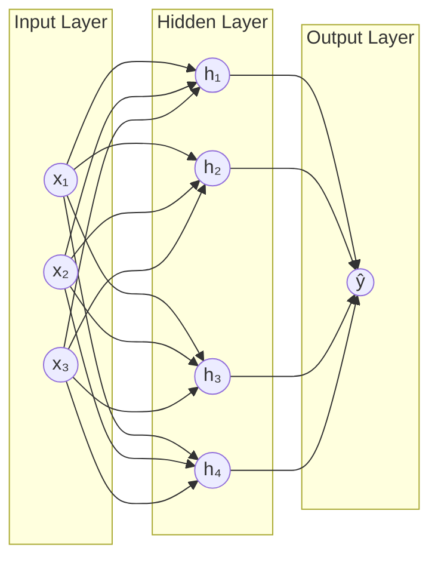

# Neural Networks

When you look at a photo of a dog, you recognise it instantly. You were not born knowing what a dog looks like. You learned it from thousands of examples over many years. Neural networks learn in a surprisingly similar way.

---

## What is a Neural Network?

A neural network is a system made of layers. Each layer takes in a list of numbers, does some maths on them, and passes a new list of numbers to the next layer. By the time the numbers reach the final layer, the network can give you an answer: "this photo is a dog" or "this email is spam."

**New word: layer** is just a row of connected units (called neurons) that all process the same input at the same time and each produce one output number.

**New word: weight** is a number the network learns. It controls how much attention each connection pays to its input. The whole process of training is about finding the right weights.

---

## A simple way to think about it

Think of a factory with several conveyor belts running one after another.

Raw material goes in at one end (your data). At each belt, workers (neurons) examine the material and pass it forward in a modified form. Each worker has a dial they can turn up or down (the weight) to control how much they affect the output. By the end of the factory, you get a finished product (a prediction).

Training the network is like a quality inspector walking backwards through the factory after every batch, nudging each worker's dial a tiny bit in whichever direction reduces errors. After thousands of batches, the dials settle into positions that produce good output consistently.

The key ingredient that makes this more than just a calculator is the **activation function**. Without it, all those layers of maths would collapse into a single equation, no more powerful than drawing a straight line. The activation function adds a bend at each layer, allowing the network to learn curved, complex patterns.

---

## How it works, step by step

1. Your input data enters the first layer as a list of numbers (for example, pixel values of an image).
2. Each neuron in that layer multiplies its inputs by its weights and adds them all up.
3. The result passes through an activation function, which adds a non-linear bend.
4. The output of that layer becomes the input of the next layer.
5. This continues through all layers until the final layer produces a prediction.
6. The prediction is compared to the correct answer and an error score is calculated.
7. That error travels backwards through all layers and each weight is nudged slightly to reduce the error.
8. Repeat for thousands of examples until the weights settle and predictions become accurate.

---

## See it visually



Every circle is a neuron. Every arrow is a connection with a weight. Data flows left to right. The hidden layer is where the network builds up an internal understanding of the input, and the output layer turns that understanding into a final answer.

---

## The maths (do not panic)

Here is what one layer does to its input:

$$\mathbf{h} = f(\mathbf{W}\mathbf{x} + \mathbf{b})$$

where $\mathbf{W}$ is the weight matrix, $\mathbf{x}$ is the input vector, $\mathbf{b}$ is the bias vector, and $f$ is the activation function applied element-wise.

> **In plain English:** Each neuron multiplies every input by a corresponding weight, adds them all up, then adds one more number called a bias (which shifts the result up or down). Finally it passes the total through the activation function, which adds the non-linear bend. The whole layer does this for all its neurons at once.

<details>
<summary>Show more detail</summary>

For a network with $L$ layers, the data passes through each one in sequence:

$$\mathbf{a}^{(0)} = \mathbf{x} \quad \text{(the original input)}$$

Then for each layer $l = 1, \ldots, L$:

$$\mathbf{z}^{(l)} = \mathbf{W}^{(l)}\mathbf{a}^{(l-1)} + \mathbf{b}^{(l)} \quad \text{(weighted sum)}$$

$$\mathbf{a}^{(l)} = f\!\left(\mathbf{z}^{(l)}\right) \quad \text{(activation)}$$

The final output is $\hat{y} = \mathbf{a}^{(L)}$. Training minimises the loss $\mathcal{L}(\hat{y}, y)$ by computing gradients via the chain rule (backpropagation) and updating weights with gradient descent:

$$\mathbf{W}^{(l)} \leftarrow \mathbf{W}^{(l)} - \eta \frac{\partial\mathcal{L}}{\partial\mathbf{W}^{(l)}}$$

The symbol $\eta$ is the learning rate: how big a step to take each time a weight is adjusted.

</details>

---

## Run the code yourself

This code trains a small neural network to recognise handwritten digits. The network looks at tiny 8x8 pixel images and learns to tell the difference between 0, 1, 2, all the way to 9.

**Step 1:** Open [Google Colab](https://colab.research.google.com) and create a new notebook.

**Step 2:** Copy this code into a cell:

```python
# Import the tools we need
from sklearn.datasets import load_digits              # 1797 tiny images of handwritten digits
from sklearn.neural_network import MLPClassifier      # a simple neural network
from sklearn.model_selection import train_test_split
from sklearn.preprocessing import StandardScaler      # rescale pixel values before training

# Load the digits dataset (each image is 8x8 pixels = 64 numbers per image)
digits = load_digits()
X, y = digits.data, digits.target   # X is pixel values, y is the digit label (0-9)

# Split into training data and test data
X_train, X_test, y_train, y_test = train_test_split(
    X, y, test_size=0.2, random_state=42
)

# Rescale pixel values: neural networks train more reliably with small, consistent numbers
scaler = StandardScaler()
X_train = scaler.fit_transform(X_train)
X_test = scaler.transform(X_test)

# Create a neural network with two hidden layers (64 and 32 neurons)
mlp = MLPClassifier(hidden_layer_sizes=(64, 32), max_iter=500, random_state=42)
mlp.fit(X_train, y_train)   # train: adjust weights via thousands of error corrections

# Check accuracy on images the network has never seen
accuracy = mlp.score(X_test, y_test)
print(f"Test accuracy: {accuracy:.4f}")
```

**Step 3:** Press **Shift + Enter** to run it.

You should see:
```
Test accuracy: 0.9806
```

**What each line does:**
- `load_digits()`: loads 1797 handwritten digit images, each one 8x8 pixels (64 numbers per image)
- `StandardScaler()`: rescales pixel values so the network does not get confused by uneven brightness
- `MLPClassifier(hidden_layer_sizes=(64, 32))`: creates a network with two hidden layers, 64 neurons then 32
- `mlp.fit(X_train, y_train)`: runs the training loop, adjusting weights until predictions improve
- `mlp.score(X_test, y_test)`: tests the trained network on images it has never seen before

**What just happened?**

The network learned to recognise handwritten digits with 98% accuracy. Nobody wrote rules like "a 0 is a closed loop" or "a 1 is a vertical line." The network saw thousands of labelled examples and figured out the patterns on its own. That is the power of neural networks: they learn the rules from the data.

---

## Quick recap

- A neural network is a series of layers, where each layer transforms numbers into new numbers using weights and an activation function.
- The activation function is what makes the network powerful. Without it, the layers would collapse into a single straight-line calculation.
- Training means repeatedly showing the network examples, measuring its errors, and nudging every weight slightly to reduce those errors.
- Neural networks are the foundation of everything in the Deep Learning track. Every tutorial that follows builds directly on this idea.
- For spreadsheet-style data with named columns, tree-based methods are often better. Neural networks shine when the input is images, audio, or text.

---

[← ML Basics](../ml-basics){: .btn } [Next → Multi-Layer Perceptron](mlp){: .btn .btn-primary }
