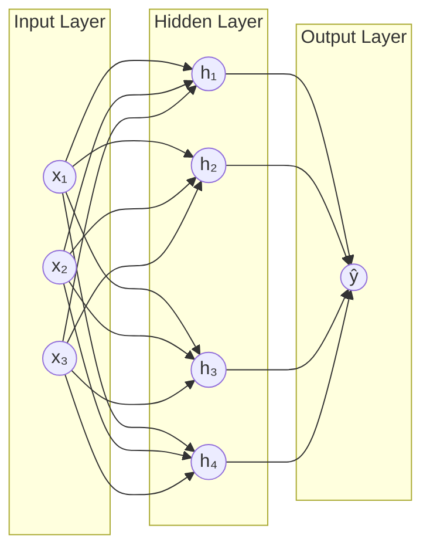

# Neural Networks

## What is it?

A neural network is a stack of layers, where each layer transforms its input by multiplying it by a set of weights, adding a bias, and passing the result through a non-linear activation function. The network learns by adjusting all its weights through backpropagation, propagating the error signal backwards from the output to every weight in the network. It's the foundation of almost all modern deep learning.

## The Idea

The inspiration is loosely biological. Neurons in the brain fire when their inputs exceed a threshold, passing signals forward. In a neural network, each "neuron" computes a weighted sum of its inputs and passes the result through an activation function. A layer of neurons transforms an input vector into an output vector. Stack enough layers and the network can learn extraordinarily complex functions.

What makes neural networks powerful is the non-linearity. Without activation functions, stacking layers would just be stacking matrix multiplications, which collapses back to a single linear transformation. Non-linear activations like ReLU ($\max(0, x)$) or sigmoid allow the network to bend and warp the feature space into shapes a linear model could never achieve.

Training is what makes the whole thing work. The network makes a prediction, compares it to the true label via a loss function, and then propagates the error backwards through the network layer by layer using the chain rule. Each weight is nudged in the direction that reduces the loss, which is gradient descent in a space with potentially millions of dimensions.

## Visual



## The Math

$$\mathbf{h} = f(\mathbf{W}\mathbf{x} + \mathbf{b})$$

where $\mathbf{W}$ is the weight matrix, $\mathbf{x}$ is the input vector, $\mathbf{b}$ is the bias vector, and $f$ is the activation function applied element-wise.

> **In plain English:** Each neuron computes a weighted combination of its inputs, adds a bias, and applies an activation function. A layer is just this operation applied in parallel for all its neurons.

<details><summary>Show the derivation</summary>

For a network with $L$ layers, the forward pass is:

$$\mathbf{a}^{(0)} = \mathbf{x} \quad \text{(input)}$$

Then for each layer $l = 1, \ldots, L$:

$$\mathbf{z}^{(l)} = \mathbf{W}^{(l)}\mathbf{a}^{(l-1)} + \mathbf{b}^{(l)} \quad \text{(linear combination)}$$

$$\mathbf{a}^{(l)} = f\!\left(\mathbf{z}^{(l)}\right) \quad \text{(activation)}$$

The final output is $\hat{y} = \mathbf{a}^{(L)}$. Training minimises a loss $\mathcal{L}(\hat{y}, y)$ by computing gradients $\partial\mathcal{L}/\partial\mathbf{W}^{(l)}$ via the chain rule (backpropagation) and updating weights with gradient descent:

$$\mathbf{W}^{(l)} \leftarrow \mathbf{W}^{(l)} - \eta \frac{\partial\mathcal{L}}{\partial\mathbf{W}^{(l)}}$$

</details>

## How It Learns

During training, data flows forward through the layers, producing a prediction. The loss function measures how wrong that prediction is relative to the true label, turning the error into a single scalar number.

Backpropagation then computes the gradient of the loss with respect to every weight in the network using the chain rule, working layer by layer from the output back to the input. A gradient descent step nudges every weight in the direction that reduces the loss. Repeat this process over many batches and epochs, and the loss gradually converges as the network settles into a set of weights that fit the training data.

## When to Use It

Neural networks excel at problems where classical machine learning tops out: images, audio, natural language, time series, and any domain where raw data contains rich structure that feature engineering struggles to capture. The trade-off is that they need more data, are harder to interpret, and require more computational resources to train.

For structured tabular data, gradient boosting usually outperforms a neural network and is far easier to tune. A good rule of thumb is to reach for a neural network when the input is high-dimensional and unstructured, like pixels, waveforms, or tokens, and to try simpler models first when working with clean, tabular features.

## Try It Yourself

If you have not set up Python yet, start with the [Get Started guide](../setup) first.

This code trains a small neural network to recognise handwritten digits. It uses scikit-learn's built-in MLP (Multi-Layer Perceptron) so you don't need PyTorch or TensorFlow yet.

Copy this into a cell and run it with Shift + Enter:

```python
from sklearn.datasets import load_digits              # 8x8 images of handwritten digits
from sklearn.neural_network import MLPClassifier      # a simple neural network
from sklearn.model_selection import train_test_split
from sklearn.preprocessing import StandardScaler      # scale inputs before training

# Load the digits dataset (8x8 images of handwritten digits, 0–9)
digits = load_digits()
X, y = digits.data, digits.target   # X is pixel values, y is the digit label

# Split and scale
X_train, X_test, y_train, y_test = train_test_split(
    X, y, test_size=0.2, random_state=42
)
scaler = StandardScaler()
X_train = scaler.fit_transform(X_train)   # normalise pixel values
X_test = scaler.transform(X_test)

# Train a small neural network: two hidden layers (64 and 32 neurons)
mlp = MLPClassifier(hidden_layer_sizes=(64, 32), max_iter=500, random_state=42)
mlp.fit(X_train, y_train)   # adjust weights via backpropagation

accuracy = mlp.score(X_test, y_test)     # fraction of test images classified correctly
print(f"Test accuracy: {accuracy:.4f}")
```

Expected output:

```
Test accuracy: 0.9806
```

**What each line does:**
- `load_digits()`: loads 1797 images of handwritten digits (each image is 8x8 pixels = 64 features)
- `StandardScaler()`: rescales pixel values so the network trains more stably
- `MLPClassifier(hidden_layer_sizes=(64, 32))`: creates a network with two hidden layers
- `mlp.fit(X_train, y_train)`: runs forward passes and backpropagation to adjust weights
- `mlp.score(X_test, y_test)`: computes accuracy on the held-out test set

**What just happened?**

The network learned to recognise handwritten digits with 98% accuracy. It never saw rules like "a 0 is a closed loop." It just saw thousands of examples and learned the patterns on its own. That's neural network learning in a nutshell.

## Key Takeaways

- A neural network is a composition of linear transformations and non-linear activations, stacked layer by layer.
- Non-linearity is what makes the whole thing work. Without it, the stack collapses to a single linear model.
- Backpropagation and gradient descent are what allow the network to learn, adjusting millions of weights simultaneously.
- Neural networks are the foundation of deep learning. Everything in this track builds directly on these ideas.
- For tabular data, start with gradient boosting. Switch to neural networks when inputs are images, audio, or text.

---

[← ML Basics](../ml-basics){: .btn } [Next → Multi-Layer Perceptron](mlp){: .btn .btn-primary }
