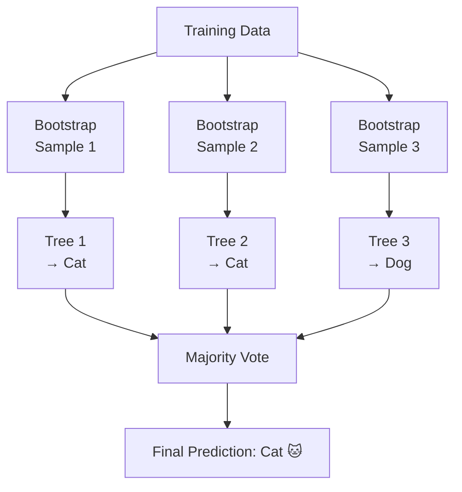

# Random Forests

Imagine asking 500 different people the same trivia question. Each person knows some things and gets other things wrong. But if you collect all their answers and go with the majority vote, you usually end up with the right answer, even though most individuals got some questions wrong. That is exactly how a Random Forest works.

---

## What is a Random Forest?

A Random Forest trains hundreds of Decision Trees (which you learned about in the previous tutorial), each one slightly different from the others. When a new example comes in, every tree makes a prediction and the majority wins.

No single tree needs to be perfect. The whole point is that different trees make different mistakes. When you combine hundreds of imperfect trees, the mistakes tend to cancel out and the final answer is far more reliable than any one tree on its own.

---

## A simple way to think about it

Think of a doctor's second opinion. One doctor might miss something. Two doctors are more likely to catch it. Five doctors, each with slightly different specialisations and backgrounds, are even more reliable.

A Random Forest builds 100 (or 500) versions of the decision tree model, each trained on a slightly different random selection of your training examples. Because each tree saw different examples, it made different mistakes. When they all vote together, the wrong votes tend to cancel out and the correct answer rises to the top.

The key word is "random." Two things are randomised for each tree. First, each tree trains on a randomly chosen sample of your data (some examples might appear twice, some might be skipped entirely). Second, when a tree is deciding how to split at each step, it only looks at a random selection of the available features, not all of them. This randomness is what makes the trees different from each other, and that difference is what makes the forest strong.

---

## How it works, step by step

1. Randomly pick a sample of your training data (some examples chosen more than once, some skipped)
2. Train one Decision Tree on that sample, using only a random subset of features at each split
3. Repeat steps 1 and 2 hundreds of times to build hundreds of different trees
4. When a new example arrives, send it through every single tree
5. Each tree votes for a category
6. The category with the most votes is the final prediction

---

## See it visually



The training data is split into three random samples (called bootstrap samples). Each sample trains a different tree. The trees make their individual predictions. The majority vote wins. In this example, two trees said "Cat" and one said "Dog", so the final answer is "Cat."

---

## The maths (do not panic)

Here is the formula that makes this work. We will break down every part.

$$\hat{y} = \text{mode}\{T_1(\mathbf{x}),\, T_2(\mathbf{x}),\, \dots,\, T_B(\mathbf{x})\}$$

> **In plain English:** The final prediction is simply whichever category the majority of trees voted for. The word "mode" here means "the most common value." $T_1$, $T_2$, etc. are the individual trees. $B$ is the total number of trees. $\mathbf{x}$ is the input example.

<details><summary>Show more detail</summary>

Here is why combining trees works so well mathematically.

Suppose each individual tree is somewhat unreliable and makes random errors. If the trees were completely independent of each other, averaging their predictions would reduce the errors quickly as you add more trees. More trees, fewer errors.

In practice, trees trained on the same dataset are not completely independent. They tend to make similar mistakes on similar examples, because they all started from the same data. The average similarity between trees is called correlation (the symbol $\rho$, pronounced "rho"). The combined error of the whole forest ends up being:

$$\rho\sigma^2 + \frac{1 - \rho}{B}\sigma^2$$

The second part shrinks toward zero as you add more trees. The first part is a floor: it cannot be reduced no matter how many trees you add, because it comes from the mistakes that all trees share.

This is exactly why randomly picking a subset of features at each split is so important. By forcing each tree to ignore some features when deciding how to split, you make the trees more different from each other. More different trees means lower correlation, which means a lower error floor, which means a more accurate forest.

</details>

---

## Run the code yourself

This code trains a Random Forest on the iris flower dataset. After training, it prints the accuracy and shows you which flower measurements were most important for making good predictions.

**Step 1:** Open [Google Colab](https://colab.research.google.com) and create a new notebook. (Or use Jupyter if you followed the [Get Started guide](setup).)

**Step 2:** Copy this code into a cell:

```python
from sklearn.datasets import load_iris                   # loads the iris flower dataset
from sklearn.ensemble import RandomForestClassifier      # the Random Forest model
from sklearn.model_selection import train_test_split     # splits data into training and test sets
from sklearn.metrics import accuracy_score               # measures how often we are right

# Load the iris dataset
data = load_iris()
X, y = data.data, data.target          # X is the measurements, y is the species label

# Split into 80% training data and 20% test data
X_train, X_test, y_train, y_test = train_test_split(
    X, y, test_size=0.2, random_state=42
)

# Create a forest of 100 trees
model = RandomForestClassifier(n_estimators=100, random_state=42)
model.fit(X_train, y_train)            # train all 100 trees (each on a different random sample)

# Get the majority vote prediction for each test flower
predictions = model.predict(X_test)
print(f"Accuracy: {accuracy_score(y_test, predictions) * 100:.1f}%")

# Show which features (measurements) mattered most across all 100 trees
for name, score in zip(data.feature_names, model.feature_importances_):
    print(f"  {name}: {score:.3f}")
```

**Step 3:** Press **Shift + Enter** to run it.

You should see:
```
Accuracy: 100.0%
  sepal length (cm): 0.091
  sepal width (cm): 0.026
  petal length (cm): 0.441
  petal width (cm): 0.442
```

**What each line does:**
- `RandomForestClassifier(n_estimators=100)`: creates a forest of 100 trees
- `model.fit(X_train, y_train)`: trains each tree on a different random sample of the training data
- `model.predict(X_test)`: sends each test flower through all 100 trees and takes the majority vote
- `model.feature_importances_`: shows how much each measurement contributed to predictions across all trees

**What just happened?**

The forest automatically discovered that petal length and petal width are the most important measurements for identifying flower species. The sepal width barely mattered at all. Nobody told the model this. It figured it out by observing which features led to the best splits across all 100 trees. It also reached 100% accuracy by combining 100 imperfect trees into one reliable answer.

---

## Quick recap

- A Random Forest builds hundreds of Decision Trees, each trained on a different random sample of data with a different random selection of features
- The diversity between trees is what makes the forest strong: different mistakes cancel out
- It is one of the most reliable ready-to-use algorithms for structured data (like spreadsheets and tables)
- It automatically tells you which features (measurements or variables) mattered most for making predictions
- It is harder to explain than a single tree, but much more accurate

---

[← Decision Trees](decision-tree){: .btn } [Next → Gradient Boosting](gradient-boosting){: .btn .btn-primary }
