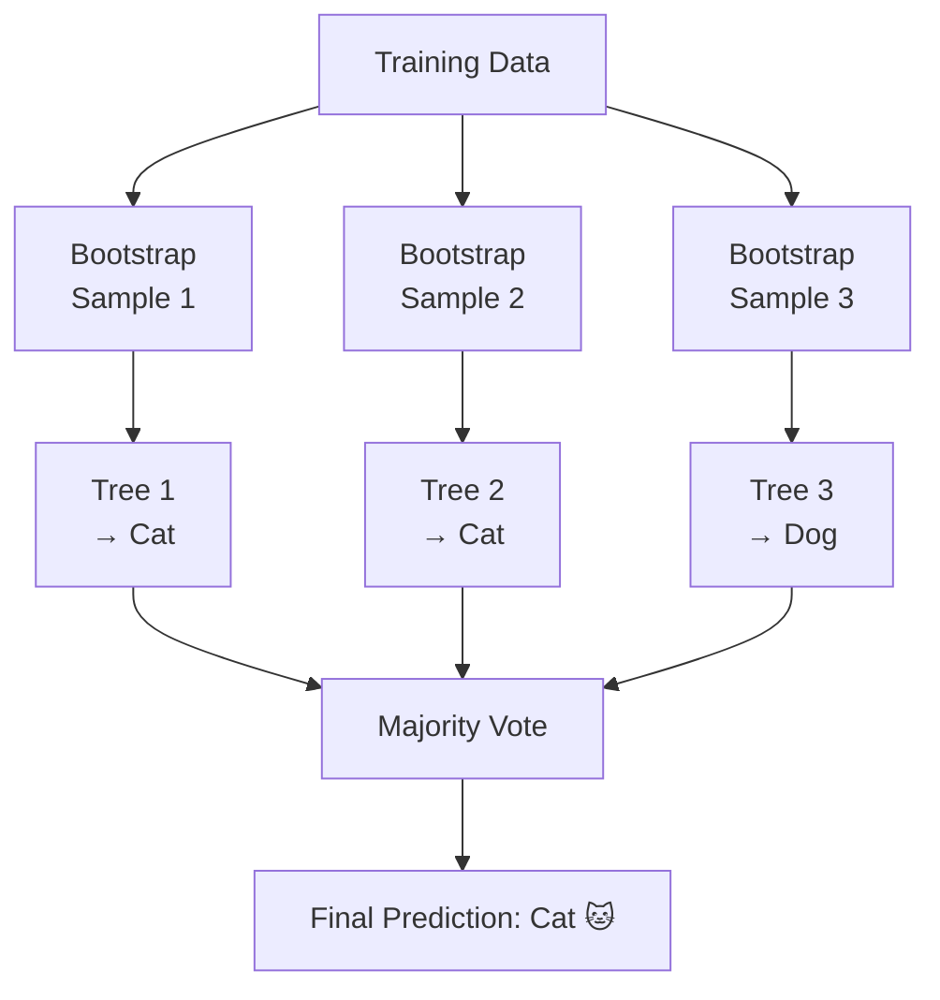

# Random Forests

## What is it?

A Random Forest builds hundreds of Decision Trees, each trained on a random subset of your data and features, and combines their predictions by majority vote. No single tree needs to be perfect. Together they cancel out each other's errors and produce a prediction far more reliable than any individual tree could manage.

---

## The Idea

The core technique behind Random Forests is called **bagging**, short for bootstrap aggregating. For each tree in the forest, the algorithm draws a random sample of the training data with replacement. That means the same example can appear more than once in a sample, and some examples won't appear at all. Each tree also considers only a random subset of features when deciding how to split at each node. The result is a collection of trees that were trained on slightly different views of the data.

This diversity is the whole point. Because each tree was trained on different examples and different features, the trees make different mistakes. When you average out those mistakes across hundreds of trees, the errors tend to cancel, and what remains is a stable, reliable prediction. No single tree needs to be right all the time. The forest is correct on average.

A single Decision Tree is brittle. Change a few training examples and the tree structure can change dramatically, leading to very different predictions. A forest sidesteps this instability entirely. Because the prediction comes from an aggregate of many independent trees, small fluctuations in training data barely move the needle on the final output.

---

## Visual



---

## The Math

$$\hat{y} = \text{mode}\{T_1(\mathbf{x}),\, T_2(\mathbf{x}),\, \dots,\, T_B(\mathbf{x})\}$$

> **In plain English:** The final prediction is simply whichever class the majority of trees voted for.

<details><summary>Show the derivation</summary>

The power of ensembling comes from **variance reduction through averaging**. Suppose each individual tree has prediction variance $\sigma^2$. If the trees were perfectly independent, averaging $B$ of them would reduce the variance to $\sigma^2 / B$. Variance shrinks to zero as you add more trees.

In practice, trees trained on the same dataset are correlated. They tend to make similar mistakes on similar examples. Let $\rho$ denote the average pairwise correlation between trees. The ensemble variance is then:

$$\rho\sigma^2 + \frac{1 - \rho}{B}\sigma^2$$

The first term, $\rho\sigma^2$, is a floor that cannot be reduced no matter how many trees you add. It captures the shared errors that come from correlation. The second term, $\frac{1-\rho}{B}\sigma^2$, shrinks toward zero as $B$ grows.

This is precisely why **random feature selection** matters. By forcing each tree to consider only $\sqrt{p}$ features (for $p$ total features) at each split, the algorithm actively decorrelates the trees, reducing $\rho$. Lower correlation means a lower variance floor, which means a more accurate ensemble.

</details>

---

## How It Learns

Each tree in the forest is built with the same greedy Gini-splitting process used by a regular Decision Tree. The differences are that each tree trains on a bootstrap sample of the data rather than the full dataset, and at every split, only a randomly chosen subset of features is considered. Typically that's $\sqrt{p}$ features for classification tasks. The trees are built independently of one another, which means the entire forest can be trained in parallel.

Once all trees are trained, making a prediction is straightforward. For classification, each tree casts a vote for its predicted class and the majority wins. For regression, the trees' numeric predictions are averaged. Either way, the forest's output is more stable than any individual tree's output because the aggregation smooths over the idiosyncratic errors each tree makes.

---

## When to Use It

Random Forest is one of the strongest default choices for tabular data. It trains quickly, it's difficult to overfit with enough trees, it handles missing values and mixed feature types gracefully, and it produces feature importance scores that tell you which inputs mattered most. For many practical problems, a Random Forest with default hyperparameters performs remarkably well without any tuning.

The tradeoff is interpretability. A single Decision Tree can be printed and explained to a stakeholder in minutes. A forest of five hundred trees can't. If explainability is a hard requirement, a shallow single tree or a linear model may serve you better. When you need to squeeze out more predictive performance than Random Forests provide, Gradient Boosting is the natural next step. It trades some of the forest's simplicity for additional accuracy.

---

## Try It Yourself

If you have not set up Python yet, start with the [Get Started guide](setup) first.

This code trains a Random Forest on the iris dataset and prints the accuracy plus how important each feature was to the predictions.

Copy this into a cell and run it with Shift + Enter:

```python
from sklearn.datasets import load_iris                   # classic flower dataset
from sklearn.ensemble import RandomForestClassifier      # the model
from sklearn.model_selection import train_test_split     # split train/test
from sklearn.metrics import accuracy_score               # measure accuracy

# Load dataset
data = load_iris()
X, y = data.data, data.target          # features and labels

# Split into train and test
X_train, X_test, y_train, y_test = train_test_split(
    X, y, test_size=0.2, random_state=42
)

# Train a forest of 100 trees
model = RandomForestClassifier(n_estimators=100, random_state=42)  # 100 trees
model.fit(X_train, y_train)            # train all trees in parallel

# Evaluate accuracy
predictions = model.predict(X_test)   # majority vote across all 100 trees
print(f"Accuracy: {accuracy_score(y_test, predictions) * 100:.1f}%")

# Inspect feature importances: which features mattered most?
for name, score in zip(data.feature_names, model.feature_importances_):
    print(f"  {name}: {score:.3f}")
```

**Expected output:**
```
Accuracy: 100.0%
  sepal length (cm): 0.091
  sepal width (cm): 0.026
  petal length (cm): 0.441
  petal width (cm): 0.442
```

**What each line does:**
- `RandomForestClassifier(n_estimators=100)`: creates a forest of 100 trees
- `model.fit(X_train, y_train)`: trains each tree on a different random bootstrap sample
- `model.predict(X_test)`: each tree votes and the majority wins
- `model.feature_importances_`: shows how much each feature contributed across all trees

**What just happened?**

Petal length and petal width dominate. The forest figured this out automatically, without any guidance from you. It also gave you 100% accuracy by combining 100 imperfect trees into one reliable answer. That's the magic of ensembling.

---

## Key Takeaways

- A Random Forest is an ensemble of Decision Trees, each trained on a random bootstrap sample with a random subset of features at each split.
- Diversity between trees is what makes the ensemble strong. Different mistakes cancel out.
- It's one of the most reliable off-the-shelf algorithms for tabular data and a great default before reaching for Gradient Boosting.
- Built-in feature importance scores make it a useful tool for understanding which variables drive your predictions.
- It's harder to interpret than a single tree, but much more accurate.

---

[← Decision Trees](decision-tree){: .btn } [Next → Gradient Boosting](gradient-boosting){: .btn .btn-primary }
