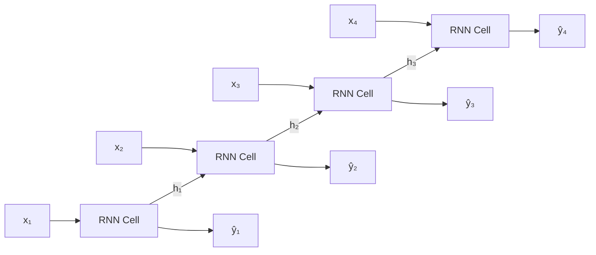

# Recurrent Neural Networks (RNN)

## What is it?

A Recurrent Neural Network (RNN) processes sequences by maintaining a hidden state that is passed from one step to the next. At each timestep, the network takes the current input and the previous hidden state, combines them, and produces a new hidden state. This lets the network carry information forward through time, making it naturally suited for text, speech, and time series.

---

## The Idea

A standard feedforward network processes each input independently. There's no memory of what came before. An RNN breaks this limitation by feeding its own output back as an input. At each timestep $t$, the hidden state $h_t$ is updated based on the new input $x_t$ and the previous state $h_{t-1}$. The same weights are shared across all timesteps. The network learns a single transition rule and applies it repeatedly.

This weight sharing is both the strength and the weakness of RNNs. Because the same transformation is applied at every step, the network can in principle handle sequences of any length. But in practice, gradients that flow backwards through time get multiplied by the same weight matrix at every step. If that matrix shrinks gradients, they vanish. If it amplifies them, they explode. This is the vanishing/exploding gradient problem, which makes it hard for vanilla RNNs to learn dependencies over long sequences.

The solution to vanishing gradients is the LSTM (Long Short-Term Memory), covered in the next tutorial. Gated Recurrent Units (GRUs) offer a simpler alternative. Plain RNNs are mainly useful for short sequences or as a conceptual building block for understanding LSTMs and GRUs.

---

## Visual



---

## The Math

$$h_t = \tanh\!\left(W_h h_{t-1} + W_x x_t + b\right)$$

> **In plain English:** The new hidden state is a tanh-squashed combination of the previous hidden state (multiplied by $W_h$, the recurrent weights) and the current input (multiplied by $W_x$, the input weights). The tanh keeps values in $[-1, 1]$, preventing unbounded growth.

<details><summary>Show the derivation</summary>

The output at each step is $\hat{y}_t = \text{softmax}(W_y h_t + b_y)$. The loss is the sum of per-step cross-entropies for sequence tasks. Training uses Backpropagation Through Time (BPTT): unroll the network for $T$ timesteps and apply standard backpropagation to the unrolled graph.

The gradient of the loss with respect to $W_h$ at step $t$ involves the product $\prod_{k=1}^{t} \frac{\partial h_k}{\partial h_{k-1}}$, which includes powers of $W_h$ and the tanh derivative. For long sequences, this product either vanishes (if the spectral radius of $W_h$ is $< 1$) or explodes (if $> 1$). Gradient clipping (capping gradient norms) mitigates explosion. LSTMs address vanishing gradients structurally.

</details>

---

## How It Learns

An RNN is trained with Backpropagation Through Time. The network is unrolled across all timesteps to create a (very deep) computational graph, then standard backpropagation is run on that graph. The same weight matrices $W_h$ and $W_x$ appear at every timestep, so their gradients are accumulated across all steps.

In practice, truncated BPTT limits unrolling to a fixed window to manage memory and computation. The vanishing gradient problem means vanilla RNNs are rarely used in modern practice. For real sequence modelling tasks, LSTMs or Transformers are preferred.

---

## When to Use It

Vanilla RNNs are mainly used as a pedagogical stepping stone to LSTMs and GRUs rather than in production. They fit well for very short sequences where gradient flow is not a problem, or situations where the sequence has no long-range dependencies.

For most real-world sequence tasks, like language modelling, speech, or time series forecasting, use LSTMs or, for large-scale NLP, Transformer architectures.

---

## Try It Yourself

If you have not set up Python yet, start with the [Get Started guide](../setup) first.

This code trains a simple RNN to predict the next value in a sine wave. It's a classic "next-step prediction" task that shows how RNNs use past values to predict future ones.

Copy this into a cell and run it with Shift + Enter:

```python
import torch                                        # PyTorch
import torch.nn as nn                              # neural network modules
import numpy as np                                 # numerical arrays

# Generate a sine wave: 500 data points over two full cycles
t = np.linspace(0, 4 * np.pi, 500).astype(np.float32)
data = np.sin(t)                                   # the sine values

# Build input/output pairs: given 20 steps, predict the next value
SEQ_LEN = 20
X = np.array([data[i:i + SEQ_LEN] for i in range(len(data) - SEQ_LEN)])  # input sequences
y = np.array([data[i + SEQ_LEN] for i in range(len(data) - SEQ_LEN)])    # next-step targets

X_t = torch.tensor(X).unsqueeze(-1)   # shape: (samples, 20, 1)
y_t = torch.tensor(y).unsqueeze(-1)   # shape: (samples, 1)

# Define a simple RNN model
class SimpleRNN(nn.Module):
    def __init__(self):
        super().__init__()
        self.rnn = nn.RNN(input_size=1, hidden_size=32, batch_first=True)  # 32 hidden units
        self.fc  = nn.Linear(32, 1)    # output: one predicted value

    def forward(self, x):
        out, _ = self.rnn(x)           # run the RNN through all 20 timesteps
        return self.fc(out[:, -1, :])  # use only the last hidden state to predict

model     = SimpleRNN()
optimizer = torch.optim.Adam(model.parameters(), lr=0.01)
loss_fn   = nn.MSELoss()               # mean squared error loss

# Train for 10 epochs
for epoch in range(1, 11):
    model.train()
    pred = model(X_t)                  # forward pass through the RNN
    loss = loss_fn(pred, y_t)         # compare prediction to true next value
    optimizer.zero_grad()              # clear old gradients
    loss.backward()                    # backpropagate through time
    optimizer.step()                   # update weights
    print(f"Epoch {epoch:2d} | Loss: {loss.item():.6f}")

# Check one prediction
model.eval()
with torch.no_grad():
    sample_pred = model(X_t[0:1]).item()
print(f"\nPredicted: {sample_pred:.4f} | Actual: {y[0]:.4f}")
```

**Expected output:**
```
Epoch  1 | Loss: 0.321847
Epoch  2 | Loss: 0.198432
Epoch  3 | Loss: 0.104219
Epoch  4 | Loss: 0.051763
Epoch  5 | Loss: 0.023481
Epoch  6 | Loss: 0.010954
Epoch  7 | Loss: 0.005312
Epoch  8 | Loss: 0.002841
Epoch  9 | Loss: 0.001673
Epoch 10 | Loss: 0.001102

Predicted: 0.8714 | Actual: 0.8749
```

**What each line does:**
- `np.linspace(0, 4 * np.pi, 500)`: creates 500 time steps covering two full sine cycles
- `X[i:i + SEQ_LEN]`: each input is a window of 20 consecutive sine values
- `nn.RNN(input_size=1, hidden_size=32)`: creates an RNN cell with 32 hidden units
- `out[:, -1, :]`: takes only the final hidden state after processing all 20 steps
- `loss.backward()`: runs backpropagation through all 20 timesteps at once

**What just happened?**

The RNN saw 20 past values of the sine wave and predicted the next one. The loss dropped from 0.32 to 0.001 in just 10 epochs. By the end, its prediction (0.8714) was very close to the actual value (0.8749). The network learned the pattern of the sine wave purely from examples.

---

## Key Takeaways

- An RNN processes sequences by passing a hidden state from step to step, allowing it to carry information through time.
- The shared weight matrices mean the same transition is applied at every timestep, which makes it prone to vanishing gradients over long sequences.
- Gradient clipping helps with explosion, but for long-range dependencies, LSTMs and GRUs are more reliable.
- Vanilla RNNs are mainly useful as a conceptual building block. In practice, use LSTMs or Transformers.
- Understanding RNNs makes the gating mechanisms in LSTMs immediately intuitive.

---

[← CNNs](cnn){: .btn } [Next → LSTM](lstm){: .btn .btn-primary }
