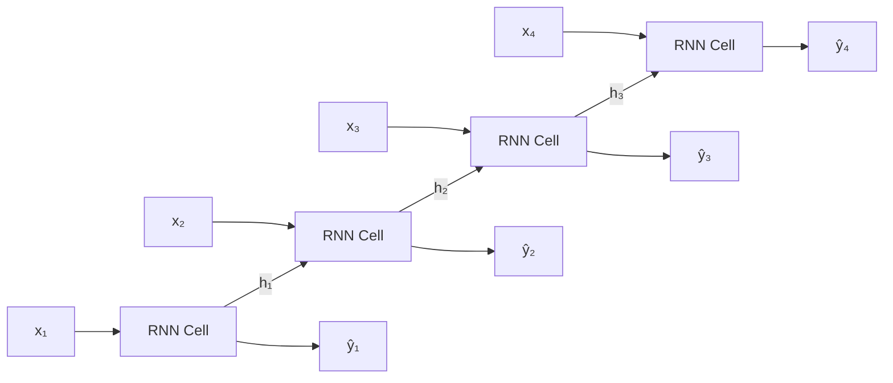

# Recurrent Neural Networks (RNN)

When you read a sentence, each word makes more sense because of the words that came before it. "I ate the apple" means something different from "I threw the apple." A Recurrent Neural Network is designed to understand sequences in exactly this way.

---

## What is a Recurrent Neural Network?

A Recurrent Neural Network (RNN) processes data one step at a time and carries a small memory from step to step. At each step it looks at the current input and what it remembered from the previous step, then produces an output and updates its memory.

**New word: sequence** is any data where the order matters. A sentence is a sequence of words. A song is a sequence of notes. A stock price is a sequence of daily values.

**New word: hidden state** is the memory the RNN carries forward. It is just a list of numbers that gets updated at every step. Think of it as the network's "short-term memory."

---

## A simple way to think about it

Imagine you are reading a detective novel one word at a time and someone keeps asking "so who do you think did it?"

After reading "The butler" you have one opinion. After reading "The butler, who had been away all evening," your opinion changes. After reading "The butler, who had been away all evening, was innocent," your opinion changes again.

At each point, your answer depends not just on the last word you read but on everything you have read so far. That is exactly what an RNN does. It processes each word (or data point) one at a time and carries a running summary (the hidden state) that it updates as it reads.

The same set of weights is used at every step. The network learns one general rule for updating its memory, then applies that rule repeatedly to handle sequences of any length.

---

## How it works, step by step

1. The network starts with an empty hidden state (all zeros).
2. The first item in the sequence arrives as input.
3. The network combines the input with the current hidden state to produce a new hidden state.
4. Optionally, the network also produces an output at this step.
5. The new hidden state becomes the current one and the next item in the sequence arrives.
6. Repeat steps 3 to 5 for every item in the sequence.
7. After all items have been processed, the final hidden state summarises the whole sequence.

---

## See it visually



Each box labelled "RNN Cell" is the same cell, using the same weights. The arrows labelled $h_1$, $h_2$, $h_3$ are the hidden state being passed from one step to the next, carrying memory forward. The $\hat{y}$ arrows are the outputs produced at each step.

---

## The maths (do not panic)

Here is how the hidden state is updated at each step:

$$h_t = \tanh\!\left(W_h h_{t-1} + W_x x_t + b\right)$$

> **In plain English:** The new hidden state $h_t$ is a blend of two things: the previous hidden state ($h_{t-1}$, what the network remembered) and the current input ($x_t$, the new information). Both are multiplied by their own set of learned weights and added together with a bias. The tanh function then squashes the result to keep values between -1 and 1, preventing the numbers from growing without limit.

<details>
<summary>Show more detail</summary>

Training an RNN means running the sequence forwards step by step to get a prediction, then sending the error signal backwards through all the steps to update every weight. This is called Backpropagation Through Time (BPTT).

The problem is that the error signal has to travel through many steps, and at each step it gets multiplied by the weight matrix $W_h$. If those multiplications repeatedly shrink the signal, it becomes so small by the time it reaches early steps that the weights there barely change. This is the vanishing gradient problem, and it means standard RNNs struggle to learn patterns that span more than a few dozen steps.

For long sequences, LSTMs and GRUs solve this problem. They are covered in the next tutorial.

</details>

---

## Run the code yourself

This code trains a simple RNN to predict the next value in a sine wave. After seeing 20 past values, the RNN guesses what comes next. This is called next-step prediction, and it is the same idea behind weather forecasting and stock prediction.

**Step 1:** Open [Google Colab](https://colab.research.google.com) and create a new notebook.

**Step 2:** Copy this code into a cell:

```python
import torch                                        # PyTorch
import torch.nn as nn                              # neural network tools
import numpy as np                                 # numerical array tools

# Create a sine wave: 500 points covering two full cycles
t = np.linspace(0, 4 * np.pi, 500).astype(np.float32)
data = np.sin(t)                                   # the actual sine values

# Build training pairs: given 20 past values, predict the next value
SEQ_LEN = 20
X = np.array([data[i:i + SEQ_LEN] for i in range(len(data) - SEQ_LEN)])  # input windows
y = np.array([data[i + SEQ_LEN] for i in range(len(data) - SEQ_LEN)])    # next value to predict

# Convert to PyTorch tensors (the format PyTorch needs)
X_t = torch.tensor(X).unsqueeze(-1)   # shape: (samples, 20, 1)
y_t = torch.tensor(y).unsqueeze(-1)   # shape: (samples, 1)

# Define the RNN model
class SimpleRNN(nn.Module):
    def __init__(self):
        super().__init__()
        self.rnn = nn.RNN(input_size=1, hidden_size=32, batch_first=True)  # 32 memory units
        self.fc  = nn.Linear(32, 1)    # predict one number from the final hidden state

    def forward(self, x):
        out, _ = self.rnn(x)           # process all 20 steps, updating hidden state each time
        return self.fc(out[:, -1, :])  # use the final hidden state to make the prediction

# Set up the model, optimiser, and loss function
model     = SimpleRNN()
optimizer = torch.optim.Adam(model.parameters(), lr=0.01)
loss_fn   = nn.MSELoss()               # mean squared error: average squared prediction mistake

# Train for 10 passes through the data
for epoch in range(1, 11):
    model.train()
    pred = model(X_t)                  # forward pass: get predictions for all windows
    loss = loss_fn(pred, y_t)         # measure how wrong the predictions are
    optimizer.zero_grad()              # clear old error signals
    loss.backward()                    # calculate which weights caused the errors
    optimizer.step()                   # nudge those weights to reduce errors
    print(f"Epoch {epoch:2d} | Loss: {loss.item():.6f}")

# Test on one example
model.eval()
with torch.no_grad():
    sample_pred = model(X_t[0:1]).item()
print(f"\nPredicted: {sample_pred:.4f} | Actual: {y[0]:.4f}")
```

**Step 3:** Press **Shift + Enter** to run it.

You should see:
```
Epoch  1 | Loss: 0.321847
Epoch  2 | Loss: 0.198432
Epoch  3 | Loss: 0.104219
Epoch  4 | Loss: 0.051763
Epoch  5 | Loss: 0.023481
Epoch  6 | Loss: 0.010954
Epoch  7 | Loss: 0.005312
Epoch  8 | Loss: 0.002841
Epoch  9 | Loss: 0.001673
Epoch 10 | Loss: 0.001102

Predicted: 0.8714 | Actual: 0.8749
```

**What each line does:**
- `np.linspace(0, 4 * np.pi, 500)`: creates 500 evenly spaced time points covering two full sine cycles
- `X[i:i + SEQ_LEN]`: each training input is a window of 20 consecutive sine values
- `nn.RNN(input_size=1, hidden_size=32)`: creates an RNN cell that maintains a hidden state of 32 numbers
- `out[:, -1, :]`: takes only the hidden state from the last of the 20 steps to use for prediction
- `loss.backward()`: sends the error signal backwards through all 20 time steps at once

**What just happened?**

The RNN saw 20 past values of a sine wave and predicted the next one. After 10 training passes, the loss dropped from 0.32 to 0.001. Its final prediction (0.8714) was very close to the actual value (0.8749). The network learned the repeating pattern of the sine wave purely from examples, with no formula given to it.

---

## Quick recap

- An RNN processes sequences one step at a time and carries a hidden state forward as a short-term memory.
- The same weights are used at every step, which means the network learns one general rule and applies it repeatedly.
- This works well for short sequences but struggles with long ones because the memory signal fades as it travels backwards through many steps.
- For sequences with important long-range patterns (like a sentence where the beginning affects the ending), LSTMs and GRUs are more reliable.
- Understanding how an RNN works makes the improvements in an LSTM immediately clear.

---

[← CNNs](cnn){: .btn } [Next → LSTM](lstm){: .btn .btn-primary }
