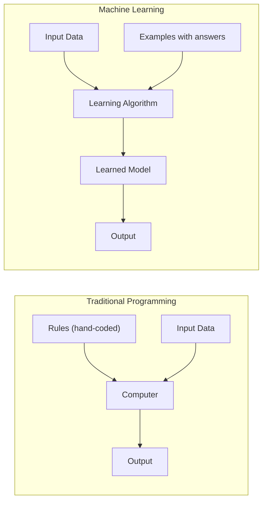

# What is Machine Learning?

## What is it?

Machine learning lets computers learn patterns from data instead of following hand-coded rules. Rather than a programmer listing every condition, the machine figures out the logic itself from examples. A spam filter is the classic case: instead of writing rules like "flag emails with the word 'winner'", you show the system thousands of spam and non-spam emails and it learns to tell them apart on its own.

---

## The Idea

The core shift in machine learning is from *telling* a computer what to do to *showing* it what good looks like. In traditional programming, you write explicit rules — if this, then that. The computer follows them exactly. That works fine until the problem gets complicated: writing rules for recognising faces, translating sentences, or detecting fraud quickly becomes impossible. The patterns are too subtle and too numerous to capture by hand.

Machine learning takes a different route. Instead of rules, you hand over data — lots of examples of inputs paired with the correct answers — and let the algorithm work out the patterns itself. The rules emerge from the data rather than from a programmer's head.

Every ML system you will ever encounter has three ingredients. First, **data**: the examples the system learns from. Second, a **model**: a mathematical structure with adjustable parameters that can represent patterns. Third, **training**: the process of feeding the data to the model and nudging its parameters until its predictions get accurate. Get those three things right and the model will generalise — it will make good predictions on inputs it has never seen before.

---

## Visual



---

## The Math

This tutorial is conceptual — the equations start from the next one. Every formula you will encounter in this series has a plain-English translation right next to it, so you will never be left staring at symbols without knowing what they mean.

---

## How It Learns

There is no single learning algorithm — the field contains dozens of them — but they all share the same underlying loop. The model makes a prediction, the system measures how wrong that prediction was, and then it adjusts the model's parameters to reduce the error. Repeat that loop thousands of times across your training data and the model gradually gets better. By the time training is done, it has compressed everything useful in your examples into a set of numbers it can use to handle new inputs.

---

## When to Use It

Machine learning earns its keep when the patterns in your data are too complex to write as explicit rules. If you could solve the problem with a handful of if/else statements, you probably should — it will be faster, cheaper, and easier to debug. But when the rules would number in the thousands, when the task involves raw images or natural language, or when you want the system to improve automatically as new data arrives, ML is the right tool. It also needs a decent amount of data to work well; on a tiny dataset, a simple hand-crafted rule will usually beat a learned model.

---

## Try It Yourself

```python
from sklearn.datasets import load_iris
from sklearn.tree import DecisionTreeClassifier

data = load_iris()
model = DecisionTreeClassifier()
model.fit(data.data, data.target)
print(data.target_names[model.predict([[5.1, 3.5, 1.4, 0.2]])[0]])
```

Expected output:
```
setosa
```

---

## Key Takeaways

Machine learning replaces hand-written rules with patterns learned directly from data — the computer figures out the logic rather than being told it. Every ML system rests on the same three pillars: data to learn from, a model to hold the patterns, and a training process to fit one to the other. Once trained, the model generalises: it makes sensible predictions on inputs it has never seen. This series walks you through the whole landscape, from the simplicity of linear regression all the way to deep learning, with every concept grounded in working code.

---

[Next → ML Foundations](foundations){: .btn .btn-primary }
