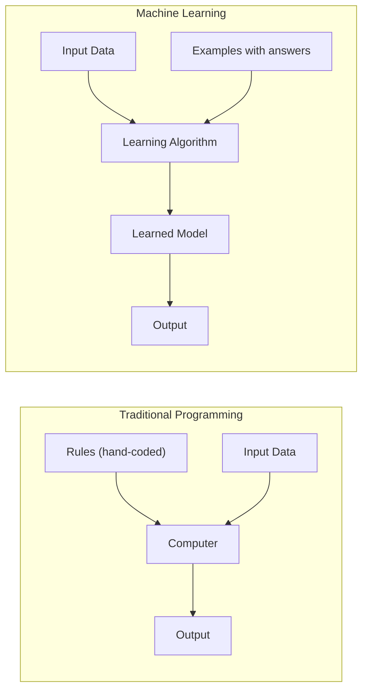

# What is Machine Learning?

## What is it?

Machine learning lets computers learn patterns from data instead of following rules that a programmer wrote by hand. Instead of telling a computer exactly what to do in every situation, you show it thousands of examples and it figures out the logic itself.

A spam filter is the classic example. Instead of writing rules like "flag any email with the word winner in it", you show the system thousands of spam emails and thousands of normal ones. It studies them and learns to tell them apart on its own. No rules. Just examples.

---

## The Idea

Traditional programming works like a recipe. You write the instructions, the computer follows them exactly. That works fine for simple tasks. But try writing a recipe for "recognise a cat in a photo" or "predict whether this loan will default." The patterns are too complex, too numerous, too subtle. You cannot write enough rules to cover everything.

Machine learning flips the approach. Instead of rules, you hand over data, lots of examples of inputs paired with the right answers, and let the algorithm find the patterns itself. The rules emerge from the data rather than from your head.

Every ML system you will ever encounter has three parts:

1. **Data**: the examples the system learns from
2. **Model**: a mathematical structure that can represent patterns
3. **Training**: the process of feeding data to the model until its predictions become accurate

Get those three things right and the model will generalise. It will make good predictions on inputs it has never seen before.

---

## Visual



---

## The Math

This tutorial is conceptual. The equations start in the next one. Every formula in this series has a plain-English translation right next to it, so you will never be left staring at symbols without knowing what they mean.

---

## How It Learns

There is no single learning algorithm. The field has dozens. But they all share the same loop:

1. The model makes a prediction
2. The system measures how wrong that prediction was
3. It adjusts the model slightly to reduce the error
4. Repeat thousands of times

By the time training finishes, the model has compressed everything useful from your examples into a set of numbers it can use to handle new inputs. It did not memorise your data. It learned the pattern behind it.

---

## When to Use It

Machine learning earns its place when the patterns in your data are too complex to write as explicit rules. If you could solve the problem with a handful of if/else statements, just do that. It will be faster, cheaper, and easier to debug.

But when the task involves images, language, fraud detection, or anything where the rules would number in the thousands, ML is the right tool. One catch: it needs a decent amount of data to work well. On a tiny dataset, a simple hand-crafted rule usually beats a learned model.

---

## Try It Yourself

If you have not set up Python yet, start with the [Get Started guide](setup) first. It takes 5 minutes.

Copy this code into a Colab cell (or Jupyter notebook) and run it with Shift + Enter:

```python
# Load a built-in dataset of flowers with measurements
from sklearn.datasets import load_iris

# Load a simple ML model that makes decisions like a flowchart
from sklearn.tree import DecisionTreeClassifier

# Step 1: Load the data
data = load_iris()
# data.data contains measurements (petal size, sepal size) for 150 flowers
# data.target contains the species label: 0, 1, or 2

# Step 2: Train the model on all 150 flowers
model = DecisionTreeClassifier()
model.fit(data.data, data.target)

# Step 3: Ask it to classify a new flower we have never shown it
# [5.1, 3.5, 1.4, 0.2] means: sepal length 5.1cm, width 3.5cm, petal length 1.4cm, width 0.2cm
new_flower = [[5.1, 3.5, 1.4, 0.2]]
prediction_index = model.predict(new_flower)[0]

# Convert the number (0, 1, or 2) into the actual species name
print(data.target_names[prediction_index])
```

Expected output:

```
setosa
```

**What each line does:**

- `load_iris()` gives us a dataset of 150 flowers with their measurements and correct labels
- `DecisionTreeClassifier()` creates a model that learns by asking yes/no questions about the measurements
- `model.fit(...)` trains the model, it studies all 150 examples and learns the patterns
- `model.predict(...)` uses what it learned to classify a brand new flower
- The output `setosa` is the species name the model predicted

**What just happened?**

The model saw 150 labelled flowers during training. It learned that flowers with short petals (like `petal length 1.4cm`) tend to be setosa. When you gave it a new flower with similar measurements, it predicted setosa correctly. You never wrote any rule about petal lengths. The model figured it out from the data.

---

## Key Takeaways

- Machine learning replaces hand-written rules with patterns learned from data
- Every ML system needs three things: data, a model, and a training process
- Once trained, the model generalises: it makes predictions on inputs it has never seen
- This series covers the full journey, from the simplicity of linear regression all the way to deep learning, with every concept grounded in working code

---

[Next: ML Foundations](foundations){: .btn .btn-primary }
