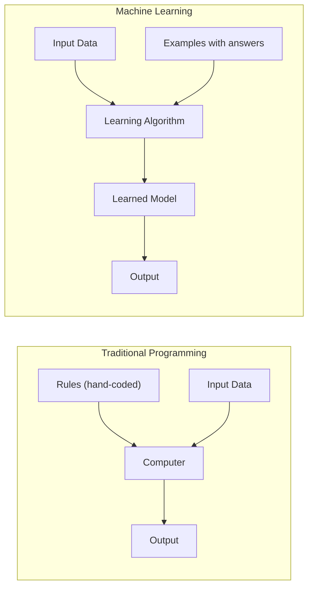

# What is Machine Learning?

Have you ever noticed that YouTube seems to know exactly which video you want to watch next? Or that Gmail moves junk mail into your spam folder without you doing anything? That is machine learning at work, quietly learning your habits from millions of examples.

---

## What is Machine Learning?

Machine learning is a way for computers to learn from examples instead of following instructions a programmer wrote by hand. You show the computer thousands of examples, and it figures out the pattern on its own.

Think of spam email. Instead of a programmer writing rules like "flag every email with the word 'winner'", you just show the system thousands of spam emails and thousands of normal emails. It studies them and learns to tell them apart. No rules. Just examples.

**New word: model.** In machine learning, a "model" is just the thing the computer builds after studying the examples. It is what makes new predictions later.

---

## A simple way to think about it

Imagine you are learning to recognise dogs. Nobody gave you a rulebook. Instead, you saw hundreds of dogs as a child, and over time your brain picked up the pattern: four legs, fur, a tail, barks. Now you can recognise a dog you have never seen before.

Machine learning works the same way. You show the computer hundreds (or millions) of examples, and it builds its own internal pattern. Once training is done, it can recognise things it has never seen.

The big difference from normal computer programs is this: in normal programming, a person writes every rule. In machine learning, the computer writes its own rules by studying the data.

---

## How it works, step by step

1. Collect examples, like thousands of emails labelled "spam" or "not spam"
2. Choose a model, which is a blank structure that is ready to learn
3. Train the model by showing it all the examples over and over
4. The model adjusts itself each time it gets something wrong
5. Once training is finished, the model is ready to make predictions on new examples it has never seen

---

## See it visually



The left side shows traditional programming: a person writes all the rules. The right side shows machine learning: the computer receives examples and builds its own rules automatically.

---

## The maths (do not panic)

This tutorial is about the big picture. The equations start in the next tutorial. Every formula in this series has a plain-English translation right next to it, so you will never be left staring at symbols without knowing what they mean.

---

## Run the code yourself

This code will train a tiny model to identify a flower species from its measurements. The model will study 150 flowers and then name a flower it has never seen before.

**Step 1:** Open [Google Colab](https://colab.research.google.com) and create a new notebook. (Or use Jupyter if you followed the [Get Started guide](setup).)

**Step 2:** Copy this code into a cell:

```python
# Load the iris flower dataset: 150 flowers with petal and sepal measurements
from sklearn.datasets import load_iris

# Load a simple model that makes decisions by asking yes/no questions
from sklearn.tree import DecisionTreeClassifier

# Step 1: Load the data
data = load_iris()
# data.data contains the flower measurements (petal size, sepal size) for all 150 flowers
# data.target contains the species label for each flower: 0, 1, or 2

# Step 2: Train the model. Show it all 150 flowers so it can learn the pattern
model = DecisionTreeClassifier()
model.fit(data.data, data.target)

# Step 3: Ask the model to identify a new flower it has never seen before
# These measurements mean: sepal length 5.1cm, width 3.5cm, petal length 1.4cm, width 0.2cm
new_flower = [[5.1, 3.5, 1.4, 0.2]]
prediction_index = model.predict(new_flower)[0]  # get the predicted species number

# Convert the species number (0, 1, or 2) into the actual species name
print(data.target_names[prediction_index])
```

**Step 3:** Press **Shift + Enter** to run it.

You should see:
```
setosa
```

**What each line does:**
- `load_iris()`: loads a built-in dataset of 150 flowers, each one already labelled with its correct species name
- `DecisionTreeClassifier()`: creates a blank model that learns by asking yes/no questions about the measurements
- `model.fit(data.data, data.target)`: trains the model by showing it all 150 labelled examples
- `model.predict(new_flower)`: uses what the model learned to identify a brand new flower
- `data.target_names[...]`: converts the prediction number (0, 1, or 2) into a human-readable species name

**What just happened?**

The model studied 150 flowers during training. It noticed that flowers with very short petals, like the one you gave it, tend to be the setosa species. When you gave it a new flower with those same measurements, it predicted setosa correctly. You never wrote any rule about petal lengths. The model worked it out from the data on its own. That is exactly what machine learning means.

---

## Quick recap

- Machine learning lets computers learn patterns from examples instead of following hand-written rules
- Every machine learning system needs three things: data (the examples), a model (the blank structure), and training (the learning process)
- Once trained, the model can make predictions on inputs it has never seen before
- This series covers the full journey, from simple linear regression all the way to advanced methods, with every concept grounded in working code

---

[Next: ML Foundations](foundations){: .btn .btn-primary }
