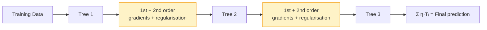

# XGBoost

You already know how Gradient Boosting works: build one small tree at a time, each one correcting the previous mistakes. XGBoost takes that same idea and makes it smarter, faster, and harder to overfit. It has won more machine learning competitions than any other single algorithm, and it is a standard tool in any data scientist's kit.

---

## What is XGBoost?

XGBoost stands for "Extreme Gradient Boosting." It is a faster, more accurate version of Gradient Boosting that adds two important improvements.

First, it uses extra mathematical information when building each tree. Instead of only using how wrong the current prediction is (called the first-order gradient), it also uses how quickly the error is changing (called the second-order gradient or curvature). This extra information helps it build better trees with fewer attempts.

Second, it adds built-in protection against overfitting (which means memorising the training examples instead of learning the real pattern). It does this by adding a penalty that discourages trees from growing too large or from having extreme values at their leaves.

---

## A simple way to think about it

Imagine you are adjusting a guitar string to reach the right pitch. A simple approach: pluck the string, hear it is too flat, tighten it a bit, repeat. That is like standard Gradient Boosting. It only knows which direction to go (flat or sharp), not how much to move.

XGBoost is like having a tuner that knows both the direction and the rate of change. It can say: "you are flat, and the pitch is changing slowly as I tighten, so I need a big turn." Or: "you are flat, but the pitch is changing quickly, so a tiny turn will be enough." It reaches the right pitch faster and avoids overshooting.

The penalty for complex trees is like a rule: "no tree is allowed to be unnecessarily complicated." This stops the model from building messy, overly detailed trees that work perfectly on training examples but fail on new ones.

---

## How it works, step by step

1. Start with a first prediction for all examples (the average, or another simple starting point)
2. Calculate both the direction and the rate-of-change of the current errors for each example
3. Use that information to build the next tree, choosing the splits that reduce errors most efficiently
4. Apply a penalty to discourage the tree from having too many branches or extreme values
5. Add that tree to the model, scaled by the learning rate
6. Repeat steps 2 to 5 for as many rounds as you choose

---

## See it visually



Each tree is built using both first and second-order gradient information, plus a penalty term that limits complexity. The final prediction is the sum of all trees, each scaled by the learning rate.

---

## The maths (do not panic)

Here is the formula that makes this work. We will break down every part.

$$\mathcal{L}^{(t)} = \sum_{i=1}^{n} \left[ g_i f_t(\mathbf{x}_i) + \frac{1}{2} h_i f_t^2(\mathbf{x}_i) \right] + \Omega(f_t)$$

where $g_i$ is the first-order gradient, $h_i$ is the second-order gradient (Hessian), and $\Omega(f) = \gamma T + \frac{1}{2}\lambda \|w\|^2$ penalises trees with many leaves ($T$) or large leaf weights ($w$).

> **In plain English:** At each step, XGBoost uses both how wrong the prediction is (the slope of the error) and how fast the error is changing (the curvature) to build the best possible next tree. It also adds a penalty that stops trees from becoming too complicated. Together, these produce smarter corrections than standard Gradient Boosting.

<details><summary>Show more detail</summary>

XGBoost approximates the loss function (the formula measuring prediction errors) using a second-order Taylor expansion. This is a mathematical technique that describes any curve using just two numbers: the slope and the curvature.

Because the approximation is a simple bowl shape (quadratic), the best value for each leaf can be calculated directly with a formula instead of searching for it by trial and error. For a leaf containing a set of examples, the best leaf value is:

$$w_j^* = -\frac{\sum_{i \in I_j} g_i}{\sum_{i \in I_j} h_i + \lambda}$$

The improvement from making a split is:

$$\text{Gain} = \frac{1}{2}\left[\frac{G_L^2}{H_L+\lambda} + \frac{G_R^2}{H_R+\lambda} - \frac{(G_L+G_R)^2}{H_L+H_R+\lambda}\right] - \gamma$$

Here, $G$ and $H$ are the summed first and second-order gradients going left and right. The $\gamma$ term is the minimum improvement required before a split is allowed. If no split meets that minimum, the tree stops growing at that point. This is how XGBoost controls tree size through its penalty rather than through a separate depth limit.

</details>

---

## Run the code yourself

This code trains an XGBoost model on a breast cancer dataset. You will need to install the xgboost library first by running `pip install xgboost` in a cell. The model uses built-in penalties to avoid overfitting while reaching high accuracy.

**Step 1:** Open [Google Colab](https://colab.research.google.com) and create a new notebook. (Or use Jupyter if you followed the [Get Started guide](setup).)

**Step 2:** Copy this code into a cell:

```python
# pip install xgboost scikit-learn
import xgboost as xgb                              # the XGBoost library
from sklearn.datasets import load_breast_cancer    # medical dataset: 569 tumours, 2 classes
from sklearn.model_selection import train_test_split
from sklearn.metrics import accuracy_score

# Load the breast cancer dataset
data = load_breast_cancer()

# Split into 80% training and 20% testing
X_train, X_test, y_train, y_test = train_test_split(
    data.data, data.target, test_size=0.2, random_state=42
)

# Create the XGBoost model with penalties to prevent memorisation
model = xgb.XGBClassifier(
    n_estimators=100,       # build 100 trees in sequence
    learning_rate=0.1,      # each tree contributes only 10% of its prediction
    max_depth=3,            # keep trees shallow (small and simple)
    reg_lambda=1.0,         # penalty on large leaf values (reduces overfitting)
    gamma=0.1,              # minimum improvement required before making a split
    random_state=42,
    eval_metric="logloss",  # use log-loss to track training progress
)
model.fit(X_train, y_train)   # train using both gradient and curvature information

# Check accuracy on examples the model never saw during training
predictions = model.predict(X_test)
print(f"Accuracy: {accuracy_score(y_test, predictions) * 100:.1f}%")
```

**Step 3:** Press **Shift + Enter** to run it.

You should see:
```
Accuracy: 97.4%
```

**What each line does:**
- `n_estimators=100`: builds a sequence of 100 trees, each correcting the previous
- `learning_rate=0.1`: scales each tree's contribution to 10% so corrections stay small and stable
- `reg_lambda=1.0`: adds a penalty for large leaf values to prevent the model from memorising training data
- `gamma=0.1`: a split only happens if it improves the model by at least 0.1, which keeps trees from growing unnecessarily
- `model.fit(...)`: trains each tree using both the slope and the curvature of the errors for smarter splits
- `model.predict(X_test)`: adds up all 100 trees' contributions to make the final prediction

**What just happened?**

XGBoost reached 97.4% accuracy on cancer diagnosis. The penalties (`reg_lambda` and `gamma`) are what stopped it from simply memorising the training examples. Without those penalties, a simpler model would get higher accuracy on training data but worse accuracy on new data. The penalties are what make XGBoost reliable in the real world, not just on the data it has already seen.

---

## Quick recap

- XGBoost improves on Gradient Boosting by using both the slope and the curvature of errors to build smarter trees
- Built-in penalties stop trees from growing too large or having extreme values, which prevents memorisation of training data
- It is one of the most reliable algorithms for structured data (tables and spreadsheets) and a natural first choice
- The key settings to adjust are the learning rate, max depth, number of trees, and the two penalty values
- Understanding XGBoost also means you understand LightGBM and CatBoost, which are built on the same ideas

---

[← Gradient Boosting](gradient-boosting){: .btn } [Next → SVM](svm){: .btn .btn-primary }
