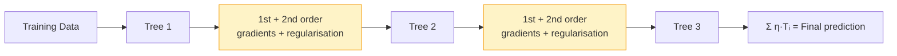

# XGBoost

## What is it?

XGBoost is Gradient Boosting with a better objective function, built-in regularisation to prevent overfitting, and engineering optimisations that make it significantly faster. It has won more Kaggle competitions than any other single algorithm and is a standard tool in any ML practitioner's toolkit.

---

## The Idea

Standard Gradient Boosting uses first-order gradients, the residuals, to guide each new tree. XGBoost goes further by also using second-order gradients, the curvature of the loss function, to build better trees faster. This second-order Taylor expansion of the loss gives a quadratic approximation that can be minimised analytically, producing closed-form optimal leaf weights without needing iterative search.

Beyond better gradients, XGBoost adds regularisation terms directly to the objective function, penalising trees that are too complex. The penalty $\gamma T + \frac{1}{2}\lambda\|w\|^2$ discourages both too many leaves and large leaf weight magnitudes, so the model is steered away from overfitting as it trains, not just after the fact.

Two additional improvements complete the picture. Column subsampling (like Random Forests) introduces diversity across trees and reduces correlation between them. Parallel tree construction within each level makes the algorithm scale gracefully to large datasets, which is why XGBoost became the go-to algorithm when training time matters.

---

## Visual



---

## The Math

$$\mathcal{L}^{(t)} = \sum_{i=1}^{n} \left[ g_i f_t(\mathbf{x}_i) + \frac{1}{2} h_i f_t^2(\mathbf{x}_i) \right] + \Omega(f_t)$$

where $g_i$ is the first-order gradient, $h_i$ is the second-order gradient (Hessian), and $\Omega(f) = \gamma T + \frac{1}{2}\lambda \|w\|^2$ penalises trees with many leaves ($T$) or large leaf weights ($w$).

> **In plain English:** At each step, XGBoost uses both the slope and the curvature of the loss to fit the next tree more precisely, plus a penalty that discourages overly complex trees.

<details><summary>Show the derivation</summary>

Applying a second-order Taylor expansion to the loss around the current predictions gives a quadratic approximation in $f_t$. Because the approximation is quadratic, it can be minimised analytically with respect to the leaf weights.

For a leaf $j$ containing the instance set $I_j$, the optimal leaf weight is:

$$w_j^* = -\frac{\sum_{i \in I_j} g_i}{\sum_{i \in I_j} h_i + \lambda}$$

The Hessian sum $\sum h_i$ acts as a weighted sample count, so leaves with uncertain curvature receive smaller corrections, a natural form of shrinkage. The gain from proposing a split is:

$$\text{Gain} = \frac{1}{2}\left[\frac{G_L^2}{H_L+\lambda} + \frac{G_R^2}{H_R+\lambda} - \frac{(G_L+G_R)^2}{H_L+H_R+\lambda}\right] - \gamma$$

where $G$ and $H$ are the summed gradients and Hessians in the left and right child. If no split achieves Gain $> 0$, the tree is pruned at that node. The $\gamma$ term is the minimum gain threshold, giving direct control over tree depth through the regularisation parameter rather than a post-hoc pruning step.

</details>

---

## How It Learns

XGBoost follows the same sequential structure as Gradient Boosting: each tree is trained to correct the errors of all previous trees. What changes is how each tree is built. Rather than fitting raw residuals, XGBoost computes both first- and second-order gradients of the loss at the current predictions and uses the analytical gain formula to evaluate every candidate split. Splits that don't improve the regularised objective by at least $\gamma$ are rejected outright, so the tree grows only where it genuinely helps. The resulting leaf weights are set to the closed-form optimal values rather than estimated by averaging, which means each tree is as good as it can be given the regularisation constraints. The learning rate $\eta$ then scales down each tree's contribution before it's added to the ensemble, keeping the sequential corrections small and stable.

---

## When to Use It

XGBoost is the go-to algorithm for tabular machine learning. Whenever you have structured data with a clear target variable, whether classification, regression, or ranking, it's almost always one of the first methods worth trying. The most important hyperparameters to tune are `learning_rate`, `max_depth`, and `n_estimators`, which control how aggressively the model learns and how many trees it uses. The regularisation parameters `reg_lambda` and `reg_alpha` (L2 and L1 penalties on leaf weights) and `gamma` (minimum split gain) are what separate a well-tuned XGBoost model from an overfit one. For diversity and variance reduction, `subsample` and `colsample_bytree` mirror the ideas from Random Forests. If training on very large datasets where speed is the bottleneck, LightGBM's leaf-wise splitting strategy can be faster, but for most problems XGBoost's depth-wise approach is more stable out of the box.

---

## Try It Yourself

If you have not set up Python yet, start with the [Get Started guide](setup) first.

This code trains an XGBoost classifier with regularisation on a breast cancer dataset. You'll need to install xgboost first: `pip install xgboost`.

Copy this into a cell and run it with Shift + Enter:

```python
# pip install xgboost scikit-learn
import xgboost as xgb                              # the XGBoost library
from sklearn.datasets import load_breast_cancer    # medical dataset
from sklearn.model_selection import train_test_split
from sklearn.metrics import accuracy_score

data = load_breast_cancer()
X_train, X_test, y_train, y_test = train_test_split(
    data.data, data.target, test_size=0.2, random_state=42
)

model = xgb.XGBClassifier(
    n_estimators=100,       # number of boosting rounds (trees)
    learning_rate=0.1,      # how much each tree contributes
    max_depth=3,            # keeps trees shallow
    reg_lambda=1.0,         # L2 regularisation on leaf weights (prevents overfitting)
    gamma=0.1,              # minimum gain required to make a split
    random_state=42,
    eval_metric="logloss",  # use log-loss to measure training progress
)
model.fit(X_train, y_train)   # train sequentially with gradient + Hessian info

predictions = model.predict(X_test)
print(f"Accuracy: {accuracy_score(y_test, predictions) * 100:.1f}%")
```

Expected output:
```
Accuracy: 97.4%
```

**What each line does:**
- `n_estimators=100`: builds 100 trees, each correcting the previous
- `learning_rate=0.1`: scales each tree's contribution down to prevent overshooting
- `reg_lambda=1.0`: penalises large leaf weights (keeps the model from overfitting)
- `gamma=0.1`: a split only happens if it improves the objective by at least 0.1
- `model.fit(...)`: trains using both gradient and curvature info for better splits
- `model.predict(X_test)`: sums all trees to produce the final prediction

**What just happened?**

XGBoost reached 97.4% accuracy on cancer diagnosis by combining 100 smart trees. The regularisation parameters (`reg_lambda` and `gamma`) are what stopped it from just memorising the training data. That's the key difference between XGBoost and plain Gradient Boosting.

---

## Key Takeaways

- XGBoost improves on Gradient Boosting by using second-order gradient information for more accurate trees.
- Built-in regularisation through $\gamma$, $\lambda$, and $\alpha$ is what makes it robust to overfitting.
- It's one of the most reliable algorithms for tabular ML and still one of the first things worth trying.
- The engineering underneath, from parallel tree construction to column subsampling, means it scales well.
- Understanding XGBoost means you also understand LightGBM and CatBoost, which build on the same ideas.

---

[← Gradient Boosting](gradient-boosting){: .btn } [Next → SVM](svm){: .btn .btn-primary }
